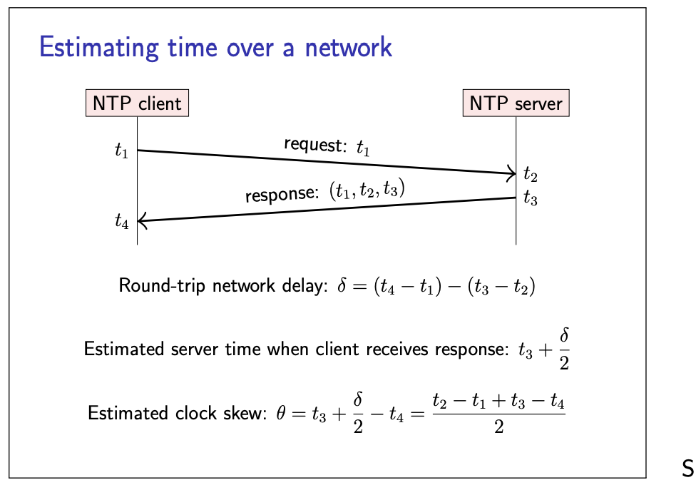

# Syncronisation of clocks

- Atomic clocks are too expensive and bulky to build into every computer and phone, so quartz clocks
are used.
- Since these clocks drift, they need adjustment from time to time, which is most commonly done
using the **Network Time Protocol (NTP)**
- All mainstream operating systems have NTP clients built in.
- Once NTP has estimated the clock skew between client and server, the next step is to adjust the
client’s clock to bring it in line with the server.
- The client corrects small differences gently by adjusting the clock speed which is called **slewing.**
- However, if the skew is larger, slewing would take too long, so the NTP client instead forcibly sets its
clock to the estimated correct time based on the server timestamp.This is called **stepping** the clock.
- And finally, if the skew is very large (by default, more than about 15 minutes), the NTP client may
decide that something must be wrong, and refuse to adjust the clock, leaving the problem for a user
or operator to correct.

# Monotonic clocks

- The fact that clocks may be stepped by NTP, i.e. suddenly moved forwards or backwards, has an
important implication for any software that needs to measure elapsed time.
- There is **time-of-day** clock  (also known as real-time clock) 
- When the NTP client steps the local clock, a time-of-day clock may jump.
- calculating elapse time (diff between 2 epoch) using this time will give you wrong results.
- HENCE, **monotonic clock** , which is not affected by NTP stepping and it always moves forward.
- Only the rate at which it moves forward may be adjusted by NTP slewing.
- This makes a monotonic clock much more robust for measuring elapsed time
- Time since arbitrary point (e.g. when machine booted up)