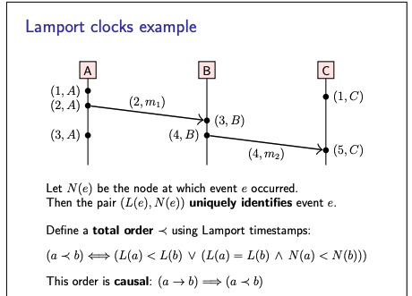
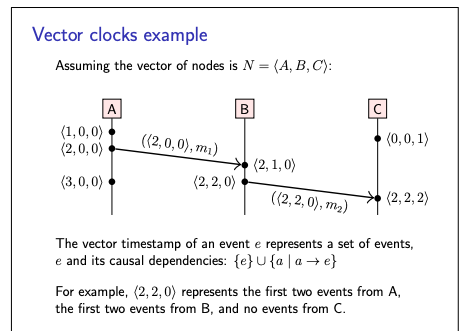
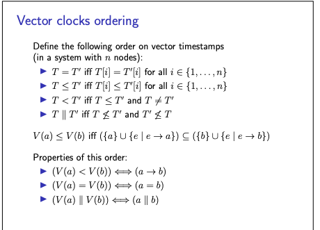

# Logical Clocks

- As we have seen earlier that physical clocks are used to count number of seconds elapsed.
- Logical clocks are used to to count number of events occurred.
- Logical clocks are designed to capture casual dependencies.
    - That is if (e1 -> e2) then (T(e1) < T(e2))
    - Simply if event 1 happens before event 2 then timestramp of event 1 must be less than timestramp of e2.

**Problems with physical clocks**

- Physical clocks may be inconsistent with causality.
- Even though these clocks are synchronised with NTP.
- In contrast, logical clocks focus on correctly capturing the order of events in a distributed system.

## Types of Logical clocks

- Lamport clocks
- Vector clocks

### **Lamport clocks**

- This introduced by Lamport in 1978.

Below is the algorithm for Lamport clock,

```shell
on initisisation do 
  t:= 0 ## each node has its own local variable t 
end on 

on any event occuring at the local node do 
  t := t + 1
end on

on request to send message m do 
  t := t + 1 ## send(t, m) via underlying network link.
end on

on receiving (t^, m) via the underlying network link do 
  t := max(t, t^) + 1
  deliver m to the application
end on 
```

Properties of this algorithm,

- The algorithm assumes a crash-stop model (or a crash-recovery model if the timestamp is maintained in stable storage,
  i.e. on disk).

It guarantees that,

- If a -> b then L(a) < L(b) , Here a,b are events and L(a), L(b) are value of t after increment.
- However, L(a) < L(b) does not imply a -> b, it is also possible that a and b work in concurrent.
    - Here the only thing we can do is to rule out the b -> a, because if b > a then timestamp should be L(b) < L(a)
- Also, possible that L(a) = L(b) for a != b
    - This means 2 different happens at the same timestamp. It is not preventing this.

Now, consider the below example,



- Here important thing to notice that there 2 diffrent events with timestamp 1 and same for timestamp 3.
- Once thing we can do is to uniquely identify the events
    - We can do that by using Lamport timestamp and combining that with the name of the node at which it occurs.
- Once more important thing we can do is, to define the total order using Lamport timestamp.
    - (a -> b) if and only if (L(a) < L(b) OR (L(a) == L(b) AND N(a) < N(b)))
    - Here a,b are events, L(a) and L(b) are lamport timestamp of events and N(a) and N(b) are name of events like node
      name.
    - Also while considering N(a) < N(b) , we will consider the lexicography order or so on.
- Hence, it makes it total order.

### Vector clocks

**Problem with Lamport clock**

- If given a Lamport timestamp L(a) and L(b) where L(a) < L(b)
    - Then it cannot tell whether a -> b or a || b
- Hence, it is important to tell which events happens before and which one happens concurrent.
- And this is where Vector clock comes in.

**Vector clocks**

- Assumes n nodes in the system , N = {N1,N2,N3...,Nn}
- Vector timestamp of event a is V(a) = {t1,t2,...tn}
- Here, ti is the number of events observed by node Ni
- Each node has a current vector timestamp T
- On event on Node Ni , increment vector element T[i]
- Attach current vector timestamp to each message.
- Recipient merges message vector into its local vector.

Below is the algorithm for Vector clocks

```shell
on initialisation of node Ni do
  T := {0,0,0....0}  ## Local variable at node Ni
end on

on any event occured at node Ni do
  T[i] := T[i] + 1
end on

on request to send message m to node Ni do
  T[i] := T[i] + 1;
  send(T, m); ## via network
end on

on receiving (T^ ,m) at node Ni via network do 
  T[j] := max(T[j],T^[j]) for every j E {1,....n}
  T[i] := T[i] + 1; deliver m to the application
end on 
```

Below pic shows the algo in action,



Ordering of Vector timestamp,

