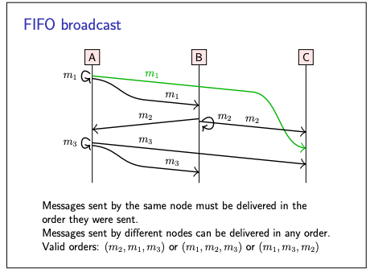

# Broadcast protocols

- Many networks provide point-to-point (unicast) messaging, in which a message has one specified recipient.
- Whereas in broadcast protocols, which generalise networking such that a message is sent to all nodes in some group
- The group membership may be fixed, or the system may provide mechanisms for nodes to join and leave the group
- Some local-area networks provide multicast or broadcast at the hardware level but communication over the Internet
  typically only allows unicast

### System models assumptions

- System models assumptions about node behaviour and synchrony carry over directly to broadcast groups.
- Can be **best-effort** -> May drop messages
- Or **Reliable** -> non-faulty nodes deliver every message, by retransmitting dropped messages
- Asynchronous/partially synchronous timing model -> no upper bound on message latency

Consider below pic,

Before we go into the details, we should clarify some terminology.

- When an application wants to send a message to all nodes in the group, it uses an algorithm to broadcast it.
- To make this happen, the broadcast algorithm then sends some messages to other nodes over point-to-point links, and
  another node receives such a message when it arrives over the point-to-point link.
- Finally, the broadcast algorithm may deliver the message to the application
- There is sometimes a delay between the time when a message is received and when it is delivered.

### Forms of reliable broadcast

- We will examine three different forms of broadcast.
- All of these are reliable: every message is eventually delivered to every non-faulty node, with no timing guarantees
- However, they differ in terms of the order in which messages may be delivered at each node
- this difference in ordering has very fundamental consequences for the algorithms that implement the broadcast.

1. **FIFO broadcast**

- The weakest type of broadcast is called FIFO broadcast
- In this model, messages sent by the same node are delivered in the order they were sent.

- Example in above pic, m1 must be delivered before m3, since they were both sent by A.
- However, m2 can be delivered at any time before, between, or after m1 and m3.
- This model violates causality -> node C delivers m2 before m1, even though B broadcast m2 after delivering m1.

2. **Causal broadcast**

- Causal broadcast provides a stricter ordering property than FIFO broadcast.
- As the name suggests, it ensures that messages are delivered in causal order: that is, if the broadcast of one message
  happened before the broadcast of another message, then all nodes must deliver those two messages in that order.
- If two messages are broadcast concurrently, a node may deliver them in either order.

3. **Total Order broadcast**

- sometimes also known as atomic broadcast.
- While FIFO and causal broadcast allow different nodes to deliver messages in different orders
- total order broadcast enforces consistency across the nodes,
- ensuring that all nodes deliver messages in the same order
- As with causal broadcast, nodes may need to hold back messages, waiting for other messages that need to be delivered
  first
- For example, node C could receive messages m2 and m3 in either order. If the algorithm has determined that m3 should
  be delivered before m2, but if node C receives m2 first, then C will need to hold back m2 until after m3 has been
  received.

