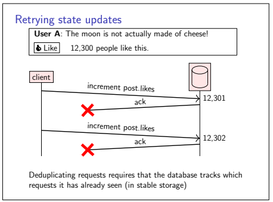
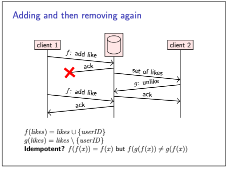
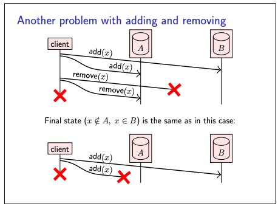
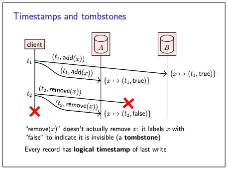
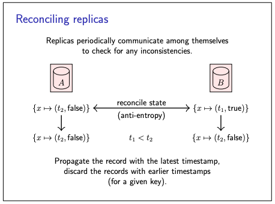
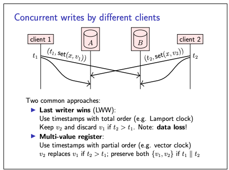

# Replication

- We will now turn to the problem of replication, which means to maintain a copy of the same data on multiple nodes,
  each of which is called a replica.
- Replication is a standard feature of many distributed databases, filesystems, and other storage systems.
- It is one of the main mechanisms we have for achieving fault tolerance:
- if one replica becomes faulty, we can continue accessing the copies of the data on other replicas.
- Also used to, Spread load across many replicas
- It is Easy if the data doesn’t change: just copy it
- We will focus on data changes
- Compare to RAID (Redundant Array of Independent Disks) replication within a single computer
  - In RAID single computer will have multiple discs and data is written on multiple disks.
  - If one disk fails other can be used.
  - But RAID has single controller; in distributed system, each node acts independently
  - Replicas can be distributed around the world, near users
- the main problem in replication is managing changes to the data.

### How data changes happens in distributed systems

Before we get into the details of replication, let’s look at how data changes happen in a distributed system.

1. Retrying state update

- Let’s consider as example the act of “liking” a status update on a social network.
- When you click the “like” button, the fact that you have liked it, and the number of people who have liked it, need to
  be stored somewhere so that they can be displayed to you and to other users.
- A request to update the database may be lost in the network, or an acknowledgement that an update has been performed
  might be lost.
- As usual, we can improve reliability by retrying the request.
- However, if we are not careful, the retry could lead to the request being processed multiple times, leading to an
  incorrect state in the database.
- One way of preventing an update from taking effect multiple times is to deduplicate requests.
- However, in a crash-recovery system model, this requires storing requests (or some metadata about requests, such as a
  vector clock) in stable storage, so that duplicates can be accurately detected even after a crash.

2. Idempotence

- We have seen the issue n retry, also seen the drawback of using retry using deduplication which required recording
  request meta data or vector clock.
- An alternative to recording requests for deduplication is to make requests idempotent.
- An idempotent update can safely be retried, because performing it several times has the same effect as performing it
  once
- Incrementing a counter is not idempotent, but adding an element to a set is.
- This lead to 3 Choices of retry:
  - _At-most-once semantics_: send request, don’t retry, update may not happen
  - _At-least-once semantics_: retry request until acknowledged, may repeat update
  - _Exactly-once semantics_: retry + idempotence or deduplication
- Idempotence allows an update to have exactly-once semantics

**Limitations of Idempotence**

- idempotence has a limitation that becomes apparent when there are multiple updates in progress.
- Consider the below examples:

1. Adding and removing again:

- client 1 adds a user ID to the set of likes for a post, but the acknowledgement is lost
- Client 2 reads the set of likes from the database (including the user ID added by client 1), and then makes a request
  to remove the user ID again
- Meanwhile, client 1 retries its request, unaware of the update made by client 2.
- The retry therefore has the effect of adding the user ID to the set again.
- In this case, the fact that adding an element to a set is idempotent is not sufficient to make the retry safe.

2. Another problem with adding and removing:

- Here we have 2 replicas.
- In the first scenario a client first adds x to both replicas of the database
- then tries to remove x again from both.
- However, the remove request to replica B is lost, and the client crashes before it is able to retry.
- In the second scenario a client tries to add x to both replicas, but the request to replica A is lost, and again the
  client crashes.
- In both scenarios the outcome is the same: x is present on replica B, and absent from replica A.
- When the two replicas **reconcile** their inconsistent states, we want them to both end up in the state that the
  client intended.
- However, this is not possible if the replicas cannot distinguish between these two scenarios.

### Solution with Timestramp and tombstones

- We have seen the problem above that When the two replicas **reconcile** their inconsistent states, we want them to
  both end up in the state that the client intended.
- However, this is not possible if the replicas cannot distinguish between these two scenarios.
- To solve this problem, we can do two things
  - First, we attach a logical timestamp to every update operation, and store that timestamp in the database as part of
    the data written by the update.
  - Second, when asked to remove a record from the database, we don’t actually remove it, but rather write a special
    type of update (called a tombstone) marking it as deleted.
- In many replicated systems, replicas run a protocol to detect and reconcile any differences (this is called
  anti-entropy), so that the replicas eventually hold consistent copies of the same data.
  - Thanks to tombstones, the anti-entropy process can tell the difference between a record that has been deleted and a
    record that has not yet been created.
  - And thanks to timestamps, we can tell which version of a record is older and which is newer.
- This approach also helps address the problem on (Limitation:1 - Adding and removing again) a retried request has the
  same timestamp as the original request, so a retry will not overwrite a value written by a causally later request with
  a greater timestamp.

**This solution also helps in concurrent updates**

- client 1 wants to set key x to the value v1 (with timestamp t1),
- while concurrently client 2 wants to set the same key x to the value v2 (with timestamp t2).
- Replica A receives v2 first and v1 second,
- while replica B receives the updates in the opposite order.
- To ensure that both replicas end up in the same state, we rely not on the order in which they receive requests, but
  the order of their timestamps.

What type of timestamp we can use in this approach?

- In Lamport timestamp,
  - two concurrent updates will be ordered arbitrarily, depending on how the timestamps happen to get assigned.
  - the update with the greatest timestamp takes effect, and any concurrent updates with lower timestamps to the same
    key are discarded.
  - which leads to last writer wins (LWW) semantics
  - This approach is simple to work with, but it does imply data loss when multiple updates are performed concurrently
  - Whether or not this is a problem depends on the application:
- In Vector clock
  - When discarding concurrent updates is not acceptable
  - we need to use a type of timestamp that allows us to detect when updates happen concurrently, such as vector clocks.
  - With such partially ordered timestamps, we can tell when a new value should overwrite an old value (when the old
    update happened before the new update),
  - and when several updates are concurrent, we can keep all of the concurrently written values
  - These concurrently written values are called conflicts, or sometimes siblings.
  - The application can later merge conflicts back into a single value (discussed later)
  - A downside of vector clocks is that they can become expensive: every client needs an entry in the vector,
