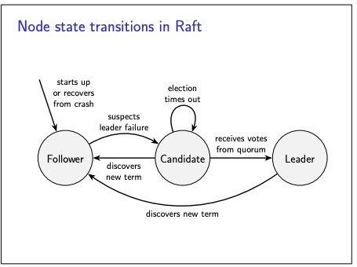

# The Raft consensus algorithm

For a graphical visualisation of the algorithm, [see](https://thesecretlivesofdata.com/raft/)

- In order to understand the algorithm, it is worth keeping in mind the state machine
- A node can be in one of three states: leader, candidate, or follower.
- When a node first starts running, or when it crashes and recovers, it starts up in the follower state and awaits
  messages from other nodes.
- If it receives no messages from a leader or candidate for some period of time, the follower suspects that the leader
  is unavailable
- and it may attempt to become leader itself.
- The timeout for detecting leader failure is randomised, to reduce the probability of several nodes becoming candidates
  concurrently and competing to become leader.
- When a node suspects the leader to have failed
    - it transitions to the candidate state
    - increments the term number
    - and starts a leader election in that term
    - asking other nodes to vote for it.
    - During this election, if the node hears from another candidate or leader with a higher term, it moves back into
      the follower state.
    - But if the election succeeds and it receives votes from a quorum of nodes, the candidate transitions to the leader
      state.
    - If not enough votes are received within some period of time, the election times out, and the candidate restarts
      the election with a higher term.
- Once a node is in the leader state
    - it remains leader until it is shut down or crashes
    - or until it receives a message from a leader or candidate with a term higher than its own
    - Such a higher term could occur if a network partition made the leader and another node unable to communicate for
      long enough that the other node started an election for a new leader
    - On hearing about a higher term, the former leader steps down to become a follower.