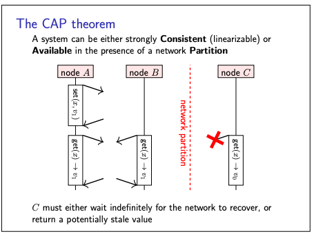
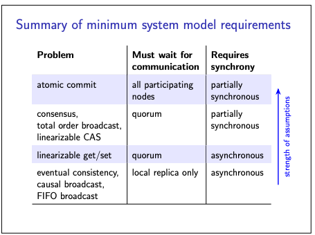

# Eventual consistency

- We have seen, Linearizability is a very convenient consistency model for distributed systems
- As it guarantees that a system behaves as if there was only one copy of the data, even if it is in fact replicated.
- Hence, it is Simple for applications to use
- But there are downsides of Linearizability (the ABD algorithm and the linearizable CAS algorithm)
    - Performance cost: lots of messages and waiting for responses
    - Scalability limits: leader can be a bottleneck
    - Availability problems: if you can’t contact a quorum of nodes, you can’t process any operations

Example:

- consider the calendar app that you can find on most phones, tablets, and computers.
- We would like the appointments and entries in this app to sync across all of our devices;
- in other words, we want it to be replicated such that each device is a replica.
- Moreover, we would like to be able to view, modify, and add calendar events even while a device is offline
- If the calendar app’s replication protocol was linearizable, this would not be possible, since an offline device
  cannot communicate with a quorum of replicas.
- Instead, calendar apps allow the user to read and write events in their calendar even while a device is offline, and
  they sync any updates between devices sometime later, in the background, when an internet connection is available.
- So there is trade off

**This kind of trade off is called CAP theorem (consistency, availability, and partition tolerance)**

## CAP Theorem

- CAP theorem states that if there is network partition in the system, then we must choose between one of the following:
    - We can have linearizable consistency
        - But in this case, some replicas will not be able to respond to requests because they cannot communicate with a
          quorum.
        - Not being able to respond to requests makes those nodes effectively unavailable.
    - We can allow replicas to respond to requests even if they cannot communicate with other replicas.
        - In this case, they continue to be available, but we cannot guarantee linearizability.

- Sometimes the CAP theorem is formulated as a choice of “pick 2 out of 3 but that framing is misleading.
- A system can be both linearizable and available as long as there is no network partition, and the choice is forced
  only in the presence of a partition

Consider below pic to understand this tradeoff:

- Here, node C is unable to communicate with nodes A and B.
- On A and B’s side of the partition, linearizable operations can continue as normal,because A and B constitute a
  quorum.
- However, if C wants to read the value of x, it must either wait (potentially indefinitely) until the network partition
  is repaired
- OR it must return its local value of x, which does not reflect the value previously written by A on the other side of
  the partition.
- The example above od calender, The calendar app chooses option 2:
    - it forgoes linearizability in favour of allowing the user to continue performing operations while a device is
      offline. Many other systems similarly make this choice for various reasons.

- The approach of allowing each replica to process both reads and writes based only on its local state, and without
  waiting for communication with other replicas, is called **optimistic replication OR Eventual consistency.**

## Eventual consistency

- Eventual consistency is defined as: “if no new updates are made to an object, eventually all reads will return the
  last updated value”
- This is a very weak : what if the updates to an object never stop, so the premise of the statement is never true? - No
  guarantees how long it might take.
- A slightly stronger consistency model called **strong eventual consistency,**

## Strong eventual consistency

- This is more appropriate
- It is based on the idea that as two replicas communicate, they converge towards the same state.
- Eventual delivery:
    - every update made to one non-faulty replica is eventually processed by every non-faulty replica.
- Convergence:
    - any two replicas that have processed the same set of updates are in the same state
      (even if updates were processed in a different order).

- In both eventual consistency and strong eventual consistency, there is the possibility of different nodes concurrently
  updating the same object, leading to conflicts
- Various algorithms have been developed to resolve those conflicts automatically
    - Example: last writer wins
    - A more refined approach might merge the updates to the time and the title

## Summary of minimum system model requirements for consistency models

