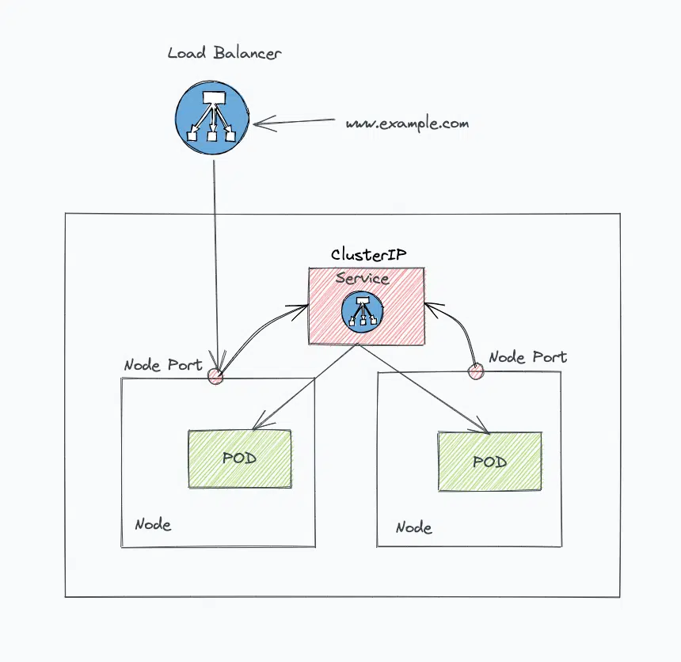
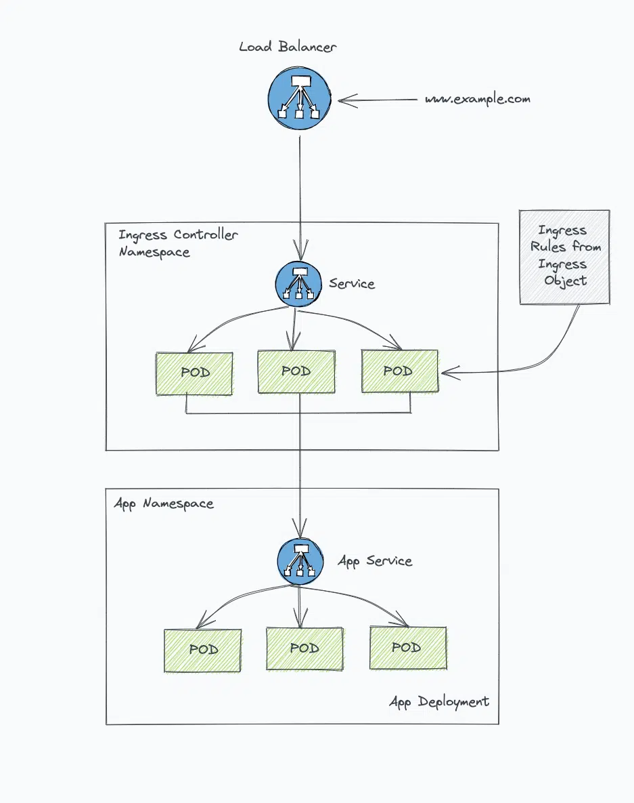
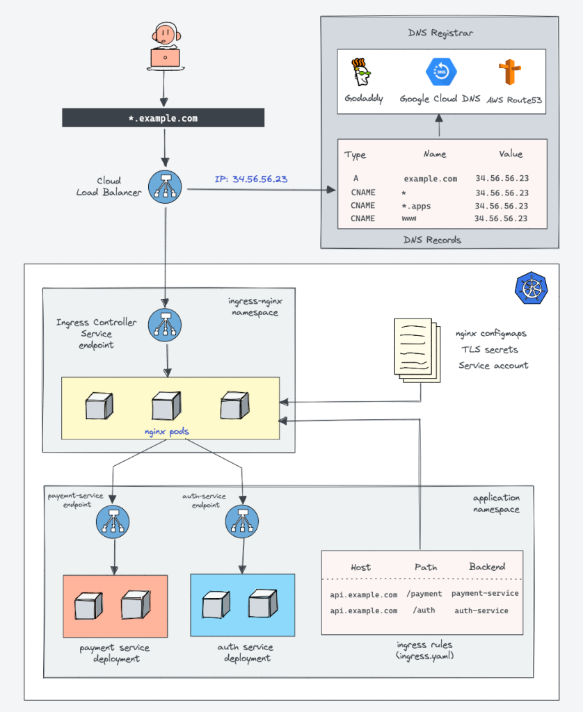
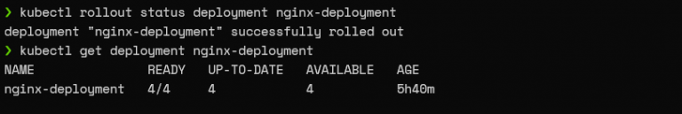
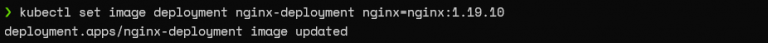
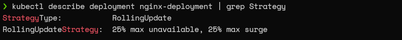
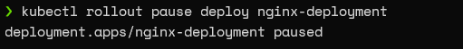
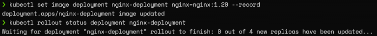
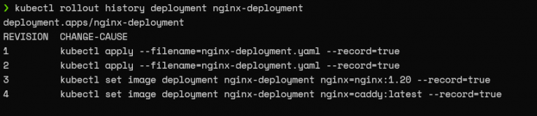

# Basic Architecture

The architecture of Kubernetes has a master node and worker nodes:

**Worker Node:**

- Each node can have multiple pods on it.
- 3 processes must be installed on every node.
    - _Container Runtime_ like docker or containerd
    - _Kubelet_
        - It is a process of k8s which interacts with both container runtime and node.
        - It starts the pods with containers in them.
        - It assigns the node resources like CPU, and memory to the pods.
    - _Kubeproxy_
        - It is responsible for forwarding the request from the service to the pod.
        - It must be installed on every node
        - It has intelligent forwarding logic inside which makes sure that communication happens in the most performant
          way.
        - Eg: When my app is calling the MyDB pod, then it will forward the request to the Mydb pod instance of the same
          node to avoid latency and network overhead.

**Master Node:**

There are four processes run on the master node:

- API Server
    - It gets an initial request to perform any activity on the cluster.
    - It acts as a gateway for authentication.
    - Some Request ➝ API Server ➝ Validates request ➝ Other processes (e.g.-Scheduler)  ➝ Perform activity (e.g.-
      schedule pod)

- Scheduler
    - The scheduler has an intelligent logic which checks where to schedule the pod on which worker node.
    - It checks how many resources are needed for the pod and checks the resources available on worker nodes, and based
      on that schedules the pod on the specific worker node.
    - It interacts with Kubelet on the worker node and creates a pod on the worker node.
    - Schedule new pod request ➝ API Server ➝ Scheduler (Where to put the pod ) ➝ Kubelet from worker node ➝ Starts the
      pod

- Control Manager
    - It detects the state changes like the crashing of pods
    - Detects the state change like the crash of the pod on the worker node and reschedules the pod
    - For rescheduling, it communicates with the scheduler and then the same cycle happens.

- etcd
    - It is a Key-value store which holds the cluster state.
    - It is a cluster brain which holds all the data.
    - All changes like when the pod is scheduled or dies etc are stored in etcd.
    - Ex: How the scheduler knows, how many resources are available on the worker node?
    - Ex: How control manager knows that the cluster state is changed?
    - Ex: If you query the API Server about cluster health, where does the API server gets all this information?
    - All this is possible because the data is stored in etcd

> The master node can have multiple instances, in such a case API server is load balanced and the etcd is distributed across multiple instances of the master.

---

# Basic components of k8s

- Assume we have an application that needs to be deployed to k8s.
- The application is a container image.
- To deploy the application container into k8s we will need,

Deployment:

- Which will tell the k8s to create 3 replicas of pods
- K8s will deploy these pods on the worker nodes with the help of the scheduler.
- The virtual network of k8s will assign the temporary IP to these pods.
- Now if you increase the replica set in the deployment, the deployment object will notice the replica set is increased
  and it will schedule more pods on the worker nodes.

Service:

- Now the pods have a temporary IP address and we have multiple pods as well.
- To manage, we will need a permanent IP and a load balancer which will distribute the load on multiple pods.
- Service will do this work for us.
- It has a separate lifecycle from pods.
- It acts as a load balancer.
- In a cloud environment, k8s interact with the cloud load balancer to work as a service.
- When the user sends the request to the pod API, it will call the load balancer IP and that IP is assigned to the cloud
  load balancer and it will send the request to the pods.

---

# Scheduler

- In k8s we have a bunch of machines.
- When the user asks to schedule a pod, the schedular will determine where to put the pod.
- When we create a pod in k8s, a pod object is created.
- The scheduler continuously watches for such pod objects which are created but not yet scheduled.
- It also watches the state of all machines, as it is needed to determine where to schedule the pod.
- What schedular thinks before making a scheduling decision is a mixture of two things,
- Predicate
- Priorities.

Predicates:

- They are the hard constraints which cannot be avoided.
- For Eg: I need to run a pod on the machine which needs a min of 4 GB memory. (Memory requirement) This is system
  specific requirement. Or when the user asks to schedule pods on machines which have been labelled as SSD only. (Pod
  selector) (User specific)

Priorities:

- They are soft constraints and can be avoided.
- Eg: It would be nice if my application is spread across a large number of machines.
- It would be nice if every machine has the same amount of workload.
- Taint ➝ It tells the k8s that the machine is sick and doesn't schedule pods on it, but it is a soft constraint.
- Now if we have taint and spreading requirements and we give more priority to spreading then it may schedule the pod on
  the tainted machine.

> In general, the formula used for selecting the pod is sort(filter(nodes));

---

# K8s Objects

Kubernetes objects are represented in JSON or YAML files and describe the state of your cluster. The state of the
cluster defines what workloads should be running in it. You can create these objects, and then Kubernetes makes sure
that your desired state is maintained. For example, if you create a deployment in Kubernetes, it makes sure it’s running
even if the cluster restarts after a crash. That’s the beauty of Kubernetes.

There are two categories of objects in Kubernetes:

- basic objects:
    - Pods, Service, Volumes, Namespace, etc., which are independent and don’t require other objects

- high-level objects (controllers):
    - Deployments, Replication Controllers, ReplicaSets, StatefulSets, Jobs, etc., which are built on top of the basic
      objects

### Object spec and status

In Kubernetes, object representation is stored in a manifest, as discussed above. Each kind of object has two specific
properties:

- _spec_: This contains the details about the object. For example, for a pod, it would contain which container image it
  would run, the ports to expose, the labels, and more.

- _status_: This contains your object’s current state and is updated in real time by the Kubernetes control plane. If
  you delete your pod, the status changes to Terminating, and then the pod is no longer listed as it gets deleted. The
  status is automatically assigned to each object.

### Required fields

Each YAML configuration for an object contains a selected set of fields for it to be valid. These fields are called
required fields, and they include the following:

- _apiversion_: This contains the instruction as to which version of the Kubernetes API should be used to create your
  object from the manifest.
- _kind_: As noted above, there are two categories of objects—basic and high-level objects. This field contains the
  details of the type of object; for example, if you want to create a pod in your cluster, the kind would be Pod.
- _metadata_: Metadata is defined as a set of data that gives information about other data. So this property defines
  parameters like name, UID, or namespace that would help you identify your object amid other objects of the same kind.
  You’ll read more about UID and namespace later in this article.
- _spec_: This, as discussed above, contains your object’s specifications. For example, it would contain what container
  image the pod would run, as well as what ports should be available for the object pod.

Example:

```yaml
apiVersion: v1
kind: Pod
metadata:
  name: nginx
spec:
  containers:
    - name: nginx
      image: nginx:1.14.2
      ports:
        - containerPort: 80
```

Each object has two unique specifiers:

- _Name_: This is the unique name for your object, and it has some restrictions.
- _UID_: UID is a unique, system-generated string standardized as SO/IEC 9834-8 and as ITU-T X.667 for the whole
  lifetime of the cluster. It helps you distinguish between historical occurrences of similar entities and simplifies
  logs. UIDs are more reliable than the name as there might be an object of the same name in the history of the cluster,
  but the UIDs would be distinct.

### namespaces

Namespaces help you to divide your resources into isolation groups for ease and efficient resource management with the
help of resource quotas.

Regardless of how many namespaces you create, there will always be four initial namespaces present:

- default: where your resources you create would be deployed
- kube-system: where the objects created by the Kubernetes system would be stored
- kube-public: where the resources that should be visible and publicly readable should be stored
- kube-node-lease: where Node Lease objects are stored.

The namespace helps isolation, but there’s a limit to what objects it can isolate. For example, you can isolate your
pods but not your nodes. You can have pods, deployments, service, and other objects in a namespace, but
PersistentVolumes can’t be in any namespace. To see the full list, you can run this command:

```shell
# Object in a namespace
 kubectl api-resources --namespaced=true 
# Object not in a namespace
 kubectl api-resources --namespaced=false
```

### Labels and selectors

Labels and selectors come in handy when you create a meaningful key-value relationship between your objects for
segregation and across namespaces. Their beauty lies in the fact they allow for efficient queries and great
organization.

In short, labels help you tag your pods, and selectors help you identify objects tagged with a label. Here, in metadata,
we have two labels — environment and app:

```yaml
apiVersion: v1
kind: Pod
metadata:
  name: nginx
  labels:
    environment: dev
    app: nginx
spec:
  containers:
    - name: nginx
      image: nginx:latest
      ports:
        - containerPort: 80
```

You can have labels for your different environments like dev or testing, and they would help you manage the objects
inside the labels together.

### Recommended labels

Recommended labels are a collection of labels that enable your tools to communicate with one another by describing items
in a way that all of the tools can comprehend.

```yaml
apiVersion: v1
kind: Service
metadata:
  labels:
    app.kubernetes.io/name: mysql
    app.kubernetes.io/instance: mysql-abcxzy
    app.kubernetes.io/version: "5.7.21"
    app.kubernetes.io/managed-by: helm
    app.kubernetes.io/component: database
    app.kubernetes.io/part-of: wordpress
```

### Annotations

Apart from labels and selectors, Kubernetes also offers annotations. Annotations are another type of metadata that can’t
be used to select objects but are there for the sole purpose of providing additional context to you or your logs and act
as pointers to your logging, monitoring, and analytics systems.

Annotations are mapped in a key-value format, like labels, though they don’t have nomenclature limitations. Annotations
can be large, small, structured, or unstructured data as there are no restrictions.

```yaml
apiVersion: v1
kind: Pod
metadata:
  name: annotations-demo
  annotations:
    imageregistry: "https://hub.docker.com/"
spec:
  containers:
    - name: nginx
      image: nginx:1.14.2
      ports:
        - containerPort: 80
```

In the above example from the Kubernetes Documentation, you can see how imageregistry is used as an annotation to tell
the operator that we are pulling the image from Docker Hub and not some other repository. Annotations provide context
for the human operator, and it becomes easier for the operator to find the image from a specific registry if required.

### Owners and dependents

Owners and dependents are a parent-child relationship present in Kubernetes. Take a look at the following deployment
object manifest:

```yaml
apiVersion: apps/v1
kind: Deployment
metadata:
  labels:
    app: nginx
  name: nginx
spec:
  replicas: 1
  selector:
    matchLabels:
      app: nginx
  strategy: { }
  template:
    metadata:
      creationTimestamp: null
      labels:
        app: nginx
    spec:
      containers:
        - image: nginx
          name: nginx
          resources: { }
```

The deployment object has replicas and pods objects linked to it. Deployment is the owner of replicas and pods, and the
pods/replicas are dependents of the deployment object.

If you delete the owner, the dependents get deleted too. So the owner objects manage the dependents automatically, and
any change in them translates to a change in the dependent. The relationship is managed by a metadata field called
ownerReference.

---

# Storage and Volumes

- In k8s base unit is a pod
- Within the pod, there will be one or more containers.
- Volume is a separate component and it is associated with the pod and mounted with the container at a particular path

Why do we need volume?

- Want storage that does not depend on pod lifecycle.
- You don't know on which node your pod will be scheduled, so storage should be available from all nodes.
- Also, you need HA storage

Kubernetes manages storage and volumes using three components:

- Persistence Volume
- Persistence Volume claim
- Storage class

### Persistence Volume (PV) :

- Think of PV as a cluster resource like RAM or CPU but it is used to store data.
- PV like any other k8s component is created using a yaml file
- PV is the abstract component which actually takes storage from physical storage like local hard disk or cloud storage.
- In PV yaml you can specify which storage backend you want to use.
- PV are not name-spaced but accessible to the entire cluster.

Example:

```yaml
apiVersion: v1
kind: PersistentVolume
metadata:
  name: pv0005
spec:
  capacity:
    storage: 5Gi
  volumeMode: Filesystem
  accessModes:
    - ReadWriteOnce
  persistentVolumeReclaimPolicy: Recycle
  storageClassName: slow
  mountOptions:
    - hard
    - nfsvers=4.1
  nfs:
    path: /tmp
    server: 172.17.0.2
```

### Persistence Volume Claim (PVC) :

- Once k8s admin configures the storage backend and PV, developer can claim the PV using PVC component.
- PVC is a separate k8s component
- When developer defines PVC, the PV that satisfy the requirement will be used.
    - Pod request the storage volume from PVC.
    - PVC tries to find the PV in cluster.
    - PV will have the actual storage backend.
    - Once claim uses the PV, then volume is mounted to the pod and then to the container.
- If you have multiple containers in the pod then you can configure to mount the volume to specific container or all
  containers.
- You can create multiple PVCs and mount it to the pod/containers.

```yaml
apiVersion: v1
kind: PersistentVolumeClaim
metadata:
  name: example-pvc
spec:
  accessModes:
    - ReadWriteOnce
  resources:
    requests:
      storage: 1Gi
```

In this example, a PVC named "example-pvc" is created with access mode "ReadWriteOnce" and a request for 1Gi of storage.

Also you need to use this PVC in your pod configuration,

```yaml
apiVersion: v1
kind: Pod
metadata:
  name: example-pod
spec:
  containers:
    - name: example-container
      image: nginx
      volumeMounts:
        - name: example-pvc
          mountPath: /data
  volumes:
    - name: example-pvc
      persistentVolumeClaim:
        claimName: example-pvc
```

- In this example, a Pod named "example-pod" is created with a single container "example-container" running the nginx
  image. The container has a volume mounted at /data that is backed by the PVC named "example-pvc".

ConfigMap and Secret does not use PV/PVC but uses local storage.

You just have to mount local storage to your pod, containers like PVC.

```yaml
apiVersion: v1
kind: ConfigMap
metadata:
  name: example-configmap
data:
  config.properties: |
    property1=value1
    property2=value2

---

apiVersion: v1
kind: Pod
metadata:
  name: example-pod
spec:
  containers:
    - name: example-container
      image: nginx
      envFrom:
        - configMapRef:
            name: example-configmap
      volumeMounts:
        - name: config-volume
          mountPath: /etc/config
  volumes:
    - name: config-volume
      configMap:
        name: example-configmap
```

In this example, a ConfigMap named "example-configmap" is created with the key config.properties containing a list of
key-value pairs. The Pod named "example-pod" is created with a single container "example-container" running the nginx
image. The container has environment variables created from the ConfigMap and a volume mounted at /etc/config that
contains the ConfigMap data.

### Storage Class :

- Consider a cluster with 100s of applications and need diffrent storages.
- So developer need to ask admin to create PV before deploying applications.
- And admin will have to provision storage from cloud provider and creates PV.
- This is time-consuming process.
- To make the process more efficient there is Storage Class Component.
- Storage class provision PV dynamically whenever PVC claims it.
- SC is created using yaml configuration just like any other k8s components.
- Now as SC creates PV dynamically so instead of defining the backend in PV we will have to define the storage backend
  in SC.
- This can be done using provisioner backend.
- There are many internal and external provisioner available.

Example Storage class configuration,

```yaml
apiVersion: storage.k8s.io/v1
kind: StorageClass
metadata:
  name: example-sc
provisioner: kubernetes.io/aws-ebs
parameters:
  type: gp2
  encrypted: "true"
reclaimPolicy: Retain
mountOptions:
  - debug
```

In this example, a StorageClass named "example-sc" is created using the AWS Elastic Block Store (EBS) provisioner. The
type parameter is set to gp2 and the encrypted parameter is set to true. The reclaim policy is set to Retain, meaning
the underlying storage will not be deleted when the PVC is deleted. The mountOptions parameter lists the desired mount
options for the created Persistent Volumes.

Here's an example YAML file for a Kubernetes Persistent Volume Claim (PVC) that uses a StorageClass:

```yaml
apiVersion: v1
kind: PersistentVolumeClaim
metadata:
  name: example-pvc
spec:
  accessModes:
    - ReadWriteOnce
  resources:
    requests:
      storage: 1Gi
  storageClassName: example-sc
```

In this example, a PVC named "example-pvc" is created with access mode "ReadWriteOnce" and a request for 1Gi of storage.
The storageClassName field specifies the name of the StorageClass to use, which in this case is "example-sc". When the
PVC is created, a Persistent Volume that meets the requirements specified in the PVC (including the storageClassName)
will be dynamically provisioned.


---

# Config Map

- A Kubernetes configMap is an API object that allows you to store data as key-value pair
- Kubernetes pods can use configMap as configuration files, environment variables or command-line arguments.
- Config-Map allows you to decouple environment-specific configurations from containers to make applications portable.
- But they are not suitable for confidential data.
- ConfigMap files should be limited to 1MB in size.

Creating a ConfigMap:

`kubectl create configmap <name> <data-source>`

- name -- Name of configMap, which should be valid to be used as dns subdomain
- data-source -- File or values from which configMap should be created, You can create configMap based on one file,
  multiple files, directories, or env-files. Base name of each file becomes key and content becomes value.

```shell
kubectl create configmap app-settings --from-file=app-container/settings/app.properties

kubectl create configmap app-settings --from-file=app-container/settings/app.properties
--from-file=app-container/settings/backend.properties

kubectl create configmap app-env-file --from-env-file=app-container/settings/app-env-file.properties

kubectl create configmap app-settings --from-file=app-container/settings/


kubectl describe configmap <name>

kubectl get configmaps <name> -o yaml
```

How to consume Kubernetes configMap:

There are two main ways to access configMap,

- Inject configMap using k8s api in pod
- ConfigMap mounted as volume into the application container and then you read using standard file I/O calls.

Below is the example pod where configMap is injected,:

```yaml
apiVersion: apps/v1
kind: Deployment
metadata:
  name: phpmyadmin
  labels:
    app: phpmyadmin
spec:
  replicas: 1
  selector:
    matchLabels:
      app: phpmyadmin
  template:
    metadata:
      labels:
        app: phpmyadmin
    spec:
      containers:
        - name: phpmyadmin
          image: phpmyadmin/phpmyadmin
          ports:
            - containerPort: 80
          env:
            - name: PMA_HOST
              valueFrom:
                configMapKeyRef:
                  name: mysqldb-configmap
                  key: database_url
```

ConfigMap mounted as volume into the application container:

```yaml
spec:
  containers:
    image: index.docker.io/sandycash/cm-loader
    volumeMounts:
      - mountPath: /clusters-config
        name: clusters-config-volume
  volumes:
    - configMap:
        name: clusters-config-env
      name: clusters-config-volume
```

---

# Secrets

- Kubernetes secrets are used to store sensitive information in Kubernetes which can later be used by the application.
- Examples of creating secrets are,

```shell
kubectl create secret general my-secret --from-lateral=username=user1 --from-lateral=password=P@ssW0rd

kubectl create secret generic my-secret --from-file=mysecret.txt
```

- You can use this secret in your app k8s manifest files to pass the secret values as environment variables or mount to
  volume to use it in application at specified locations.
- Kubernetes secrets are stored in etcd which is encrypted key-value store by default.
- However data stored in secret is still a plain text format.
- If you want to encrypt the secret you can use the tool like sops or sealed secrets

`sops --encrypt --in-place mysecret.yaml`

Kubernetes Secret encryption mechanism:

Kubernetes secret encryption mechanism is 2 steps process to encrypt and decrypt the secrets stored in the k8s cluster.

- Data encryption
    - When a secret is created or updated in k8s, the data is encrypted using symmetric encryption algo like AES.
    - A randomly generated encrypted encryption key is used to encrypt the data.
    - The key is then encrypted using master key.
    - Finally encrypted data and encrypted encryption key is then stored in k8s.
- Key encryption
    - The master key is used to encrypt the encryption key , and is stored in k8s secret called
      kubernetes.io/service-account-token Secret.
    - This secret is automatically created by k8s and is used by k8s api server to authenticate with the k8s api server.
    - The master key is encrypted using KEK.(Key encryption key)
    - KEK is also used to decrypt the encrypted encryption key when user request the secret.

When user request the secret:

- The encrypted encryption key and encrypted data is retrieved from etcd.
- The KEK is used to decrypt the encrypted encryption key
- This decrypted key is then used to decrypt the encrypted data.
- The decrypted data is then returned to the user.

External secrets:

- It is a solution that enables you to manage sensitive data outside of k8s cluster.
- External Secrets consists of 2 components,
    - Controller
        - It synchronised the secret from the external secret store to k8s internal secret.
    - CRD
        - It defines the structure of external secret.
- To use External secret, you first need to configure external secret controller to connect to your external store.
- Once configured you can create instance of external secret CRD in k8s.

How application retrieved external secret:

- In k8s external secrets, the external secret controller retrieves the secret from the external store using the
  credentials provided during configuration.
- When k8s app requests the secret, the ES controller reads the ES CRD, which contains the reference to the external
  secret in the external store.
- The controller then uses this information to retrive the secret value.
- The secret value is then stored in k8s internal secret to made it available to requesting application
- Once this internal secret is created application can use it as needed.
- When external store value is changed external secret will detect the change and sync it with this internal secret.
- The internal secret which is created from external secret is not in plain text and is always encrypted using k8s
  native secret encryption mechanism.

Types of Secrets:

- Opaque
  - The Opaque type is the most common type of Secret and is used for storing arbitrary data such as passwords, keys,
    and other sensitive information. The data is stored as a base64-encoded string in the Secret object.
- Service Account
  - A Service Account Secret is automatically created by Kubernetes when a Service Account is created. This Secret
    contains a token that can be used by pods to authenticate with the Kubernetes API server.
- TLS
  - The TLS type is used for storing TLS certificates and keys for secure communication between services.
- Docker Registry
  - The Docker Registry type is used for storing credentials for accessing private Docker image registries. The data is
    stored in the Secret object as plain text.

# RBAC

- Kubernetes has many resources and components.
- Resources like secrets should have strict access.
- For this reason, Kubernetes have a mechanism called Role-based access control (RBAC)
- RBAC implements rules that define what service account/user is allowed to access certain components or resources in a
  cluster.
- Implementing RBAC in k8s is done using Role/Cluster Role and RoleBinding/ClusterBinding
- Role/ClusterRole
  - You will have to create a role or cluster role to define what user/service account is allowed to access.
  - ClusterRole is applied at the cluster level.
  - Whereas Role is applied at the namespace level.
- RoleBinding/ClusterBinding
  - Once you created a Role then you will have to create the RoleBinding.
  - It will bind the k8s user to the role.
  - The ClusterBinding is at the Cluster level whereas the RoleBinding is at the namespace level.

How RBAC works in the k8s:

- RBAC configuration uses the `rbac.authorization.k8s.io/v1/apiversion` to create roles and bindings
- The role has verbs and nouns
- verb :
  - It is permission given to the service account/ user
  - Users can be granted the below permissions while working on k8s resources.
  - get, list, watch, create, update, patch, delete
- nouns:
  - They are the resources to which these permissions are applied like services, deployments etc.

```yaml
apiVersion: rbac.auth.k8s.io/v1
kind: role
metadata:
  name: earthy-access-role
  namespace: earthy
rules:
  apiGroup:
    - apps
    - autoscaling
    - batch
    - extensions
    - policy
    - rbac.auth.k8s.io
  resources:
    - pods
    - deployment
    - ingress
    - jobs
    - namespace
    - nodes
    - serviceaccount
    - services
verbs: [ "get","list","watch" ]

---

apiVersion: rbac.auth.k8s.io/v1
kind: rolebinding
matadata:
  name: earthy-rb
  namespace: earthy
roleRef:
  apiGroup: rbac.auth.k8s.io
  kind: role
  name: earthy-access-role
subject:
  - namespace: earthy
    kind: serviceAccount
    name: earthy-service-account
```

```shell
kubectl create role earthy-access-role -- verb=get --verb=list --resource=service -n earthy 

kubectl create rolebinding test 
  --role = service-reader
  --serviceaccount = foo:default
  -n organisation
```

ClusterRole and ClusterBinding:

- They are also same, the only difference is they don't have namespace parameter

---

# Network - Container Communication

- Pod is the smallest unit
- Now the question is why use pod when we can use containers?
  - So when we start the container, we map the container port to the host port.
  - Now so with thousands of containers running in the cluster, how we will map what ports are available?
  - Hence k8s introduced pods.
  - Also, pods add a level of abstraction for a container runtime.
- When the pod is created on the node it got its own network namespace and virtual ethernet connection.
- So pod is a small host, both with an IP address and a range of ports bind to containers.
- This means you don't have to worry about port mapping.
- The pod can have one container and max 6 containers.
- When multiple containers run inside the same pod, as they are in the same network namespace, they can talk to each
  other using localhost.
- Pause Container:
  - The pause container is available for every pod
  - It is also called a sandbox container
  - It reserves and holds the network namespace.
  - It enables the communication between containers.
  - When the container dies, the pod creates a new container and keeps the pause container.
  - Whereas when the pod dies, a new pause container is created which will give a new IP address and network namespace
    to the newly created pod.

---

# Network - Pod to pod

- Each Pod in k8s is assigned a dedicated IP address with a dedicated namespace
- K8s imposes 3 fundamental requirements for any network.
  - Pods on a node can communicate with all pods on all nodes with NAT.
  - Agents on the node (System daemons, kubelet) can communicate with all pods on that specific node.
  - Pods on the host network can communicate with pods on all nodes with NAT (For Linux which supports pods running on
    host network)

Communication between pods running on the same node:

- K8s created a virtual ethernet adapter for every pod, and it is connected to the network adapter of the node.
- When a network request is made, the pod connects through the network adapter of the node through the tunnel.
- In the K8s node, there is a network bridge called cbro.
- All pods are part of this network bridge.
- When a network request is made this bridge checks for the correct destination pod and directs the traffic to the
  destination pod.

Communication between pods in different nodes:

- When a requested IP cannot be found within the pod, the network bridge directs the traffic to the default gateway.
- This will then look for the IP address at Cluster Level.
- K8s keeps a record of all the IP ranges associated with each node.
- IP is assigned to a pod within the nodes from the range assigned to the node.
- When a request is made to the IP address in a cluster, it will
  - Look for the IP range for the requested IP.
  - Then directs the traffic to the specific node and then to the correct pod.

---

# Network - Pod to Service

- Service is an abstraction that routes traffic to the set of pods.
- In other words, the service will map the single IP address to the set of pods.
- When a network request is made the service proxy the request to the necessary pod.
- This proxy happens via a process called Kube proxy that runs in each node.
- Service will get an IP within the cluster.
- Request first reaches service IP before reaching actual pod IP.
- This decouples the dependency on networking directly to the pod.
- Thus pods can be created and destroyed without worrying about network connectivity, as the service will automatically
  update its endpoint.
- Label selector is a core grouping primitive in k8s which identifies the set of objects.
- The label selector will look for a specified label in each pod and match them with the service accordingly.
- DNS for internal routing
  - Each cluster comes with in-build DNS
  - DNS is assigned to each service in a cluster.
  - DNS is assigned to each service in a cluster.

---

# Network - Internet to Service

Introduction:

- Ingress refers to the act of entering - Traffic entering the cluster
- Egress refers to the act of existing - Traffic that exits the cluster.
- Ingress is a native k8s object that defines the routing rules- DNS routing configurations
- The Ingress controller does the actual routing by reading the routing rules from ingress objects which are stored in
  etcd.

Without Ingress:

- Before k8s ingress, a custom Nginx/HAProxy k8s deployment would be exposed as a Load Balancer service.
- Routing rules would be added as a config map to these pods.
- Whenever there is a change in DNS or a new route entry to be added, it gets updated in Configmap, and pods are
  reloaded ot it is re-deployed.
- Request first goes to the Load Balancer , through LoadBalancer it goes to specific node.
- Using Node port it is then forwarded to service Cluster IP.
- This ClusterIP forwards the request to Nginx pod and then via pod to ClusterIP of actual application pods.



With Ingress:

- In the same implementation with ingress, there is a reverse proxy (Ingress Controller) between the load balancer and
  the k8s service endpoint.
- K8s ingress follows the similar pattern as above.
- In Ingress routing rules are maintained as k8s objects as Ingress insted of configMap.
- And Instead of NGInx/HAProxy, we have an ingress controller, which fetches these routing rules defined in k8s etcd.
- These routing rules are fetched dynamically.



K8s Ingress Resource:

- AS mentioned earlier, it is k8s native object which defines the DNS routing rules.
- It means you map the external DNS traffic to the internal k8s service endpoints.

```yaml
apiVersion: networking.k8s.io/v1
kind: Ingress
metadata:
  name: test-ingress
  namespace: dev
spec:
  rules:
    - host: test.apps.example.com
      http:
        paths:
          - path: ""
            pathType: ""
            backend:
              service:
                name: hello-service
                port:
                  number: 8080
```

- The routing rule defines that all traffic to test.apps.example.com should hit the service name hello-service residing
  in dev namespace.
- We can add multiple routing rules for path based routing, and also we can add tls configuration etc.
- The external traffic hits the Ingress controller service endpoint , configured using Load Balancer.

K8s Ingress Controller:

- Ingress controller is not a native k8s implementation.
- We need to setup an Ingress controller for Ingress setup to work.
- There are several open-source Ingress controller available.
- It is typically a reverse web proxy server implementation in the cluster.
- In short, it is reverse web proxy server implementation deployed as k8s deployment and exposed as service type Load
  Balancer.
- Can have multiple Ingress controllers in Cluster.



List of Ingress Controller:

- Nginx Ingress Controller (Community & From Nginx Inc)
- Traefik
- HAproxy
- Contour
- GKE Ingress Controller for GKE
- AWS ALB Ingress Controller Fro AKS
- Azure Application Gateway Ingress Controller

---

# Service

- Provides abstraction that represents a set of logical pods where the application is running.
- Pods are ephemeral, and hence we cannot rely on pod IP for communication.
- Service gets a virtual IP (Cluster IP) and lives until explicitly deleted.
- It redirects the request to the appropriate pods.

```yaml
kind: Service
apiVersion: v1
metadata:
  name: my-service
spec:
  selector:
    app: MyApp
  ports:
    - protocol: TCP
      port: 80
      targetPort: 9376
```

**Types:**

- ClusterIP
- NodePort
- LoadBalancer
- Ingress

NodePort, LoadBalancer and Ingress allow the external traffic into the k8s cluster.

ClusterIP:

- It is the default type
- It exposes IP which is internal in the cluster.

NodePort:

- It Opens a specific port on all nodes to accept traffic from the external world.
- Any traffic sent to this NodeIP/port will be redirected to the service cluster IP.

LoadBalancer:

- It is the more standard way of exposing a k8s service externally.
- If we use the google k8s engine, it creates a network load balancer and exposes the IP.
- This IP will load balance the traffic to the appropriate node.
- Then using NodePort it is redirected to Service Cluster IP

Ingress:

- It is not a service
- It sits in front of multiple services and performs smart routing between them.
- There are several types of ingress controller that has different routing capabilities.
- In GKE, the ingress controller creates an http Load balancer which routes the traffic to services in the load balancer
  using path-based routing or using sub domain.

Service for external workload:

- A service can be applied to an external workload.
- This allows the pods to connect to the external backend or db by providing the layer of abstraction.
- Eg: Pod can connect to the service and sends the traffic to the external backend without knowing about external
  backend endpoints.
- In order to do so service should be defined without label selector.
- After a service is created, the endpoint of the external backend needs to be created and specified.

```yaml
kind: Endpoints
apiVersion: v1
metadata:
  name: my-service
subsets:
  - addresses:
      - ip: 62.82.24.195
        ports:
          - port: 9376
```

All incoming traffic to my-service will get routed straight through to endpoint 62.82.24.195:9376

External Name:

An incoming request for the service gets routed by Kubernetes DNS to the external domain specified

For example, to redirect traffic sent to my-service to `my.database.example.com`

```yaml
kind: Service
apiVersion: v1
metadata:
  name: my-service
  namespace: default
spec:
  type: ExternalName
  externalName: my.database.example.com
```

Service Discovery:

- Uses k8s cluster DNS.
- DNS server watches the k8s API for new service created.
- Once service is created, it creates a set of DNS records for each.
- Pods can access service using these DNS (service-name)
- If outside of namespace (service-name.namespace)

---

# Replica Set

- ReplicaSet is one of the controllers that makes sure we have specified number of pods running.
- Without ReplicaSet we will have to create multiple manifests of pods.
- ReplicaSets makes use of set-based LabelSelector (in, notin and exists)
  - It manages all the pods that matches the label selector.

```yaml
apiVersion: apps/v1
kind: ReplicaSet
metadata:
  name: some-name
  labels:
    app: some-App
    tier: some-Tier
spec:
  replicas: 3
  selector:
    matchLabels:
      tier: some-Tier
  template:
    metadata:
      labels:
        app: some-App
        tier: some-Tier
    spec:
      containers:
        - name: container-name # You need to provide a name for the container
          image: image-name # You need to specify the image to use for the container
          # Add other container specifications as needed
```

> In general Kubernetes recommend that we use deployment (a higher-level concept that manages ReplicaSets and provides
> declarative updates to pods along with a lot of other useful features) controller instead of ReplicaSets.

---

# Daemon Sets

- K8s is a distributed system and there must be some functionality which will allow the administrator to run
  platform-specific applications on all nodes.
- This is where DeamonSets comes into the picture.
- DeamonSet is a native k8s object and is designed to run system daemons.
- It is designed to ensure that a single pod runs on every node, you cannot scale the pods in a node.
- And for some reason, if the pod is deleted, daemon set controller will be going to create the pod once again.
- Using nodeSelector, nodeAffinity, Taints and tolerances you can restrict the pods getting created on some nodes.

Use Cases:

- KubeProxy runs as DeamonSet
- Cluster Log Collector: Running a log collector on every node to centralize k8s logging. Eg: fluentd, logstash,
  fluentbit
- Cluster Monitoring: Run Prometheus node exporter.
- Security & Compliance: Running CIS benchmark on every node using tools like kube-bench.
- Storage provisioning
- Network Management

Example:

Deploy a fluentd logging agent as a Deamonset on all the cluster worker nodes.

```yaml
apiVersion: apps/v1
kind: DaemonSet
metadata:
  name: fluentd
  namespace: logging
  labels:
    app: fluentd-logging
spec:
  selector:
    matchLabels:
      name: fluentd
  template:
    metadata:
      labels:
        name: fluentd
    spec:
      containers:
        - name: fluentd-elasticsearch
          image: quay.io/fluentd_elasticsearch/fluentd:v2.5.2
          resources:
            limits:
              memory: 200Mi
            requests:
              cpu: 100m
              memory: 200Mi
          volumeMounts:
            - name: varlog
              mountPath: /var/log
      terminationGracePeriodSeconds: 30
      volumes:
        - name: varlog
          hostPath:
            path: /var/log
```

---

# Deployment

- Kubernetes Deployment is the process of providing declarative updates to Pods and ReplicaSets. It allows users to
  declare the desired state in the manifest (YAML) file, and the controller will change the current state to the
  declared state.

Example of deployment:

```yaml
apiVersion: apps/v1
kind: Deployment
metadata:
  name: nginx-deployment
  labels:
    app: webserver
spec:
  replicas: 4
  selector:
    matchLabels:
      app: webserver
  template:
    metadata:
      labels:
        app: webserver
    spec:
      containers:
        - name: nginx
          image: nginx:latest
          ports:
            - containerPort: 80
```

Discovering the deployment details:

- When managing a Kubernetes cluster, the initial step would be to check for a successful deployment. For this purpose,
  we can use the kubectl rollout status and kubectl get deployment commands.

```shell
kubectl rollout status deployment nginx-deployment
kubectl get deployment nginx-deployment
```



Managing Deployment:

- What differentiates deployments from a simple ReplicaSet is that deployments enable users to update the pods (pod
  templates) without causing any interruption to the underlying application.

Performing Rolling updates:

- Using the kubectl set image command
- Changing the deployment configuration file

`kubectl set image deployment nginx-deployment nginx=nginx:1.19.10`



`kubectl edit deployment nginx-deployment`

Deployment Strategies:

- Recreate
- RollingUpdate

`kubectl describe deployment nginx-deployment | grep Strategy`



Pausing & Resuming Deployments:

- Kubernetes deployments provide the ability to pause and resume deployments. This enables users to modify and address
  issues without triggering a new ReplicaSet rollout.

`kubectl rollout pause deploy nginx-deployment`



- Now, if we update the Nginx image in the paused status, the controller will accept the change, yet it will not trigger
  the new ReplicaSet rollout. If we look at the rollout status, it will indicate a pending change.

```shell
kubectl set image deployment nginx-deployment nginx=nginx:1.20 --record
kubectl rollout status deployment nginx-deployment
```



- You can simply run the “rollout resume deploy” command to resume the deployment.

Scaling Deployment:

- Manually

```shell
kubectl scale deployment nginx-deployment --replicas=8
kubectl rollout status deployment nginx-deployment
```

- Auto-Scaling Rule

`kubectl autoscale deployment nginx-deployment --min=5 --max=10 --cpu-percent=70`

- Rolling Back a deployment:

- Kubernetes also supports rolling back deployments to the previous revision Let’s assume that we have updated our
  configuration with an incorrect image. (We will be using the caddy webserver in this example.)

`kubectl set image deployment nginx-deployment nginx=caddy:latest --record`

- This is where the Deployment controller’s history function comes into play. The controller keeps track of any changes
  to the pod template and keeps them in history. When we specify the record flag in a command, it will be reflected in
  the history.

`kubectl rollout history deployment nginx-deployment`



- We can use the revision number to inform the deployment controller to roll back our deployment to the previous
  revision.

`kubectl rollout history deployment nginx-deployment --revision=3`

```shell
kubectl rollout undo deployment nginx-deployment --to-revision=3
kubectl rollout status deployment nginx-deployment
```