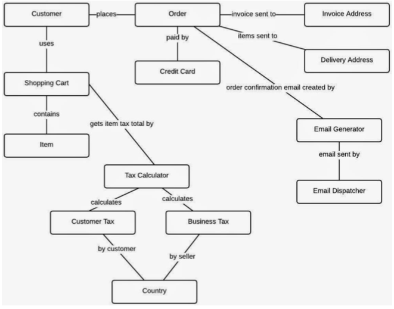
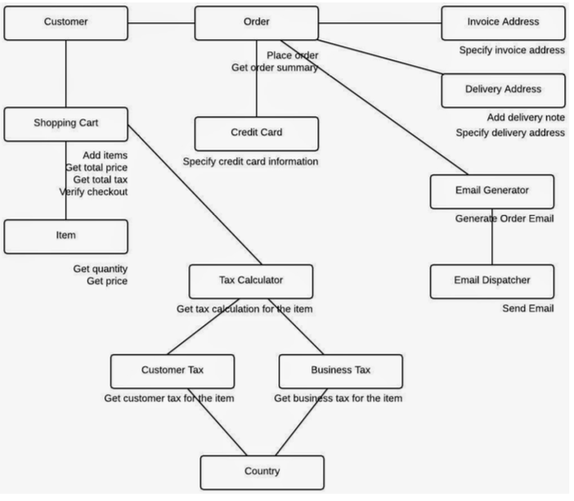
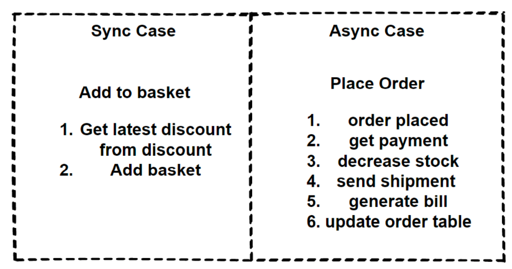
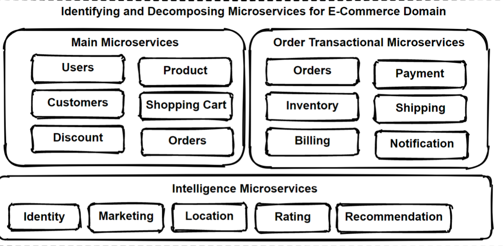

# What is Microservices ?

- Microservices are small, independent, and loosely coupled services that can work together.
- Each service is a separate codebase, which can be managed by a small development team.
- Microservices communicate with each other by using well- defined APIs.
- Microservices can be deployed independently and autonomously.
- Microservices can work with many different technology stacks which is technology agnostic.
- Microservices has its own database that is not shared with other services.

# What is Microservices Architecture ?

- The microservice architectural style is an approach to developing a single application as a suite of small services,
  each running in its own process and communicating with lightweight mechanisms, often an HTTP or gRPC API.
- Microservices architecture decomposes an application into small independent services that communicate over
  well-defined APIs. Services are owned by small, self-contained teams.
- Microservices architecture is a cloud native architectural approach in which services composed of many loosely coupled
  and independently deployable smaller components.
- Microservices have their own technology stack, communicate to each other over a combination of REST APIs, are
  organized by business capability, with the bounded contexts.
- Following Single Responsibility Principle that referring separating responsibilities as per services.

# Microservices Characteristics

- Componentization via Services
- Organized around Business Capabilities
- Products not Projects -> You build it and you run it -> Full responsibility
- Smart endpoints and dumb pipes
- Decentralized Governance
- Decentralized Data Management
- Infrastructure Automation
- Design for failure

# Benefits of Microservices Architecture

- Agility, Innovation and Time-to-market
- Flexible Scalability
- Small, focused teams
- Small and separated code base
- Easy Deployment
- Technology agnostic, Right tool for the job
- Resilience and Fault isolation
  - Microservices are fault toleranced and handle faults correctly for example by implementing retry and circuit
    breaking patterns.
- Data isolation

# Challenges of Microservices Architecture

- Complexity
  - Each service is simpler, but the entire system is more complex. Deployments and Communications can be complicated
    for hundreds of microservices.
- Network problems and latency
  - Microservice communicate with inter-service communication, we should manage network problems. Chain of services
    increase latency problems and become chatty API calls
- Development and testing
  - Hard to develop and testing these E2E processes in microservices architectures if we compare to monolithic ones.
- Data integrity
  - Microservice has its own data persistence. Data consistency can be a challenge. Follow eventual consistency where
    possible
- Deployment
  - Deployments are challenging. Require to invest in quite a lot of devops automation processes and tools. The
    complexity of microservices becomes overwhelming for human deployment.
- Logging & Monitoring
  - Distributed systems are required to centralized logs to bring everything together. Centralized view of the system to
    monitor sources of problems.
- Debugging
  - Debugging through local IDE isn’t an option anymore. It won’t work across dozens or hundreds of services.

# The Database-per-Service Pattern

- Core characteristic of the microservices architecture is the loose coupling of services. every service should have its
  own databases, it can be polyglot persistence among to microservices.
- E-commerce application. We will have Product - Ordering and SC microservices that each services data in their own
  databases. Any changes to one database don’t impact other microservices.
- The service’s database can’t be accessed directly by other microservices. Each service’s persistent data can only be
  accessed via Rest APIs.

### Benefits of the Database-per-Service Pattern with Polygot Persistence

- Data schema changes made easy without impacting other microservices.
- Each database can scale independently.
- Microservices domain data is encapsulated within the service.
- If one of the database server is down, this will not affect to other services.
- Polyglot data persistence gives ability to select the best optimized storage needs per microservices.
- Ex:
  - Product service using NoSQL document database for storing catalog related data.
  - Shopping cart service using a distributed cache that supports its simple, key-value data store.
  - Ordering service using a relational database to handle the rich relational structure.
  - NoSQL databases able to massive scale and high availability, and also schemaless structure give flexibility.

---

# Main Considerations groups which we need to solve

- Decomposition – Breaking Down Services
- Communications
- Data Management
- Transaction Management
- Deployments
- Resilience

---

# 1. Decomposition of Microservices Architecture

### Why we need to Decompose ?

- What is the main reason behind the decomposition of microservices ? provide to Scale Independently.
- Main benefits of microservices are "Independent Scale and Deployments".
- Clearly identify microservices which parts could be required independent scale and deploy.
- Design Principle: Decompose services by scalability requirements
- Applications are consist of multiple modules or services, with different requirements for scaling.

### Microservices Decomposition Pattern:

**1.1 Decompose by Business Capability**

- In Microservices Architecture, split the application as a set of loosely coupled services.
- 2 Prerequisite of decomposition of microservices:
  - Services must be **cohesive**. A service should implement a small set of strongly related functions.
  - Services must be **loosely coupled** - each service as an API that encapsulates its implementation.
- "Decompose by Business Capability" pattern offer:
  - Define services corresponding to business capabilities.
  - A business capability is a concept from business architecture modeling.
  - A business service should generate value.

**1.2: Decompose by Subdomain**

- Services must be cohesive. A service should implement a small set of strongly related functions.
- Services must be loosely coupled - each service as an API that encapsulates its implementation.
- "Decompose by Subdomain" pattern offer:
  - Define services corresponding to Domain-Driven Design (DDD) subdomains.
  - DDD refers to the application’s problem space, the business as the domain. A domain is consists of multiple
    subdomains.
  - Each subdomain corresponds to a different part of the business.

**1.3: Bounded Context Pattern (Domain-Driven Design)**

- DDD - Bounded Context Pattern which is one of the main pattern that we mainly use when decomposing microservices.
- Domains are required high cooperation and have a certain complexity by nature are called collaborative domains
- DDD has 2 phases, **Strategic and Tactical DDD.**
- **Strategic DDD**, we define the large-scale model of the system, defining to the business rules that allow designing
  loosely coupling units and the context map between them.
- **Tactical DDD** focuses on implementation and provides design patterns that we can use to build the software
  implementation.
- Include concepts such as entity, aggregate, value object, repository, and domain service.
- DDD domain defines its own common language and divides boundaries into specific, independent components. Common
  language is called **ubiquitous language**, and independent units are called **bounded context**.

- DDD is solving a complex problem is to break the problem into smaller parts and focus on smaller problems that are
  relatively easy.
- A complex domain may contain sub domains. And some of sub domains can combine and grouping with each other for common
  rules and responsibilities.
- Bounded Context is the grouping of closely related scopes that we can say logical boundaries.
- Bounded context is the logical boundary that represents the smaller problem particles of the complex domain that are
  self-consistent and as independent as possible.

**Identify Bounded Context Boundaries for Each Microservices:**

- How we can identify Bounded Context ?
- To identify bounded contexts use DDD.
- In DDD, use the Context Mapping pattern for identification of bounded contexts.
- With Context Mapping Pattern, we can identify the whole bounded contexts in the application and with their logical
  boundaries.
- The solution is using Context Mapping.
- The Context Map is a way to define logical boundaries between domains.
- Identify the Bounded Contexts by talking to the domain experts and using some clues.
- Once defined the Bounded Contexts, iterate design, those are not immutable.
- Reshape your Bounded Contexts by talking to the domain experts and consider refactoring's with the changing
  conditions.
- Its crucial to discuss with domain experts to defining domains and sub domains.
- Evaluate Bounded Context with the domain experts will help you identify to microservices.
- Sub domains inside of the Bounded Context are representing same data but naming differently due to domain experts
  areas.
- Should discuss several domain experts for their expertise areas.

**A Bounded Context == A Microservice ?**

- No right answer to this question under all circumstances.
- Bounded Context can create more than one Microservice.
- Decision to be made based on the microservice's need for scalability and independence.
- Since Bounded Context defines the boundaries of the domain, a Microservice determines the technical and organizational
  boundaries.
- Similar to Microservices, Bounded Contexts are autonomous and responsible by certain domain capability.
- Context Mapping and the Bounded Context pattern are good approaches for identifying microservices.

**Using Domain Analysis to Model Microservices**

- Microservices should be designed by business capabilities and should have loose coupling and autonomous services.
- We can change a particular microservices without affecting other services. Each service can be change independently.
- Domain-driven design (DDD) provides a set of methodology that we can follow the principles and create a well-designed
  microservices.
- Follow DDD-Bounded Context which following Context Mapping Pattern and decompose by sub domain models patterns.

**Checklist After Decompose Microservices**

- Microservice should do "one thing"
- Microservice size should not too big and not too small
- Avoid Chatty Communication
  - When you splitting functionality into two services, if those services becomes overly chatty communications, then its
    good to combine them into 1 service.
- No Locking Dependencies
  - If your services has inter-service dependencies more than 2 or 3, and if those are required to move and deploy
    together that means there are pain points of your design and its good to re-think again.
- It should always be possible to deploy a microservice without re-deploying any other services. Services should not be
  tightly coupled, and can evolve independently.

**Example:**

Identify steps:

- Requirements and Modelling
- Identify User Stories
- Identify the Nouns in the user stories
- Identify the Verbs in the user stories

Understand E-Commerce Domain: Functional Requirements:

- List products
- Filter products as per brand and categories
- Put products into the shopping cart
- Apply coupon for discounts and see the total cost all for all of the items in shopping cart
- Checkout the shopping cart and create an order
- List my old orders and order items history

Understand E-Commerce Domain: User Stories (Use Cases):

- As a user I want to list products
- As a user I want to filter products as per brand and categories
- As a user I want to put products into the shopping cart so that I can check out quickly later
- As a user I want to apply coupon for discounts and see the total cost all for all of the items that are in my cart
- As a user I want to checkout the shopping cart and create an order
- As a user I want to list my old orders and order items history
- As a user I want to login the system as a user and the system should remember my shopping cart items

Analysis E-Commerce Domain - Nouns and Verbs:

- As a user I want to **list** `products`
- As a user I want to be able to **filter** `products` as per `brand` and `categories`
- As a user I want to **see** the supplier of `product` in the product detail screen with all characteristics of product
- As a user I want to be able to **put** `products` that I want to **purchase** in to the `shopping cart` so I can check
  out
- As a user I want to **see** the total cost all for all of the `items` that are in my `cart` so that I see if I can
  afford to buy
- As a user I want to **see** the total cost of each `item` in the `shopping cart` so that I can re-check the price for
  items
- As a user I want to be able to **specify** the `address` of where all of the products are going to be sent to
- As a user I want to be able to **add** a note to the `delivery address` so that I can provide special instructions
- As a user I want to be able to **specify** my `credit card` information during **check out** so I can pay for the
  items
- As a user I want system to **tell** me how many items are in `stock` so that I know how many items I can purchase
- As a user I want to **receive** order confirmation email with `order` number so that I have proof of purchase
- As a user I want to **list** my old `orders` and `order items history`
- As a user I want to **login** the system as a `user` and the system should remember my shopping cart items

Analysis E-Commerce Domain - Nouns:

- Customer
- Order
- Order Details
- Product
- Shopping Cart
- Shopping Cart Items
- Supplier
- User
- Address
- Brand
- Category

Analysis E-Commerce Domain - Verbs:

- List products applying to paging
- Filter products by brand, category and supplier
- See product all information in the details screen
- Put products in to the shopping cart
- See total cost for all of the items
- See total cost for each item
- Checkout order with purchase steps
- Specify delivery address
- Specify delivery note for delivery address
- Specify credit card information
- Pay for the items
- Tell me how many items are in stock
- Receive order confirmation email
- List the order and details history
- Login the system and remember the shopping cart items

**Object Responsibility Diagram:**

**Main Use Case of Our E-Commerce Application:**

**Identifying and Decomposing Microservices for E-Commerce:**

---

