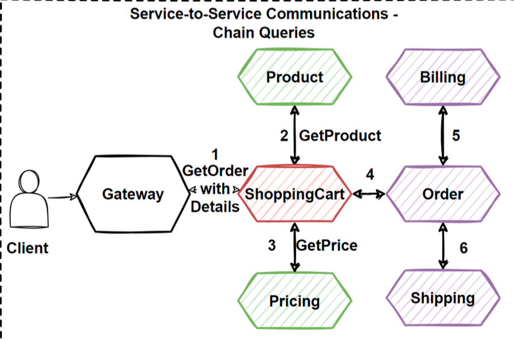
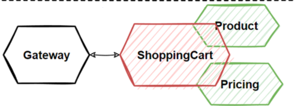
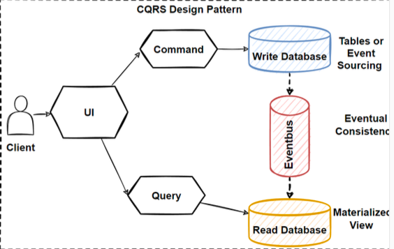

# What is Microservices ?

- Microservices are small, independent, and loosely coupled services that can work together.
- Each service is a separate codebase, which can be managed by a small development team.
- Microservices communicate with each other by using well- defined APIs.
- Microservices can be deployed independently and autonomously.
- Microservices can work with many different technology stacks which is technology agnostic.
- Microservices has its own database that is not shared with other services.

# What is Microservices Architecture ?

- The microservice architectural style is an approach to developing a single application as a suite of small services,
  each running in its own process and communicating with lightweight mechanisms, often an HTTP or gRPC API.
- Microservices architecture decomposes an application into small independent services that communicate over
  well-defined APIs. Services are owned by small, self-contained teams.
- Microservices architecture is a cloud native architectural approach in which services composed of many loosely coupled
  and independently deployable smaller components.
- Microservices have their own technology stack, communicate to each other over a combination of REST APIs, are
  organized by business capability, with the bounded contexts.
- Following Single Responsibility Principle that referring separating responsibilities as per services.

# Microservices Characteristics

- Componentization via Services
- Organized around Business Capabilities
- Products not Projects -> You build it and you run it -> Full responsibility
- Smart endpoints and dumb pipes
- Decentralized Governance
- Decentralized Data Management
- Infrastructure Automation
- Design for failure

# Benefits of Microservices Architecture

- Agility, Innovation and Time-to-market
- Flexible Scalability
- Small, focused teams
- Small and separated code base
- Easy Deployment
- Technology agnostic, Right tool for the job
- Resilience and Fault isolation
  - Microservices are fault toleranced and handle faults correctly for example by implementing retry and circuit
    breaking patterns.
- Data isolation

# Challenges of Microservices Architecture

- Complexity
  - Each service is simpler, but the entire system is more complex. Deployments and Communications can be complicated
    for hundreds of microservices.
- Network problems and latency
  - Microservice communicate with inter-service communication, we should manage network problems. Chain of services
    increase latency problems and become chatty API calls
- Development and testing
  - Hard to develop and testing these E2E processes in microservices architectures if we compare to monolithic ones.
- Data integrity
  - Microservice has its own data persistence. Data consistency can be a challenge. Follow eventual consistency where
    possible
- Deployment
  - Deployments are challenging. Require to invest in quite a lot of devops automation processes and tools. The
    complexity of microservices becomes overwhelming for human deployment.
- Logging & Monitoring
  - Distributed systems are required to centralized logs to bring everything together. Centralized view of the system to
    monitor sources of problems.
- Debugging
  - Debugging through local IDE isn’t an option anymore. It won’t work across dozens or hundreds of services.

# The Database-per-Service Pattern

- Core characteristic of the microservices architecture is the loose coupling of services. every service should have its
  own databases, it can be polyglot persistence among to microservices.
- E-commerce application. We will have Product - Ordering and SC microservices that each services data in their own
  databases. Any changes to one database don’t impact other microservices.
- The service’s database can’t be accessed directly by other microservices. Each service’s persistent data can only be
  accessed via Rest APIs.

### Benefits of the Database-per-Service Pattern with Polygot Persistence

- Data schema changes made easy without impacting other microservices.
- Each database can scale independently.
- Microservices domain data is encapsulated within the service.
- If one of the database server is down, this will not affect to other services.
- Polyglot data persistence gives ability to select the best optimized storage needs per microservices.
- Ex:
  - Product service using NoSQL document database for storing catalog related data.
  - Shopping cart service using a distributed cache that supports its simple, key-value data store.
  - Ordering service using a relational database to handle the rich relational structure.
  - NoSQL databases able to massive scale and high availability, and also schemaless structure give flexibility.

---

# Main Considerations groups which we need to solve

- Decomposition – Breaking Down Services
- Communications
- Data Management
- Transaction Management
- Deployments
- Resilience

---

# 1. Decomposition of Microservices Architecture

### Why we need to Decompose ?

- What is the main reason behind the decomposition of microservices ? provide to Scale Independently.
- Main benefits of microservices are "Independent Scale and Deployments".
- Clearly identify microservices which parts could be required independent scale and deploy.
- Design Principle: Decompose services by scalability requirements
- Applications are consist of multiple modules or services, with different requirements for scaling.

### Microservices Decomposition Pattern:

**1.1 Decompose by Business Capability**

- In Microservices Architecture, split the application as a set of loosely coupled services.
- 2 Prerequisite of decomposition of microservices:
  - Services must be **cohesive**. A service should implement a small set of strongly related functions.
  - Services must be **loosely coupled** - each service as an API that encapsulates its implementation.
- "Decompose by Business Capability" pattern offer:
  - Define services corresponding to business capabilities.
  - A business capability is a concept from business architecture modeling.
  - A business service should generate value.

**1.2: Decompose by Subdomain**

- Services must be cohesive. A service should implement a small set of strongly related functions.
- Services must be loosely coupled - each service as an API that encapsulates its implementation.
- "Decompose by Subdomain" pattern offer:
  - Define services corresponding to Domain-Driven Design (DDD) subdomains.
  - DDD refers to the application’s problem space, the business as the domain. A domain is consists of multiple
    subdomains.
  - Each subdomain corresponds to a different part of the business.

**1.3: Bounded Context Pattern (Domain-Driven Design)**

- DDD - Bounded Context Pattern which is one of the main pattern that we mainly use when decomposing microservices.
- Domains are required high cooperation and have a certain complexity by nature are called collaborative domains
- DDD has 2 phases, **Strategic and Tactical DDD.**
- **Strategic DDD**, we define the large-scale model of the system, defining to the business rules that allow designing
  loosely coupling units and the context map between them.
- **Tactical DDD** focuses on implementation and provides design patterns that we can use to build the software
  implementation.
- Include concepts such as entity, aggregate, value object, repository, and domain service.
- DDD domain defines its own common language and divides boundaries into specific, independent components. Common
  language is called **ubiquitous language**, and independent units are called **bounded context**.

- DDD is solving a complex problem is to break the problem into smaller parts and focus on smaller problems that are
  relatively easy.
- A complex domain may contain sub domains. And some of sub domains can combine and grouping with each other for common
  rules and responsibilities.
- Bounded Context is the grouping of closely related scopes that we can say logical boundaries.
- Bounded context is the logical boundary that represents the smaller problem particles of the complex domain that are
  self-consistent and as independent as possible.

**Identify Bounded Context Boundaries for Each Microservices:**

- How we can identify Bounded Context ?
- To identify bounded contexts use DDD.
- In DDD, use the Context Mapping pattern for identification of bounded contexts.
- With Context Mapping Pattern, we can identify the whole bounded contexts in the application and with their logical
  boundaries.
- The solution is using Context Mapping.
- The Context Map is a way to define logical boundaries between domains.
- Identify the Bounded Contexts by talking to the domain experts and using some clues.
- Once defined the Bounded Contexts, iterate design, those are not immutable.
- Reshape your Bounded Contexts by talking to the domain experts and consider refactoring's with the changing
  conditions.
- Its crucial to discuss with domain experts to defining domains and sub domains.
- Evaluate Bounded Context with the domain experts will help you identify to microservices.
- Sub domains inside of the Bounded Context are representing same data but naming differently due to domain experts
  areas.
- Should discuss several domain experts for their expertise areas.

**A Bounded Context == A Microservice ?**

- No right answer to this question under all circumstances.
- Bounded Context can create more than one Microservice.
- Decision to be made based on the microservice's need for scalability and independence.
- Since Bounded Context defines the boundaries of the domain, a Microservice determines the technical and organizational
  boundaries.
- Similar to Microservices, Bounded Contexts are autonomous and responsible by certain domain capability.
- Context Mapping and the Bounded Context pattern are good approaches for identifying microservices.

**Using Domain Analysis to Model Microservices**

- Microservices should be designed by business capabilities and should have loose coupling and autonomous services.
- We can change a particular microservices without affecting other services. Each service can be change independently.
- Domain-driven design (DDD) provides a set of methodology that we can follow the principles and create a well-designed
  microservices.
- Follow DDD-Bounded Context which following Context Mapping Pattern and decompose by sub domain models patterns.

**Checklist After Decompose Microservices**

- Microservice should do "one thing"
- Microservice size should not too big and not too small
- Avoid Chatty Communication
  - When you splitting functionality into two services, if those services becomes overly chatty communications, then its
    good to combine them into 1 service.
- No Locking Dependencies
  - If your services has inter-service dependencies more than 2 or 3, and if those are required to move and deploy
    together that means there are pain points of your design and its good to re-think again.
- It should always be possible to deploy a microservice without re-deploying any other services. Services should not be
  tightly coupled, and can evolve independently.

**Example:**

Identify steps:

- Requirements and Modelling
- Identify User Stories
- Identify the Nouns in the user stories
- Identify the Verbs in the user stories

Understand E-Commerce Domain: Functional Requirements:

- List products
- Filter products as per brand and categories
- Put products into the shopping cart
- Apply coupon for discounts and see the total cost all for all of the items in shopping cart
- Checkout the shopping cart and create an order
- List my old orders and order items history

Understand E-Commerce Domain: User Stories (Use Cases):

- As a user I want to list products
- As a user I want to filter products as per brand and categories
- As a user I want to put products into the shopping cart so that I can check out quickly later
- As a user I want to apply coupon for discounts and see the total cost all for all of the items that are in my cart
- As a user I want to checkout the shopping cart and create an order
- As a user I want to list my old orders and order items history
- As a user I want to login the system as a user and the system should remember my shopping cart items

Analysis E-Commerce Domain - Nouns and Verbs:

- As a user I want to **list** `products`
- As a user I want to be able to **filter** `products` as per `brand` and `categories`
- As a user I want to **see** the supplier of `product` in the product detail screen with all characteristics of product
- As a user I want to be able to **put** `products` that I want to **purchase** in to the `shopping cart` so I can check
  out
- As a user I want to **see** the total cost all for all of the `items` that are in my `cart` so that I see if I can
  afford to buy
- As a user I want to **see** the total cost of each `item` in the `shopping cart` so that I can re-check the price for
  items
- As a user I want to be able to **specify** the `address` of where all of the products are going to be sent to
- As a user I want to be able to **add** a note to the `delivery address` so that I can provide special instructions
- As a user I want to be able to **specify** my `credit card` information during **check out** so I can pay for the
  items
- As a user I want system to **tell** me how many items are in `stock` so that I know how many items I can purchase
- As a user I want to **receive** order confirmation email with `order` number so that I have proof of purchase
- As a user I want to **list** my old `orders` and `order items history`
- As a user I want to **login** the system as a `user` and the system should remember my shopping cart items

Analysis E-Commerce Domain - Nouns:

- Customer
- Order
- Order Details
- Product
- Shopping Cart
- Shopping Cart Items
- Supplier
- User
- Address
- Brand
- Category

Analysis E-Commerce Domain - Verbs:

- List products applying to paging
- Filter products by brand, category and supplier
- See product all information in the details screen
- Put products in to the shopping cart
- See total cost for all of the items
- See total cost for each item
- Checkout order with purchase steps
- Specify delivery address
- Specify delivery note for delivery address
- Specify credit card information
- Pay for the items
- Tell me how many items are in stock
- Receive order confirmation email
- List the order and details history
- Login the system and remember the shopping cart items

**Object Responsibility Diagram:**

**Main Use Case of Our E-Commerce Application:**

**Identifying and Decomposing Microservices for E-Commerce:**

---

# Communications

Main Reasons of Why should use API Gateway:

- Client Can't Manage Communications
  - The client applications can try to handle multiple calls to microservice endpoints, not manageable when it comes to
    communicates with different protocols like http, GraphQL, gRPC and WebSocket.
- Complex Client Code
  - Cause to lots of requests to the backend services, create possible chatty communications. Increases latency and
    complexity on the UI side. Becomes complex client code.
- Strong Coupling
- Cross-cutting Concerns
  - Authentication, Authorization, Rate Limiting, SSL certifications, Logging, Monitoring, Load Balancing and Circuit
    Breaker. Implementing all these cross- cutting concerns for every microservice is not a good solution.
- Protocol Exchanges
  - Communication required to use different protocols like exposing HTTP Rest API but continue to gRPC for internal
    communications or exposing WebSocket protocol. Requests must be translate to the other protocols afterwards
- Async Communication Requirements
  - Client application can't use async communication due to not supported AMQP protocols. Microservices uses async
    communication in order to decouple communication as soon as possible. Hard to implement event-driven publish-
    subscribe model.
- Payload Changes for Different Clients
  - Web, Mobile and other client applications might be required different payloads when communicating with internal
    services. It requires to optimize data responses from services tailored with client applications.

API Gateway Patterns:

- Use API Gateways between client and internal microservices and it is a single point of entry to the client
  applications.
- API Gateway sits between the client and multiple backend services and manage routing to internal microservices.
- API Gateways can handle that Cross-cutting concerns like authentication, authorization, protocol translations, Rate
  Limiting, Logging, Monitoring, Load Balancing.
- API Gateway Patterns:
  - Gateway Routing pattern
  - Gateway Aggregation pattern
  - Gateway Offloading pattern

Gateway Routing pattern:

- Route requests to multiple microservices with exposing a single endpoint.
- Useful when expose multiple services on a single endpoint and route them to internal backend microservices based on
  the request.
- The client needs to consume several microservices, Gateway Routing pattern offers to create a new endpoint that handle
  the request and route this request for each service.
- E-commerce application might provide services such as search Customers, Shopping cart, discount, and order history.
- If one of microservices are changed, the Client doesn't know anything and not need to change any code on client side,
  the only changes will be configuration routing changes.
- It abstracts your backend microservices from the client applications, with allowing to keep client codes simple, even
  backend services are changed on behind the API Gateway.
- Deploy microservices APIs with blue/green or canary deployments with multiple API versions of same microservices, you
  can gradually shift your request to new API with using the Gateway Routing Pattern.
- Gateway Routing Pattern gives you the flexibility to use different API versions routing to the requests.
- If new version of API has got exceptions, it can be quickly reverted back by making only a configuration change.
- Use Application Layer 7 routing to route the request to the internal services.

Gateway Aggregation Pattern:

- API Gateway service that provide to aggregate multiple individual requests towards to internal microservices with
  exposing a single request to the client.
- Use if client application have to invoke several different backend microservices to perform its logic.
- Client applications need to make multiple calls to different backend microservices, this leads to chattiness
  communications and impact the performance.
- If new service added into use cases, then client need to send additional request that increase the network calls and
  latency.
- To abstract complex internal backend service communication from the client applications.
- Dispatches requests to the several backend services, then aggregates the results and sends them back to the requesting
  client.

Gateway Offloading Pattern:

- Gateway Offloading Pattern offers to combine commonly used shared functionalities into a gateway proxy services.
- Shared functionalities can application development by moving shared service functionality into centralized places.
- Authentication, Authorization, Rate Limiting, SSL certifications, Logging, Monitoring, Load Balancing.
- Implementing cross-cutting concerns for every microservice is not a good solution.
- Gateway Offloading Pattern offers to manage all those Cross-cutting Concerns into API Gateways.
- Simplify the development of microservices by removing the cross-cutting concerns on services to maintain supporting
  resources, allow to focus on the application functionality.

API Gateway Pattern - Summarized:

- API gateway locate between the client apps and the internal microservices.
- Working as a reverse proxy and routing requests from clients to backend services and provide cross-cutting concerns
  like authentication, SSL termination, and cache.
- Several client applications connect to single API Gateway possible to single-point-of-failure risk.
- If these client applications increase, or adding more logic to business complexity in API Gateway, it would be anti-
  pattern.
- Best practices is splitting the API Gateway in multiple services or multiple smaller API Gateways: BFF-Backend-
  for-Frontend Pattern.
- Should segregated based on business boundaries of the client applications.

Main Features of API Gateway Pattern:

- **Reverse Proxy and Gateway Routing** Reverse proxy to redirect requests to the endpoints of the internal
  microservices. Using Layer 7 routing for HTTP requests for redirections. Decouple client applications from the
  internal microservices. Separating responsibilities on network layer and abstracting internal operations.
- **Requests Aggregation and Gateway Aggregation** Aggregate multiple internal microservices into a single client
  request. Client application sends a single request to the API Gateway and it dispatches several requests to the
  internal microservices and then aggregates the results and sends back to the client application in 1 single response.
  Reduce chattiness communication.
- **Cross-cutting Concerns and Gateway Offloading** Best practice to implement cross-cutting functionality on the API
  Gateways. Cross-cutting functionalities can be; Authentication and authorization, Service discovery, Response caching,
  Retry policies, Circuit Breaker, Rate limiting and throttling, Load balancing, Logging, tracing, IP allowlisting.

Backends for Frontends Pattern - BFF:

- Backends for Frontends pattern basically separate API Gateways as per the specific frontend applications.
- Single API Gateway makes a single-point-of failure.
- BFF offers to create several API Gateways and grouping the client applications according to their boundaries.
- A single and complex API Gateway can be risky and becoming a bottleneck into your architecture.
- Larger systems often expose multiple API Gateways by grouping client type like mobile, web and desktop functionality.
- Create several API Gateways as per user interfaces to provide to best match the needs of the frontend environment.
- BFF Pattern is to provide client applications has a focused interfaces that connects with the internal microservices.

# Service-to-Service Communications between Backend Internal Microservices:

- Created API Gateways and separate this API Gateways following the BFF Pattern.
- Sync request comes from the clients and goes to internal microservices over the API Gateways.
- What if the client requests are required to visit more than one internal microservices ? How we can manage internal
  microservice communications ?
- Best practice is reducing inter-service communication as much as possible.
- In some cases, we can't reduce these internal communications due to operation need to visit several internal services.
- Client send query request to internal microservices to accumulate some data in the sceen page of frontend.
- User addItem into shopping cart, these operation need to get data from Product and Price microservices.
- Synchronous communcation over the API Gateways which is the Request/Response Messaging.
- The client send http request to the microservices for querying or adding item into Shopping Cart:
  - 1- The client send request to API Gateway
  - 2- API Gateway dispatch request to ShoppingCart
  - 3- SC need to extend information by sending sync request to Product and Pricing microservices
- Internal calls makes coupling each microservices.
- If one of the microservices is down, it can't return data to the client so its not any fault-tolerance.
- If service calls are much then a few HTTP calls to multiple microservices, than it goes to un-manageable situation.
- Place Order Use Case: client checkout shopping cart, start order fulfillment processes.
- Request/Response Sync Messaging end up with 6 sync chain HTTP Request.
- Increase latency and negatively impact the performance, scalability, and availability.
- What if the step 5 or 6 is failed ?
- We can apply 2 way to solve this issues:
  - 1- **Change microservices communications to async way**
  - 2- **Use Service Aggregator Pattern to aggregate some query operations in 1 API Gateway.**

**Service Aggregator Pattern:**

- Service Aggregator Pattern is receives a request from the client or API Gateway.
- Dispatches requests of multiple internal backend microservices.
- Combines the results and responds back to the initiating request in 1 response structure.
- Reduces chattiness and communication overhead between the client and microservices
- AddItem aggregates request data from to several back-end microservices: Product - SC and Pricing.
- Isolates the underlying addItem operation that makes calls to multiple back-end microservices.
- Centralizing its logic into a specialized microservice.

**Service Registry/Discovery Pattern:**

- Microservice Discovery Patterns and Service Registry provide to register and discover microservices in the cluster.
- Why We Need Service Discovery Pattern ? When deploying and scaling microservices, more microservices and instances
  could be added to the system to provide scalability to the distributed application.
- Service locations can change frequently, more dynamic configuration is needed for the microservice architecture.
- IP Addresses and network locations are dynamically assigned and often change due to auto-scaling features.
- Service Registry and Discovery pattern allows to find the network locations of microservices without injecting or
  coupling services.
- To find the network locations of microservices, the service discovery pattern is used in microservices applications.
- It will provide to register and discover microservices in the cluster.
- API Gateways for routing the traffic with client and internal microservices. How API Gateways access the internal
  backend microservices ?
- Service discovery pattern uses a centralized server for «service registry» to maintain a central view of microservices
  network locations.
- Services update their locations in the service registry at fixed intervals. Clients can connect to the service
  registry and fetch the locations of microservices.
- There are 2 main service discovery patterns: - Client-side service discovery
- Server-side service discovery

# Microservices Asynchronous Message- Based Communication

Synchronous communication:

- Synchronous communication is using HTTP or gRPC protocol for returning synchronous response.
- The client sends a request and waits for a response from the service.
- The client code block their thread, until the response reach from the server.
- The synchronous communication protocols can be HTTP or HTTPS.
- The client sends a request with using http protocols and waits for a response from the service.
- The client call the server and block client their operations.
- The client code will continue its task when it receives the HTTP server response.

Asynchronous Communication:

- The client sends a request but it doesn't wait for a response from the service. The client should not have blocked a
  thread while waiting for a response.
- AMQP (Advanced Message Queuing Protocol)
- Using AMQP protocols, the client sends the message with using message broker systems like Kafka and RabbitMQ queue.
- The message producer does not wait for a response.
- Message consume from the subscriber systems in async way, and no one waiting for response suddenly.
- If there is busy interactions in communication across multiple microservices, then use asynchronous messaging
  platforms.
- Message brokers are responsible for handling the message sent by the producer service in async messaging-based
  communication.
- If the consumer service is down at the moment, the broker might be configured to retry as long as necessary for
  successful delivery.
- Messages can be persisted if required or stored only in memory.
- Message broker is responsible for delivering the message.
- No longer necessary for both microservices to be up and running for successful communication.
- Async messaging provides loosely couple communication.

Benefits of Asynchronous Communication:

- New Subscriber Services Adding new services is very simple. We can easily subscribe to message that we want to
  receive. The producer doesn’t need to be know about subscribers, we can remove and add subscribers without affecting
  producer service.
- Scalability With async communications we can easier to manage scalability issues, can scale producer, consumer and
  message broker system independently. Scale services according to incoming messages into event bus system. Kubernetes
  KEDA Auto-scalers.
- Event-driven Microservices With async communication, we can provide event-driven architectures which is best way to
  communicate between microservices.
- Retry mechanisms Brokers can retry to sending message and keep trying automatically without any custom solutions.

Challenges of Asynchronous Communication:

- Single Point of Failure - Message Broker The message broker becomes a single point of failure. We should not rely of
  all communication with a single node of message brokers, instead we should scale it and use hybrid communication with
  sync and async in your cases.
- Debugging difficult to debug issues with async communication, it can be hard to trace the flow of a single operation
  across service boundaries. debugging of the flow and the payload of events takes so many times and hard to debug at
  the same time.
- At-least-once delivery and Not Guarantee an order of messages Mostly Brokers use at-least-once delivery and not
  Guarantee order of messages. Should embrace these message delivery mechanism with applying idempotency consumers and
  not designing FIFO requires cases.

- Use Asynchronous message-based communication when you have multiple microservices are required to interact each other
  without any dependency.
- Asynchronous message-based communication is works with events.
- Events can place the communication between microservices: Event-driven communication.
- If any changes happens in microservices, it is propagating changes across multiple microservices as an event.
- Events consumed by subscriber microservices.
- Event-driven communication bring us Eventual consistency.

2 Type of Asynchronous Messaging Communication:

- Single-receiver Message-based Communication (1-1 model/ point to point model)
- Multi-receiver Message-based Communication (1-Many model/ publish-subscribe model)

Single-receiver Message-based Communication:

- one-to-one (queue) or point-to-point communications.
- If you send 1 request to the specific consumer, and this operation will take long time, use this Single-receiver async
  one-to-one communication.
- Single producer and single receiver; implementation as a Command Pattern.

Multiple-receiver Message-based Communication:

- Publish/subscribe mechanisms that has multiple receivers.
- Producer service publish a message and it consumes from several microservices by subscribing message on the message
  broker system.
- Publisher don't need to know any subscriber, no any dependecy with communication parties.
- one-to-many (topic) implementation has Multiple receivers. Each request can be processed by zero to multiple
  receivers.
- Publish/subscribe used in patterns Event-driven microservices architecture.
- Message broker system is publishing events between multiple microservices, subscribing these events in an async way.
- Messages are available to all subscribers and the topic can have more than one subscriber.
- The message remains persistent in a topic until they are deleted.
- Kafka, RabbitMQ or Amazon SNS and EventBridge.
- Event-driven Architecture, CQRS pattern, event storming, eventual consistency principles.

Fan-Out & Message Filtering with Publish/Subscribe Pattern:

- Fan-out is a messaging pattern; ‘fanned out’ to multiple destination in parallel.
- Each of destinations can work and process this messages in parallel.
- Publisher/subscriber model to define a topic which is logical access point to enabling message communication with
  asynchronously.
- Publisher sends the message to the topic, message is immediately fanned out to all subscribers of this topic.
- Each service can operate and scale independently and individually that completely decoupled and asnycronously.
- The publisher and the subscribers don’t need to know who is publishing / consuming this message that is broadcasting.
- Deliver the same message to multiple receivers is to use the Fanout Publish/Subscribe Messaging Pattern.

---

# Microservices Database Management Patterns and Principles

- Managing a microservices database is challenging job, should have a strategy.
- Challenging to implement queries and transactions that visits to several microservices.

### Microservices Database Management Patterns and principles:

- The Database-per-Service pattern
- The API Composition pattern
- The CQRS pattern
- The Event Sourcing pattern
- The Saga pattern
- The Shared Database anti-pattern

**Overview of patterns:**

**1. The Database-per-Service Pattern:**

- In order to be a loose coupling of services, each microservice should have its own private database. Design database
  architecture for microservices.
- Microservices should be loosely coupled, scalable, and independent. When shifting to the monolithic architecture to
  microservices architecture, should decomposes databases.
- Distributed data model with many smaller databases for particular microservice.
- Data schema changes can perform without any impact on other microservices, Changes to an individual database don’t
  impact other services.
- There isn’t a single point of failure in the application, the application is becomes more resilient.
- Individual databases are easier to scale, if 1 service peek the requests that only that microservice can scale
  independently.
- Separating databases can gives us to ability to pick the best optimized database for our microservices.
- Can choices include relational, document, key-value, and even graph-based data stores.
- Using the most efficient database depending on the service requirements and functionality.
- Drawback:
  - Services need a communication method to exchange data, inter-service communication.
  - Each service must provide a clear API, that need to make resilience of these communications like applying retry and
    circuit breaker patterns.
  - Distributed transactions across microservices can negatively impact consistency and atomicity.
  - Complex queries, no simple way to execute join queries on multiple data stores.

**2. The Shared Database Anti-Pattern:**

- You can create a single shared database with each service accessing data using local ACID transactions. But it is
  against to microservices nature and will cause serious problems in the future of applications.
- If we don’t follow Database-per-Service pattern and use Shared Database for several microservices = Anti-Pattern
- It is against to microservices nature and will cause serious problems in the future of applications.
- When using a shared database, the microservices lose their core properties: scalability, resilience, and independence.
- You will face to develop big a few monolithic applications instead of microservices.
- Shared database can block microservices due to single- point-of-failure.
- If shared database seems to be the best option for the microservices project, should re-think that we really need the
  microservices, the monolith would be the better choice.
- Benefits:
  - Transaction management, that we don't need to span the transactions over the microservices.
  - Decrease duplicate data. Since data is fully constrained, we can easily execute complicated queries with joins.
  - Able to follow ACID. Consistency of data and state easily manage when process fails.
- Drawbacks:
  - Microservices with shared databases can’t easily scale.
  - Shared database will become a single point of failure.
  - Microservices won’t be independent in terms of development and deployment.

The API Composition Pattern:

Retrieving data from several services also need a set of patterns and practices. When implements a query by invoking
several microservices, we will follow the API Composition, Gateway Aggregation patterns for combining the results.

The CQRS Pattern:

The command query responsibility segregation (CQRS) is provide to seperate commands and queries database in order to
better perform querying several microservices.

The Event Sourcing Pattern:

The Event Sourcing pattern basically provide to accumulate events and aggregates them into sequence of events in
databases. We can replay at certain point of events.

The Saga Pattern:

Transaction management in really hard when it comes to microservices architectures. We use Saga Pattern to implementing
transactions between several microservices and maintaining data consistency.

---

# Database Choises for microservices

### Polyglot Persistence

- Microservices enables using different kinds of data storing technologies.
- Each development team can choose the persistence technology that suits the needs of their service best.
- Martin Fowler - Polyglot persistence will come with a cost - but it will come because the benefits are worth it.
- When relational databases are used inappropriately, they give damaged on application development.
- Example of looked up page elements by ID, much better suited to a key-value No-SQL databases than relational
  databases.

## How to Choose a Database for Microservices ?

- Relational Databases - RDBMS
  - Relational databases provides storing data into related data tables.
  - Relational database tables have a fixed schema, use SQL to manage data and support transactions with ACID
    principles.
  - A table uses columns and rows for storing the actual data. Each table will have a column that must have unique
    values—known as the primary key.
  - The main advantages of Relational database is ACID compliance. If one change fails, the whole transaction will fail.
  - Example of relational databases are Oracle, MS SQL Server, MySQL, PostgreSQL.

- No-SQL Databases (Non-Relational Databases)
  - No-SQL databases has different types of stored data and data models: Document, Key-value, Graph-based, Column-based
    databases.
  - Ease-of-use, scalability, resilience, and availability characteristics.
  - NoSQL databases stores unstructured data, and this gives huge performance advantage.
  - NoSQL stored unstructured data in key-value pairs or JSON documents.
  - No-SQL databases don't provide ACID guarantees.
  - Drawback is transaction management.

No-SQL Document Databases:

- Document databases stores and query data in JSON-based documents.
- Data and metadata are stored hierarchically.
- Objects are mapping to the application code.
- Don’t have to run JOINs or decompose data across tables.
- Scalability, document databases can distributed very well.
- Best choise for content management and storing catalogs.
- I.e. products data can store in document database for e- commerce applications.
- Example Document Databases: MongoDB and Cloudant.

No-SQL Key-Value Databases:

- Data is storing as a collection of key-value pairs in Key- value NoSQL database.
- Data is represented as a group of key-value in the database.
- Best choise for session-oriented applications.
- I.e. storing customer basket data into key-value database.
- Example Key-Value Databases: Redis, Amazon DynamoDB, Azure CosmosDB, Oracle NoSQL Database.

No-SQL Column-Based Databases:

- Column-based databases also known Wide-Column Databases.
- Data is stored in columns, by this way, it can access necessary data more faster than if we compare to storing data in
  rows.
- If you select mostly same columns in your databases, its good to use this databases.
- It doesn't scanning the unnecessary information in a whole row.
- Column-based databases can scale by columns independently.
- Columns could be different database servers.
- I.e. building a Data warehouse, Big Data processing.
- Apache Cassandra, Apache HBase or Amazon DynamoDB, Azure CosmosDB.

No-SQL Graph-Based Databases:

- Graph-based databases is stores data in a graph structure into node, edge, and data properties.
- Data entities are connected in nodes.
- The main benefit of a graph-based databases is to store and navigate graph relationships.
- I.e. fraud detection, social networks, and recommendation engines.
- Example of Graph-based databases are OrientDB, Neo4j, and Amazon Neptune.

When to Use Relational Databases ?

- Read Requirements, Complex Join Queries Relational Database has a fixed schema. When relationships between tables are
  important and data is highly structured and requires referential integrity.
- Can work with complex queries, table joins and reports on normalized data models.
- Relational Database supports a powerful SQL query language.
- Deployments, Centralized Structure Relational Databases will be deployed to large and one or few locations. Relational
  database has centralized structure.
- Relational databases have a single point of failure with failover.
- Relation database is deployed in vertical fashion.

When to Use No-SQL Databases ?

- Flexible Schema, Dynamic Data NoSQL Database has no fixed schema. Allows to add or remove attributes into their model
  with dynamically. When your data is dynamic and frequently changes.
- Use case of implement an IoT platform that stores data from different kinds of sensors with frequently changed the
  attributes of your data.
- Un-predictable Data, High Workload Volume When you have high volume workloads and needs to horizontal scale with low
  latency. NoSQL databases have been designed for the cloud that naturally good for horizontal scaling.
- NoSQL Databases prioritize partition tolerance that designed for handling large amount of data or data coming in high
  velocity.
- Frequently Change Data and Read Requirements When data is dynamic and frequently changes and Relationships are de-
  normalized data models and Data retrieve operations are simple and performs without table joins.
- Data Consistency, BASE Model - Basically Available, Soft State, Eventually Consistent NoSQL Database is only
  eventually consistent and don't support transactions, focus on high volume data and horizontal scaling.
- Write Performance Requirements NoSQL Database compromise consistency to achieve fast write performance, offers to fast
  write operations with Eventual consistency.
- Not Good for Complex Join Queries NoSQL Databases perform best when data is stored in the same format not require to
  relation and join operations.
- Deployments, De-centralized Structure NoSQL is scale horizontally so data is replicated across different geographical
  zones and provides better control over consistency, availability, and performance.
- NoSQL databases have no single point of failure, has decentralized structure, gives both read and write scalability,
  deployed in horizontally.

Focus The Data Type That Need to Store , Consider the type of data that you have:

- Store JSON documents in No-SQL Document database.
- Put transactional data into a Relational SQL database.
- Use a time series data base for telemetry databases.
- Choose Blob Data Storage for blob datas.
- Put application logs into Elastic Search Databases.

Trade-offs between Availability and Consistency:
Understand the Trade-offs between Availability and Consistency. Should prefer High Availability over strong consistency
as soon as possible to scale horizontally. (the CAP theorem)

Transactional Boundaries Between Microservices:
Consider business Transactional Boundaries Between Microservices, that data need to consistent across those
microservices. Prepare for compensating transactions in case of fail.

---

# Microservices Data Management - Commands and Queries

Problem:

- Cross-Service Queries with Complex JOIN operations
- Read and write operations at scale
- Distributed Transaction Management

Solutions:

- Microservices Data Query Pattern and Best Practices
- Materialized View Pattern
- CQRS Design Pattern
- Event Sourcing Pattern

What is Microservices Cross-Service Queries?

- Monolithic architectures, its very easy to query different entities, Querying data across multiple tables is
  straightforward.
- Microservices architectures uses polyglot persistence, has different databases, need strategy to manage queries.
- What if the client requests are visit more than one internal microservices ?
- E-commerce application we have product, basket, discount, ordering microservices that needs to interact each other to
  perform customer use cases.
- Integrations are querying each services data for aggregation or perform logics.

How can we manage these cross-services queries ?

Assumptions:

- Direct HTTP Communication
  - Not a good solution that makes coupling each microservices, and loose power of microservices independency.
- Async Communication
  - The best practice is reducing inter-service communication as much as possible and use async communication. Can't
    reduce these internal communications due to customer requirement.
- Client send query request to internal microservices to accumulate some data.
- Those query request wait immediate response so we can't proceed with async communication.
- Transient errors, Network congestion or any overloaded microservice can result in long-running and failed operations.
- Materialized View Pattern
  - Reduce inter-service communication and provide sync response.

Before we understand more see below examples of Cross queries:

Microservices Cross-Service Queries Chain Queries – Get Order with All Details:

Cross-Service Query Solutions in Microservices:

Weak Solutions:

- Sync Communication: Use Service Aggregator Pattern but it increase coupling and latency.
- Async Communication: Provide decoupling but query request are waiting immediate response.

Solutions:

- Materialized View Pattern
- CQRS Design Pattern

### Materialized View Pattern

- Instead of querying the Product Catalog and Pricing services, SC maintains its own local copy of that data.
- With Materialized View Pattern, even if the Catalog and Pricing services are down, Shopping Cart can continue.
- Broke the direct dependency of other microservices and make faster the response time, help efficient querying and
  improve application performance.
- Generate pre-populated views of data, more suitable format for querying and provide good query performance.
- Includes joining tables and combining data entities and calculated columns and execute transforms.
- Views are disposible and can rebuilt from the source.
- With appying Materialized View Pattern, we have duplicated data into our system.
- Duplicating data is not a anti-pattern, have strategically duplicating our data for microservice communications.
- Only one service can be a data ownership.
- _How and when the denormalized data will be updated ?_
  - When the original data changes it should update into sc microservices.
  - Need to synchronize the read models when the main service of data is updated.
  - Solve with using asynchronous messaging and publish/subscribe pattern.
  - Publish an event and consumes from the subscriber service to update its denormalized table.
  - Using a scheduled task, an external trigger, or a manual action to regenerate the table.

### CQRS (Command Query Responsibility Segregation)

- CQRS design pattern in order to avoid complex queries to get rid of inefficient joins.
- Separates read and write operations with separating databases.
- Commands: changing the state of data into application.
- Queries: handling complex join operations and returning a result and don't change the state of data into application.
- Large-scaled microservices architectures needs to manage high-volume data requirements.
- Single database for services can cause bottlenecks.
- Uses both CQRS and Event Sourcing patterns to improve application performance.
- CQRS offers to separates read and write data that provide to maximize query performance and scalability.

CQRS – Read and Write Operations:

- Monolithic has single database is both working for complex join queries, and also perform CRUD operations.
- When application goes more complex, this query and CRUD operations will become un-manageable situation.
- Application required some query that needs to join more than 10 table, will lock the database due to latency of query
  computation.
- Performing CRUD operations need to make complex validations and process long business logics, will cause to lock
  database operations.
- Reading and writing database has different approaches, define different strategy.
- «Separation of concerns» principles: separate reading database and the writing database with 2 database.
  - Read database uses No-SQL databases with denormalized data.
  - Write database uses Relational databases with fully normalized and supports strong data consistency.
- If our application is mostly reading use cases and not writing so much, it is read-incentive application.
- Read and write operations are asymmetrical and has very different performance and scale requirements.
- To improve query performance, the read operation perform queries from a highly denormalized materialized views to
  avoid expensive repetitive table joins and table locks.
- Write operation which is command operation, can perform commands into separate fully normalized relational database.
- Supporting ACID transactions and strong data consistency.
- Commands: task-based operations like "add item into shopping cart" or "checkout order".
- Commands can be handle with message broker systems that provide to process commands in async way.
- Queries: never modify the database, always return the JSON data with DTO objects.

CQRS – Synchronization with Read and Write DB:

- Keep sync both read and write databases.
- Publishes an event that subscribe from Read Database and update the read table accordingly.
- Synchronization handles with async communication using message brokers.
- This creates Eventual Consistency principle.
- The Read database eventually synchronizes from the Write database.
- Some lag in the process due to async communication with message brokers that applies publish/subscribe pattern.
- Welcome to Eventual consistency.

Benefits of CQRS:

- Scalability When we separate Read and Write databases, we can also scale these separate databases independently. Read
  databases follows denormalized data to perform complex join queries.
- If application is read-incentive application, we can scale read database more then write database.
- Query Performance The read database includes denormalized data that reduce to comlex and long-running join queries.
  Complex business logic goes into the write database. Improves application performance for all aspects.
- Maintability and Flexibility Flexibility of system that is better evolve over time and not affected to update commands
  and schema changes by separating read and write concerns into different databases.
- Better implemented if we physically separate the read and write databases.

Drawbacks of CQRS:

- Complexity : CQRS makes your system more complex design. Strategically choose where we use and how we can separate
  read and write database.
- Eventual Consistency : The read data may be stay old and not-updated for a particular time. So the client could see
  old data even write database updated, it will take some time to update read data due to publish/subscribe mechanism.
- We should embrace the Eventual Consistency when using CQRS, if your application required strong consistency than CQRS
  is not good to apply.

Best Practices for CQRS:

- Best practices to separate read and write database with 2 database physically.
- Read-intensive that means reading more than writing, can define custom data schema to optimized for queries.
- Materialized View Pattern is good example to implement reading databases.
- Avoid complex joins and mappings with pre-defined fine- grained data for query operations.
- Use different database for reading and writing database types.
- Using No-SQL document database for reading and using Relational database for CRUD operations.

How to Sync Read and Write Databases in CQRS ? :

- Event-Driven Architecture, when something update in write database, publish an update event with using message broker
  systems, consume by the read database and sync data according to latest changes.
- Creates a consistency issue, the data would not be reflected immediately due to async communication with message
  brokers.
- «Eventual Consistency» The read database eventually synchronizes with the write database, and take some time to update
  read database in the async process.
- Take read database from replicas of write database. applying Materialized View Pattern can significantly increase
  query performance.
- Event Sourcing Pattern is the first pattern we should consider to use with CQRS.
- CQRS is using with "Event Sourcing Pattern" in Event-Driven Architectures.

