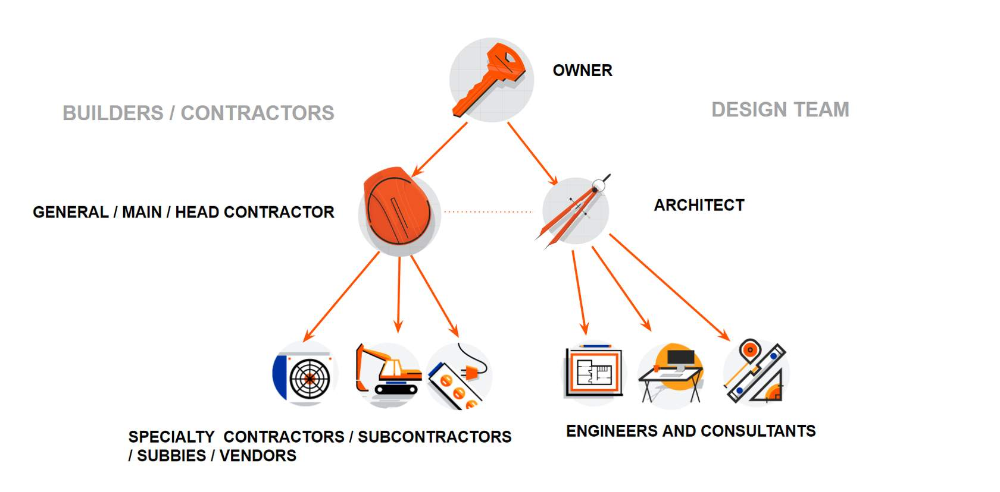

# Consruction

The construction industry is vibrant, exciting, and rapidly changing. Construction is one of the largest industries in the world, and it doesn’t show any signs of slowing down.  

Driven by population growth, urbanization, and the need for ongoing maintenance, worldwide construction is expected to grow from US $4.5 trillion USD to $15.2 trillion USD between 2020 and 2030 according to the September 2021 Oxford Economics report.

Furthermore, as the construction industry continues to rapidly grow, we envision needing to build 2.5 trillion square feet of building space in the next 40 years. That's more than the land area of Minnesota, or 40% of all of the UK. It's a staggering amount of work!

# Industry Characteristics

The construction industry has four defining characteristics.

1. Custom
First, construction is a custom business. Each project has unique variables like distinctive project teams, design, materials, terrain, regulations, and schedules. It can be said that every project is a prototype.

2. Mobile and Decentralized
Second, the workforce is mobile and decentralized. Physical construction happens on the job site, but decisions can be made in offices, on phone calls, and via email, which increases the importance of mobile access to real-time project data.

3. Complex Dynamics
Third, stakeholder dynamics are complex. Construction projects require collaboration across a range of stakeholders. These stakeholders may often have different interests and lack familiarity and trust with one another, yet all are interdependent and ultimately share project risks. As construction progresses, the teams that work together to build the project are not always physically together yet remain dependent on each other, meaning that decisions that impact one crew can have a domino effect on the other crews.

4. Constant Change
Lastly, change is constant. Construction project designs, schedules, and budgets are frequently modified. Teams often run into unforeseen issues that require quick problem solving. The owner may decide to modify the scope of the project or supply chain issues may require using different materials.

### Summary

Construction is a custom business with a mobile and decentralized workforce, complex stakeholder dynamics, and constant change.

---

# Project Team

We can organize the key construction project stakeholders that work on most construction projects into three primary groups:

- Owners
- Designers
- Contractors. 

Note: This visual depicts Design-Bid-Build delivery. In this delivery method, the Project Owner contracts with the Design Team and the General Contractor separately. This is referred to as the traditional delivery method and is based on a sequential process of designing, bidding, contracting, and then constructing. For the purposes of this introductory course, we will learn the construction roles and their responsibilities within this delivery method.

Although each member of the Project Team works with the other members, contractual agreements only exist between the Owner and Architect, Owner and General Contractor, and General Contractor and Specialty Contractors. Each of these roles plays a vitally important role on the Project Team and, as we’ll see, they are all related and dependent on each other for the overall success of the project. 

---

# Owners

Owners are the visionaries of construction projects. They have the initial business need and idea of what the space or building can be to meet those needs.

Project Owners are the entity that commissions and pays for a construction project. They hire the Designers and the Contractors, finance the project, and set milestones and expectations around the project quality, timing, and budget. You may also hear Owners called the Developer or the Client. It could be said that the whole construction industry exists because an Owner decided to do construction projects in the first place.

Owners are involved from the very beginning of a project to the very end. In this way, it's helpful to consider their responsibilities in chronological order.

1. Identifying Needs for the Project
Determines there is a need for a new building or space.

2. Getting Financing for the Project
Secures adequate funding for the project either through a lender, investors, or their own funds.

3. Securing the Project Site
Purchase land or buildings, or lease space, required to build the project and initial jurisdictional approvals or the intended use of the land/building/space.

4. Selecting All Professionals on the Project
The owner will select the architects, engineers, and any other consultants needed to design and engineer the project. They may also make selections for additional professional services such as lenders, attorneys, furniture and IT vendors, etc.

5. Selecting the General Contractor
The Owner will work with their Design Team to solicit pricing from General Contractors to construct the project. They may also interview the General Contractors and select the team that best meets their needs. Once the selected Contractor has been chosen, the Owner and General Contractor will negotiate and execute a contract.

7. Making Decisions in Construction
During Construction, the Owner may need to provide clarification on questions that arise, request modifications, and review changes to the scope, budget, and timeline in collaboration with the other stakeholders. Timely decision making is essential to minimizing impact on construction progress.

8. Paying for Work Completed
As the design work is completed and as construction work on the project is completed, the Owner is responsible for making progress payments.

9. Taking Possession
Near the end of the project, the Owner works closely with the Contractor and Design Team to inspect the project to make sure it meets expectations or identify things that need to be remedied. The Owner will also start moving in their equipment and furnishings as they prepare to start operating the space. When the Owner is able to take possession of the space or occupy the space, the project is said to be substantially complete.

10. Making Final Payments
When the work is complete, the Owner makes all final payments to the Contractor and to any of their Vendors.

11. Working as a Team
Construction projects can be challenging, rewarding, and full of surprises. Projects can span a couple months to years or decades, and Project Teams may comprise dozens, hundreds, or thousands of people. With all that in mind, it’s imperative that the working relationships between the Owner, Design Team, and Contractors remain healthy and solutions-oriented.

It’s important to note that when we refer to the Project Owner, we are not referring to an individual person. We are referring to an entity such as a company or a public agency. We can divide Project Owners into two big categories: **Private-Sector Owners and Public-Sector Owners.**

**Private-Sector Owners** are often corporations that use real estate to operate their business in. Think of a retail company/business that builds storefronts to sell their products or even a tech company that needs office space for their employees. 

**Public-Sector Owners** are governmentally funded entities like the federal government or a local city municipality. Think of public schools or a new sewage treatment plant.

Regardless of whether a Project Owner is a Private Owner or a Public Owner, the entity will likely have a few key roles. Though there can be many roles within the Ownership entity, the following are the key participants that are more highly involved with the design, construction, and operation of a project:

- **Owner's Representative:** A person who works on behalf of their Owner entity as a daily liaison with Contractors and the Design Team. They may negotiate contracts and changes, answer questions, and give direction to Contractors and Designers. This person may be employed directly by the Owner entity or may be a hired professional who works for another company. This person makes sure the Owner's interests are protected. **This person may hold a business title of Owner's Representative, Construction Manager, Owner’s Project Manager, or Client-Side Project Manager**. Colloquially, Project Managers are referred to as "PMs."

- **End User/Occupant:** This is the stakeholder group that will utilize the finished building or space. The Owner's Representative should consult with the End Users during design and construction to make sure that the needs of the space are met. For instance, on a school project, members of the faculty and administration may be consulted to find out their needs for power locations for their classroom technology.

- **Facilities Management:** Facilities Managers will be responsible for operating and maintaining the space after the construction is complete. They should be consulted with, much like the End Users, to make sure appropriate design accommodations have been made. For example, the janitorial team in an office building may want to have floor sinks in the storage closets to make cleaning easier. This group may also have additional insights about the needs of the End Users.

---

# Design Team

The Design Team illustrates and polishes the Owner’s vision through the creation of plans and specifications.

The goal of the Design Team is to create a set of design documents that graphically depict the Owner's vision while also meeting budgetary and constructability constraints. Depending on the size and scope of the project, the Design Team may include a single individual architect or there may be an architectural firm and multiple engineering firms that have teams of many individuals working on the project. 

Architects embrace artistic and creative ideas to create spaces and solve design problems. Their counterpart, the Engineer, is more of the mathematical, systems-oriented designer, as you will learn in the following sections.

To gain an understanding of the Design Team responsibilities on a construction project, let's take a look at their project timeline.

1. Schematic Design
Determining the needs of the Owner (size, use, and function).

2. Design Development
Adding details with codes, specifications, electrical, and mechanical.

3. Construction Documents
Creating detailed drawings for bidding/tendering.

4. Construction Administration
During construction, the Architect/Engineers work with the Contractor and Owner to review progress, answer questions, and support changes in scope.

It’s important to note that Architects are individual professionals employed at an Architecture Firm, an entity. Similarly, individual professional Engineers are employed by Engineering Firms, another entity. Colloquially in the construction industry, it's common for "Architect" to be used interchangeably with "Architecture Firm" or "Engineer" with "Engineering Firm." Examining the context of a situation can help you determine if the individual professional or the entity they work for is being referred to.

# Architects and Engineers

Let’s take a deeper dive into the scope of work that Architects and Engineers are responsible for on a project.

## Architects

Like the Owner, the Architect is involved in the project from the very beginning and stays involved through construction. The Architect, or Architecture Firm, is tasked with designing the project before starting construction.We call this phase of a project Preconstruction.

The Architect's cornerstone deliverables on the project are what we call **drawings and specifications.**

Drawings are sometimes referred to as plans or blueprints. Drawings graphically depict what is to be built in the project; they show lines, dimensions, heights, locations of fixtures and equipment, etc. Depending on the size and complexity of a project, there may be dozens, hundreds, or even thousands of drawings for a project.

The **specifications** are a written document that further describe the work depicted in the drawings and may address particular codes, processes, or requirements of the work. The specifications are sometimes also referred to as specs or the project manual.

The drawings and specs that the Architect produces are used by the Contractors to build the project, not unlike an instruction manual.

When designing a project, the Architect weighs functional needs, aesthetics, budget, and constructability. Architects may also consider how to make their designs sustainable, adding value for the Client and future End Users. In many ways, Architects are problem solvers--finding creative ways to deliver a design within specific conditions with both known and unknown constraints. 

**The Architect may also be leading and managing their engineering counterparts.** Oftentimes, the Architect has a contract with the Owner to manage both the architectural design and the various engineering components. This is an effective model because it allows the design to have a single leader who drives coordination, alignment and collaboration between building systems.

**Constructability** is a term used in construction that refers to how easy, hard, or impossible it is to build something. The easier something is to build, the more economical a project can be in terms of budget and timeframe. The harder something is to build, the more costly and time consuming the project may be. It’s important to balance constructability when designing a project.

When the design is complete and the Construction phase begins, it is the Architect's responsibility to collaborate with the Contractors, which may include collaboration through construction management software and physically visiting the jobsite.

It is common for the Architect to answer questions--what we call requests for information, or RFIs--review invoices for accuracy, inspect the site for quality, and even review and confirm materials selection before materials are ordered.

> Fun Fact: Architects can be specialized in specific types of buildings like schools, high rises, or commercial office space; or specialized in certain design work, like landscape architecture, or interior and exterior design. On a single project, there may be several different types of Architects who are specialized in a subset of the project’s scope. However, for the purposes of this course, we will focus on an Architect that produces the entire interior and exterior architectural design of a project.

## Engineers

Like Architects, Engineers are charged with creating plans and specifications during Preconstruction, and then collaborating with the Architect and Contractors during the Construction phase to make sure questions are answered, building materials are confirmed, and quality work is installed. 

While Architects may focus on the overall vision of a project including the aesthetic and feel of a space, Engineers ensure that the design will work by applying advanced mathematics, physics, and technical expertise regarding systems.

### Specializations/Disciplines of Engineering

There are several different specializations or disciplines of engineering on a given construction project. Let's review the common types of Engineers on a project.

1. Electrical Engineer: 
Develop plans, specifications, and mathematical calculations related to electrical power equipment, distribution, lighting layout, and fixtures and electrical control systems.

2. Plumbing Engineers:
Develop plans, specifications, and mathematical calculations for water and sewer systems in a building, including hot water systems, roof drainage, plumbing fixtures, fire protection systems, etc. Plumbing and Mechanical Engineers are often part of the same Engineering Firm.

3. Mechanical Engineers:
Develop plans, specifications, and mathematical calculations for mechanical power and heat. They oversee everything from refrigeration and air-conditioning equipment to noise control and acoustics and solar energy systems. Plumbing and Mechanical Engineers are often part of the same Engineering Firm.

4. Structural Engineers
Develop plans, specifications, and mathematical calculations for the load-bearing elements of a building or structure, such as columns, framing, roof and floor trusses, and beams. You can think of these elements as the bones of the building. The goal of the Structural Engineer is to design the bones of the building to be strong, stable, and safe so that the structure does not collapse under the load of the building materials attached to it or during an event such as an earthquake, fire, snow, wind load, or other forces.
Structural Engineering is a subset of Civil Engineering.

6. Civil Engineers
Like all engineers, Civil Engineers develop detailed plans, specifications, and mathematical calculations for the design and construction of a project. Civil Engineering is one of the more nuanced specialties because there are a lot of sub-specialties. So, for the purposes of this course, we will relate Civil Engineers to the scope of site-related systems, such as underground utilities, site concrete, and asphalt features, as well as the building foundation. 
Civil Engineers can specialize their work in several technical specialties like structural engineering; transportation engineering that supports airports, tunnels, bridges, dams, and harbors; geotechnical engineering that deals specifically with soils and foundation systems; or water and wastewater engineering that supports municipal water and wastewater projects.

