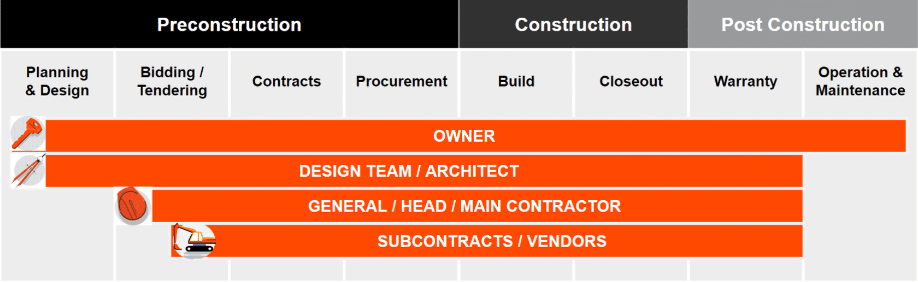

# Overview of Construction Project Phases

In this course, we will be using a framework of three basic phases to discuss the stages of a construction project:

- Preconstruction
- Construction
- Post Construction

---

# Preconstruction

We will frame Preconstruction by breaking it down into four basic sub-phases:

- Planning & Design
- Bidding/Tendering
- Contracts
- Procurement

## Planning & Design

**1. Planning Phase Considerations :**

- Where will this be built?
Sometimes a Developer takes ownership of a site with an intent to build. Other times,
 there may only be a rough idea of where a project should be located, and site selection will be a longer process.

- Will it fit into the surrounding community?
Will this project match the form of the community around it and fit in with the surrounding built environment without impeding? This question is a major consideration in the design phase of the project and is often driven by local zoning code regulations.

- How much space is required?
Space is required for both the structure itself and in the surrounding built environment. How much is required to perform the project's function?

- What is the baseline budget?
This is typically determined by square-foot costing or the historical cost of building a similar structure or facility. 

- How soon is this structure required?
Oftentimes, for example, commercial projects are expected to be completed more quickly or with a stricter deadline. In Planning, a general start and end date is determined.

- What level of performance is required?
In the context of most projects, this can be referred to as "quality"; however, some types of projects require exact specifications without much deviation. Think of laboratories, factories, oil and gas facilities, healthcare facilities, etc. Other projects may perform with baseline features and affordable materials, like basic retail spaces, small homes, or modular school facilities.

**Project Delivery Methods:**

- Design-Build delivery method.
At this stage, the Owner may hire one Contractor to deliver both the design and construction of the project from concept to closeout. That Contractor may have Architects, Engineers, and construction teams directly on-staff, or they may hire out those parties to complete the work.
To sum it up, design-build traditionally means that there is only one contract between the Owner and the party that will deliver the project.

- The Design-Bid-Build 
In a design-bid-build format, the Owner separately contracts the Architect and Contractor. 
 The architectural design firm is hired to deliver complete design documents and then the 
 Owner will use those designs to solicit bids from General Contractors to perform the work.
 The General Contractor will then be responsible for hiring Specialty Contractors and Vendors to complete that work. 

**2. Design**

By this point, “what” is being built has been well established. Whether it is a design-build or design-bid-build project, the Design phase is what takes a project from a concept to the detailed documents, plans, and drawings that the Contractor will later follow throughout the building process. 

Typically, the architectural design process consists of these four sub-phases, and designs will advance in complexity as they near construction: 

- Conceptual Design
In the Conceptual Design phase, the Architect will take the Owner’s project proposal and continually weigh form and function. How a project needs to perform, who will be primarily using it, and where it is located will have a tremendous influence on the design of the project. All jurisdictional regulations will be measured here to ensure a project is designed to be fully compliant with the building code and zoning regulations of its location. 

- Schematic Design
Once all of the necessary information is gathered in the Conceptual Design phase, we move into schematic design(s), also called SDs. Schematic Design is when a project really begins to be visualized--those line drawings and blueprints we are so familiar with. 
Floor plans, site plans, and building elevations will be determined in this stage. Building systems like plumbing; heating, ventilation, and air-conditioning (HVAC); electrical; and mechanical will be placed into the designs in this phase, as well as interior and exterior finishes, based on how the project was programmed in the previous phase.

- Design Development
Design Development, or DD, is where the design begins to be refined and the Owner begins to make some final decisions about the design. The scope will narrow here as much as possible so that a final design can be reached and the Architect can begin the process of compiling the construction documents. The Architect may begin to look at materials here and make recommendations based on durability, aesthetics, and price. This can also be referred to as a value analysis or value engineering.

- Construction Documents
The Construction Documents phase, also referred to as CDs, is where every last detail and specification is added to the project drawings and plans. It becomes the job of the Design Team to produce all documentation necessary to start construction. Oftentimes, the Permit Set of Drawings is created around the same time and based off the construction drawings. They are then submitted to the city or municipality for approval. The more accurate the documentation, the more accurate your pricing and coordination will be, and that's important! This is no small amount of pages. The CD process alone for a small office building could result in nearly 500 plan sheets and several thousand pages of specifications.

**3. Permitting**
It's important to remember that some projects never make it past the Design phase, or can take years to make it into the Construction phase. Why is that? Some locations have extremely stringent zoning laws, building codes, or environmental impact guidelines--causing certain projects to be held in permitting for an extended period of time or never reach approval. 

## Bidding/Tendering

Outside of the US, bidding is referred to as tendering. When the construction documents are completed and permits are approved, a project can be opened for bidding. This is when the Owner will decide who, or which firm, is going to build the project. Remember, we are discussing this in the context of a design-bid-build project. In a design-build project, bidding would go a bit differently and would happen much earlier on in the process because the selected Contractor would have been responsible for the entire design process.

Who Bids?
In some cases, an Owner will have a relationship with or preference for several Contractors and invite a handful of them exclusively to bid the project. If a public utility or government agency is the Owner, they are required by law to open bidding to everyone, and are also usually obligated to take the lowest bid. Typically, a Private Owner will invite multiple General Contractors to bid a project in order to ensure the bids are competitive and comprehensive.

Bid Packages:
The plans and specifications produced in the Design phase are put into a bid package and sent out to General Contractors with an invitation to bid. The contents of a bid package can vary by place and project type, but a bid package will typically include these basic elements: an invitation to bid with instructions to bidders, a sample contract, and project plans and specifications.

Estimating and Collecting Bids:

Preparing and submitting bids/tenders can be a stressful and high-stakes time for General Contractors and Specialty Contractors bidding the project. There are many documents to review, calculations to be made, pricing to gather, and project conditions to be considered--such as logistics and schedule. Further, the bidding process is essentially how Contractors "get the work" they need to generate revenue for their company. The accuracy of the bidding/estimating also directly impacts how profitable/unprofitable a project will likely be in the event that the Contractor wins the bid and is awarded the contract for the project. If their bid is inaccurate, they may not have enough money allocated to cover costs; or if their estimate is too high, they may not be competitive enough to secure the project.

General Contractors largely depend on Specialty Contractors to prepare bids for their scope of work. In this way, the General Contractor's bid is only as good as their Specialty Contractors' bids. The GC will typically send invitations to bid to 3-5 Specialty Contractors per trade--for example, three Electricians, five concrete Specialty Contractors, etc. This allows for multiple estimates in each trade to be received. We sometimes refer to this as "bid coverage," which means the General Contractor has multiple options to choose from. Each bid is analyzed by the General Contractor for accuracy against the plans and specs and for competitiveness against bids in the same trade. One bid is selected per trade and is then compiled into the General Contractor's singular estimate/bid that encompasses all the scope and costs to construct the project.

General Contractors and Specialty Contractors use technology to help organize and create their bids/estimates. They may use spreadsheets with formulas, specialized estimating/bidding software, or a combination of both to prepare their bids. They may also prepare additional proposal documents, such as preliminary schedules, a list of inclusions and exclusions, and/or team resumes or completed project references. 

## Contracts

Every construction contract is unique because it reflects the specifics of each project and team members involved. There are, however, common contract types that determine how the financial aspects of a project are defined and managed. Construction doesn't happen without a contract! 

Four basic contract types:

- Lump Sum
Lump Sum contracts are for a single fixed price based upon the plans and specifications available during the bid. Should the plans and specifications change due to Owner request, unforeseen conditions, or needed clarifications, the contract cost will be increased via change order. These contracts are also sometimes referred to as "fixed price" or "stipulated sum." This is one of the most common contract types.

- Cost Plus Fee
In a Cost Plus Fee contract, the Owner agrees to reimburse the General Contractor for the cost of construction plus pays an additional fee for the Contractor's overhead and profit. In this scenario, the Contractor has little incentive to keep costs low because the more they spend, the more they make. Reimbursable costs in this scenario are typically clearly defined, but labor and material may be marked up at the convenience of the Contractor, shifting the risk and financial liability back to the Owner.

- Guaranteed Maximum
Guaranteed Maximum contracts are similar to Cost Plus Fee contracts in that the actual project costs are tracked and then a Contractor's fee is added. The difference is that there is a price ceiling or maximum that the contract can total. If the cost of the project exceeds the ceiling, the costs are the responsibility of the Contractor. This puts a lot of risk on the Contractor since these contracts are sometimes based on more preliminary plans and may not have all the details needed to accurately bid all scopes of work in detail. Sometimes these contracts include an incentive to get the project done for less than the maximum.

- Unit Price
Unit Price contracts are really only common on civil projects with a lot of sitework required. In this case, cost is based on quantities delivered rather than overall project cost, and payments are based on the quantities of work completed. Owners can negotiate based on unit prices, but this also results in extreme specificity and extreme cost monitoring.

No matter the contract type, the legal agreement reached between the General Contractor and the Owner is known as the Prime Contract.

**Building the Project Budget:**

## Procurement

Once subcontracts and purchase orders have been bought out, the Specialty Contractors and Vendors have the contractual assurances they need to start procuring materials and equipment for their scopes of work, as well as scheduling and lining up crews to complete the work. Similarly, the General Contractor has the contractual leverage they need to make sure that milestones and deadlines are met.

In this section, we will discuss how the project schedule drives the order in which materials are procured and crews are scheduled, and then take a closer look at how Contractors gain approvals on their materials and equipment before they proceed with ordering and fabricating items.

**Building the Project Schedule :**

So, how do we even begin to predict how long a construction project will take to build? All projects start with something called Master Planning. This work is used to determine the major milestones and completion dates that will inform the overall duration of the project. Typically, throughout the Preconstruction phase and Construction phase stakeholders are involved in creating and updating the master planning schedule.

There are many techniques, methods, and theories when it comes to building an effective project schedule. We won't dive into all of that here, but having an understanding of how a project is scheduled will help you better grasp how things function in the next phase of the project. 

Scheduling can help construction teams determine who should be onsite and when, and in what sequence things should be completed. Similarly, the schedule helps inform the General Contractor, Specialty Contractor and Design Team of when certain materials must be ordered to arrive on time for the project.

**Submittals:**

Before General and Specialty Contractors order their materials and equipment or begin fabricating items in their shops, they seek approvals to ensure that they are ordering/fabricating the correct items.

A submittal is the written or physical information provided by a Contractor to the Design Team for final approval--a formal confirmation--of building materials and equipment before they are ordered, fabricated, and delivered to the project. The General Contractor and Specialty Contractor will use the schedule we discussed in the previous section to help them prioritize their submittals.

**Why is There a Procurement Process?**

We start the Procurement process during Preconstruction to make sure that materials and Specialty Contractors are prepared to arrive onsite at the right time during Construction. It can take weeks or months to receive orders and to fabricate materials or to have crew availability. Having a Procurement process gives Contractors the strong start they need to be successful on their projects. Note that the Procurement process often continues into the Construction phase.

---

# Construction Phase

By the time we reach this point, it may have taken a project a year or two, maybe more, to make it through planning, design, permitting, and all other elements of Preconstruction. Once a Contractor wins the work, finalizes their contracts, and builds the schedule, there's still a long road ahead. Now we have to build it, and build it right!

## What is Construction ?

Let's envision what a typical day looks like on a jobsite. During the Construction phase, the General Contractor's job is to make sure the job is done on time and on budget--per plans and specs--and most importantly, that it is done safely.

Onsite everyday is the **Project Superintendent, also called the Site Manager**. Their day includes scheduling and coordinating the many Specialty Contractor crews, inspecting materials installations, and documenting progress. 

Their counterparts, **the Project Manager (PM) and Project Engineer (PE)**, may be onsite or back in the home office. The PM and PE are helping make sure the project is staying on budget by negotiating contracts and change orders, documenting changes and questions, and reviewing costs.

Together, the General Contractor's team continually monitors and controls the project schedule, costs, and resources.  

Construction is always racing the clock. Schedules on big jobs are complex and difficult to maintain. If one task takes longer than expected, you might have to reschedule another, and then you might risk losing out on the Specialty Contractor originally scheduled to perform that task and run into a delay scheduling another. Or, excess material may build up onsite and have to be moved offsite to make room for other materials or equipment coming onsite. With so much going on, keeping to a schedule can seem like an impossible task, and staying on budget can be even harder. 

Let's take a closer look at the **project management practices** that keep a construction job safe, on time, and on budget.

---
## Build
---
## Documentation for a Project Manager

Project Managers track project progress using several different processes.

**Transmittals:**

Beyond all the information captured in submittals, many more items--like reports, logs, directives, and informational packages--are sent between all project stakeholders. In order for this correspondence to be formalized and carefully tracked, a General Contractor or other entity will utilize a transmittal. Construction is a collaborative process, so information sources can vary. Reports can be generated by an external consultant, for example, but need to be passed on to Project Team members. Whoever is responsible for distributing the information will want to memorialize that action somehow. Transmittals are also a way to add comments to whatever is included in the package, and it is not uncommon for a transmittal to be a cover sheet for something like submittals as well. Transmittals will often have dates, addresses, and sometimes check boxes for what action the recipient should take--for review, for approval, for information, and so forth.

**Request for Information:**

An RFI, or request for information, is a question or clarification submitted by a Specialty Contractor or General Contractor when information is missing, vague, or conflicting in the plans, specifications, or site conditions. These clarifications are sent to the Design Team through the RFI process for review and response. The RFI responses sometimes include new details or drawings for the project, and other times, just provide confirmation or direction on how to proceed.

**Change Orders:**

A change order is actually an amendment to the original Prime Contract and/or subcontracts that is required to account for changes to the project scope, cost, and schedule. Change orders arise for multiple reasons including RFI, submittal changes, unforeseen conditions, and Owner requests. 

## Documentation for a Site Manager

A site manager tracks project progress using continuous observation and reporting methods.

**Observations:**

Rigorous and regular observation and reporting is essential to construction. As you saw when we broke down the change order and RFI processes, conflicts can arise quickly on the job. A General Contractor has a vested interest in ensuring they have a pulse on what is happening on the job each day and a clear record of those observations in order to prove they were not only doing their job, but that issues may have arisen that are beyond their control and caused project delays or incidents.

Observations are tracked using the following reports:

1. Daily log

Daily site logs are the backbone to construction reporting. A daily log is a record that the Superintendent will keep of all project progress and any site conditions or personnel issues that may have impacted the job that day. This is crucial for the General Contractor's ability to cite specific incidents and demonstrate progress to the Owner.

A Daily Log will include a record of some or all of the following components:

    - Weather
    - Manpower
    - Visitors
    - Equipment deliveries
    - Phone calls
    - Waste

2. Incidents log

Construction is a very dangerous industry. The United States' Occupational Safety and Health Administration (OSHA) reports that one in five workplace deaths each year were construction-related deaths. Most construction deaths are due to falls, electrocution, workers suffering a fatal blow by falling debris or moving equipment, or workers getting caught in narrow or tight spaces on jobsites. These four types of incidents--falls, electrical exposure, struck-by, and caught in-between--have come to be known as OSHA's "Fatal Four."

There are a number of safety measures that Contractors are required to take on a daily basis. Beyond wearing the proper protective gear like hard hats, goggles, and gloves, some jobs may require fall protection harnesses and bolstered protective gear or clothing. An incident can be a tragedy for a worker and their team. It can also be financially devastating for the Contractor if an incident goes undocumented and unreported. That's where the incidents report comes in.

When a significant safety violation is made onsite or an incident occurs, it will be reported in detail. Usually an incident report is stamped with the date, time, and parties involved; and often photos and witness statements are attached. This documentation is required in order for Contractors to ensure their workers get the proper care, but it is also a historical record of a company's safety performance that may be used to inform the processes on future jobs and make them safer as a whole.

3. Inspections

Routine inspections are critical to the success of construction in order to ensure a project is being built to specifications day in and day out. The last thing a Contractor wants is for surprises to arise in the closeout stage that contribute to rework after a project is complete.

Inspections are completed by various parties. The GC and Specialty Contractors should be inspecting their work as they complete it. However, there are additional inspections that might be made by city, county, or state Inspectors; by third-party inspectors hired by the Owner; or by some of the Engineers that designed the project.

Inspections can lead to crucial jobsite discoveries like structural disparities, unsafe practices or conditions, or improper use or installation of materials. These discoveries can often lead to the creation of an RFI or change order. In addition to being required to comply with local and state laws, inspections may also be a contractual responsibility for the Contractor because they allow an Owner or Client more visibility into the construction project.

## Collaboration Opportunities

Let's take a closer look at a few opportunities for collaboration throughout the construction process.

**Scheduling and Sequencing:**

Construction has a logical order; you must pour a foundation before you can build the roof. Creating a project schedule is an art and a science, because each task requires activities to be sequenced in consideration of the trades needed onsite at each step, along with their required materials and equipment. For the Owner, scheduling ensures that the General Contractor has a plan to finish on time. For the General Contractor, scheduling establishes an efficient work plan and clear coordination with their Specialty Contractors. In addition, both Owners and General Contractors rely on their schedule to predict cash flow throughout the lifecycle of the project.

**Clashes:**

As we know, the construction team is made up of multiple specialists in design, engineering, and specialty trades. Once the design has been finalized and Specialty Contractors are hired, they will each receive the contract documents and schedule that pertain to their scope of work.

Contract documents consist of plans and specifications. Once the Specialty Contractor is able to review plans and specifications, clashes may be detected and require coordination and resolution between multiple trades, the Contractor, and the Design Team. Clashes can also be discovered during the submittal process or later, during the actual construction. The earlier the clash is detected, the more economically it can be addressed.

**OAC Meetings:**

The Owner, Architect, and General Contractor (OAC) will typically have recurring meetings to review open items, discuss progress, review and approve changes, inspect work, review invoices, etc. These are often held weekly but may be less frequent. They are commonly called OAC Meetings or Weekly Meetings. 

**Coordination Meetings:**

Coordination meetings are critical throughout the design and construction processes. These meetings allow for the opportunity to bring subsets of the Project Team together to discuss and coordinate activities and related scopes of work; and discuss any clashes, changes, or conflicts that may impact constructability, budget, or schedule. It's essential that meetings are documented for a reliable account of progress and discussions, and in case of any future claim or litigation. Meeting notes should be shared among the parties that attended. 

---
# Close out
---

By the time a project reaches the Closeout stage, all parties have a vested interest in terminating construction and moving toward the occupancy or use of the structure. The Specialty Contractors and General Contractors are likely eager to move offsite for insurance purposes and move on to another job, not to mention that they want to get paid! Meanwhile, the Owner is likely in a hurry to sell or occupy the project. If the project is infrastructure-related or intended for public use, it is likely filling a longstanding need and people are eager for it to finish up!

Unfortunately, project closeout rarely moves swiftly. In some circumstances, it can take years, and it's quite common for a project to be used by Owners for a long time before it is officially closed out, even if it's not signed-off as substantially complete, delaying payments and project turnover even further. 

**Building Commissioning:**

Many large projects have contractual requirements surrounding systems and building commissioning. Commissioning is the process of verifying that all of the project's systems and subsystems work and are properly placed. These systems include heating, ventilation, air conditioning (HVAC); plumbing; electrical; fire; and even safety and security controls that will have been built into the project. Think of this process as "turning on" the building or project for the first time. It is in the Contractor's best interest to ensure everything works as it should because they are often under warranty to maintain and fix these systems after project completion. Improper installation or placement of these systems can have serious and dangerous consequences.

**The Punch List :**

Once the project has reached a state of almost complete, the Contractor will begin the punch list process. The punch list is a list of remaining work to be completed on the job. The Architect, Owner, and General Contractor might walk the project together, inspect the jobsite, and determine what work is still outstanding. The Owner may notice that something is not built to contract, plans, and specifications, and note it as such on the punch list for the General Contractor to correct. The General Contractor and Specialty Contractors will then need to go through each item pertinent to them, and then either perform the corrective work or explain why it is not built to specification or contract. 

**Final Inspection**

**Final Site Cleanup and Demobilization**

**Document Handover:**

General Contractors, Specialty Contractors, and Vendors assemble several documents at the end of a project. These are collectively referred to as Close Out Documents, Handover Documents, or Closeout Books. They consist of several key pieces of information that help the Owner understand how to operate their building and how to maintain/repair it as needed. These Close Out Documents often contain copies of approved submittals, warranties for materials and workmanship (we will discuss this more in the Post-Construction section), As-Built Drawings, and Operation and Maintenance Manuals--also known as O&M Manuals.

---

# Post Construction Phase

In the initial weeks and months after the construction has been completed, the Contractors will receive final payments and may spend some time reflecting on how the project went, as a way to improve for the next project. 

In Post Construction, the Owner is occupying and utilizing the space. Initially, the Contractors will be on standby for anything that may initially go wrong in the space; we call this the warranty or defects liability period. After this initial period, the Owner continues to occupy and maintain the space and may eventually do other construction projects or improvements.

**Final Payment:**

Contractors are not fully paid for their work until closeout is complete. After final inspections, the punch list process, and handover documents are completed, a Contractor can invoice for final payment. Typically there are contractual and jurisdictional rules that require payments be made to the General Contractor and Specialty Contractors within a certain timeline.

Final payments include retainage, also called retention. Retainage refers to a certain value, normally 5% to 10%, that is held back from the Prime Contracts and subcontracts as a way to ensure that all work is completed.

**Evaluation:**

There is a critical component to project completion that most might not think of when they think of the end of a construction project, and that is the post-project evaluation. How did the project go? Did it go as planned? Every construction project has the capacity to inform the next. 

In Evaluation, project teams will analyze the original project schedule and the original project budget in contrast with the actual schedule and project cost to see if they were adequate estimations. They will discuss how well teams worked with Vendors and Suppliers and who they may want to do business with again, as well as how aligned, effective, and safe everyone felt on the job. 

Remember, the data collected at the end of a job becomes the same historical data that might be used to later budget, schedule, and staff another one. In a chaotic industry like construction, these learnings are crucial to the success of future projects.

## Post Construction Stages

1. Warranty

2. Operations and Maintenance