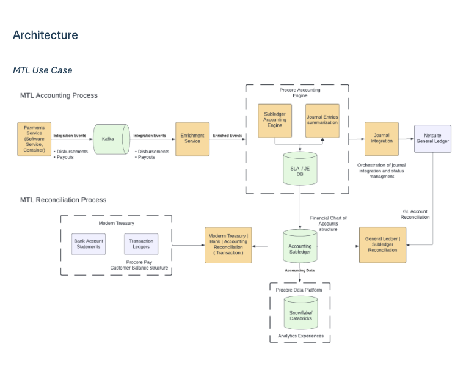
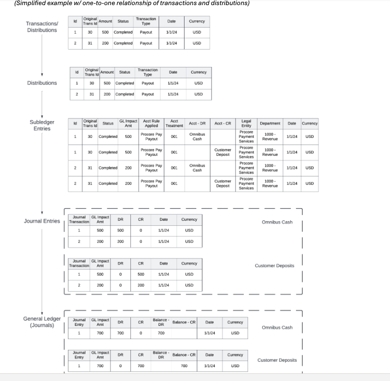

# Transaction Accounting Introduction

---

## Observation

Procore’s Finance organization has built its technology systems over many years, but it did so in a way that wasn’t well-planned or coordinated. While this approach allowed the company to grow quickly, it has led to a complex and inefficient system. The current setup is expensive, heavily dependent on manual work, and lacks key features like agility, reliability, scalability, observability, and proper governance.

### Specific Challenges:

1. **Ad-hoc Integration Strategy:**
   - **Meaning:** The connections between different systems were created on the fly without a consistent plan, leading to a messy and inefficient setup.

2. **Many Point-to-Point Integrations:**
   - **Meaning:** Systems are connected directly to each other in many different ways, creating a complex web of connections that are hard to manage.

3. **No Centralized Governance or Observability:**
   - **Meaning:** There’s no central system to oversee and monitor all the financial processes, making it hard to ensure everything is running smoothly and correctly.

4. **155 Manual Integrations in Existing Accounting Processes:**
   - **Meaning:** There are 155 instances where data has to be manually moved or connected between systems, which is time-consuming and prone to errors.

5. **Over 2,500 Manual Journal Entries Each Quarter:**
   - **Meaning:** Every three months, over 2,500 entries in the accounting system are done by hand, which is inefficient and increases the risk of mistakes.

6. **700 GL Reconciliations Quarterly:**
   - **Meaning:** The process of ensuring that the General Ledger (GL) balances match other financial records is done 700 times manually every quarter, which is labor-intensive.

7. **Distributed Accounting Derivation Logic Across Systems and Spreadsheets:**
   - **Meaning:** The rules and calculations for accounting are spread out across various systems and spreadsheets instead of being centralized, making the process more complicated and error-prone.

8. **Transaction, GL Accounts, and Bank Reconciliations are Manual:**
   - **Meaning:** Matching transactions with GL accounts and bank statements is done manually, which takes a lot of time and increases the chance of errors.

9. **FLTech Currently Has No Software Development Environment:**
   - **Meaning:** The finance team doesn’t have a proper software development setup, which limits their ability to automate and improve processes.

10. **Manual SOX Controls:**
    - **Meaning:** The controls required by the Sarbanes-Oxley Act (SOX) to ensure financial accuracy are done manually, which is labor-intensive and less reliable.

11. **Many Processes are Manual, Leading to Significant Operational Overhead and Audit Cost:**
    - **Meaning:** Because so many tasks are done by hand, it takes more time and money to operate and to undergo audits, which check that everything is being done correctly.

12. **Some Processes are Automated but Still Under Manual Controls Due to the Absence of Software Delivery Environment Covered by SOX ITGCs:**
    - **Meaning:** Even though some processes are automated, they still require manual oversight because there isn’t a proper software development environment that meets SOX IT General Controls (ITGCs). This limits the ability to fully automate and streamline financial operations.

## Summary

Procore’s finance systems are currently disorganized and overly reliant on manual work. This setup is costly and inefficient, with many processes lacking proper oversight and automation, leading to challenges in managing financial data accurately and efficiently.

---

# Solution Proposal

The company is creating a new system design (reference architecture) to help the finance team work more efficiently, supporting the company’s growth and its shift towards new business models like fintech, e-commerce, and transactional revenue models. This document is mainly about setting up a new approach to automate key financial processes, especially those related to recording financial transactions, updating the general ledger, and balancing accounts and bank statements.

## Key Points:

1. **New Reference Architecture:**
   - **Meaning:** The company is building a standardized and organized system structure that will make the finance operations more efficient and scalable.

2. **Support for New Business Models:**
   - **Meaning:** The new system will help the company transition into fintech, e-commerce, and transactional revenue models, which are different ways of earning money.

3. **Focus on Record to Report Automation:**
   - **Meaning:** The primary goal is to automate processes like:
     - **Deriving Accounting for Transactions:** Automatically figuring out how each transaction should be recorded in the financial records.
     - **Recording Transactions in the General Ledger:** Ensuring that every transaction is correctly logged in the company’s main financial record.
     - **Automating Account Balances and Bank Reconciliations:** Automatically matching the balances in the company’s accounts with bank statements to ensure accuracy.

4. **Transactional Accounting Engine:**
   - **Meaning:** The company will use a special tool (a transactional accounting engine) to automate these financial processes, particularly for systems that don’t already connect automatically with the NetSuite subledgers (a part of the company’s accounting system).

5. **Initial Use Case – Procore Pay:**
   - **Meaning:** The first application of this new system will be for managing and reconciling (balancing) the movement of money related to Procore Pay, which is a payment processing system. This will involve handling accounts used for money transmission (moving money on behalf of others).

6. **Future Opportunities:**
   - **Meaning:** After this initial implementation, the company will look for more ways to use this new system across other financial processes, prioritizing them based on importance and input from the finance and accounting teams.

## Summary

The proposed solution involves creating a more organized and automated financial system to support Procore’s growth and new business models. It focuses on automating key financial processes, starting with managing transactions in Procore Pay, and will be expanded to other areas based on need.

---

# Goals

The company aims to improve its financial processes by focusing on three main objectives: increasing accuracy, reducing risks, and cutting costs. Here’s how they plan to achieve these goals:

1. **Posting Accounting Results Daily:**
   - **Meaning:** The company wants to update its financial records every day, ensuring that the accounting information is always up-to-date and accurate.

2. **Enabling Transaction Level Details for All Activity:**
   - **Meaning:** They plan to track and record every detail of each transaction, so they have a clear and detailed view of all financial activities.

3. **Automating Cash Matching and Reconciliation:**
   - **Meaning:** The process of matching cash transactions and balancing accounts with bank statements will be automated, reducing manual work and minimizing errors.

4. **Providing Full Audit Trail from Accounting Balances to Source Transaction:**
   - **Meaning:** They will create a clear and complete record that shows how each transaction is linked to the overall financial balances, making it easier to trace any issues or discrepancies.

5. **Accelerating New Initiative Time to Market with Confidence:**
   - **Meaning:** The company wants to be able to launch new financial initiatives faster and with greater confidence, knowing that the underlying financial systems are accurate and reliable.

## Summary

The goals are to enhance the company’s financial accuracy, lower risks, and reduce costs by automating key processes, maintaining detailed records, and ensuring that everything can be easily audited. This will also help them quickly and confidently implement new financial initiatives.

---

# Principles – Transactions & Data Contracts

The new system architecture is built on some key principles to ensure it’s efficient, reliable, and adaptable. Here’s a breakdown of what that means:

1. **Event-Driven and Configuration-Based:**
   - **Meaning:** The system is designed to react to specific events (like a transaction happening) and is controlled through configurations (settings that can be adjusted without changing the code). This makes it easier to adapt and manage the system.

2. **Accounting Events Defined for Each Transaction Type:**
   - **Meaning:** For every kind of transaction (like a sale, payment, or refund), the system will clearly define what accounting actions should happen. This ensures that the correct accounting entries are made automatically.

3. **Centralized Accounting Derivation Logic:**
   - **Meaning:** All the rules and calculations for how transactions are recorded in the financial system are stored in one place. This centralization helps maintain consistency and makes it easier to manage and update the rules.

4. **Flexible and Extensible Event Models:**
   - **Meaning:** The way events are handled by the system is designed to be flexible (can adapt to different needs) and extensible (can be expanded to include new types of events or transactions). This allows the system to grow and change as needed.

5. **Transactions are Immutable and Replayable:**
   - **Meaning:** Once a transaction is recorded, it cannot be changed (immutable). If needed, the system can replay the transaction to check or reprocess it without altering the original record. This ensures data integrity and makes it easier to audit and troubleshoot issues.

## Summary

The proposed system is designed to be highly adaptable and reliable, using an event-driven approach that centralizes accounting logic and ensures transactions are consistent, unchangeable, and traceable. This structure allows for flexibility and growth, ensuring that the system can handle new types of transactions and adapt to changing business needs.

---

# Benefits

The new system architecture offers several key benefits, making financial processes more efficient, accurate, and scalable. Here’s how it helps:

1. **Transaction-Level Data Contracts Enable True Lifecycle Automation:**
   - **Meaning:** By defining clear agreements (data contracts) for each transaction, the entire process from start to finish can be automated. This means that transactions are handled automatically without needing manual intervention, covering every step of the transaction’s lifecycle.

2. **Configurable Services Eliminate/Reduce Development Cycles and Shorten Delivery:**
   - **Meaning:** Because the system is based on configurations (adjustable settings), you can make changes without needing to write new code. This reduces the time spent on development and speeds up the process of delivering new features or updates.

3. **Centralized/Governed Accounting Rules and Associated Controls Promote Rapid Change with Confidence While Reducing Audit Scope and Expense:**
   - **Meaning:** Having all the accounting rules and controls in one central place makes it easier to make changes quickly and confidently. It also simplifies audits, making them less extensive and less costly because everything is well-organized and easy to track.

4. **Automation Improves Accuracy, Eliminates Manual Costs, and Provides Scalability:**
   - **Meaning:** Automating processes reduces the risk of errors, lowers costs by cutting down on manual work, and allows the system to easily handle more transactions as the company grows.

5. **Transaction-Level Distributions Mitigate Audit via Variance Reduction and Transaction-Level Discovery:**
   - **Meaning:** By handling each transaction at a detailed level, the system reduces differences (variances) between records and makes it easier to track and understand every transaction. This helps in audits by making discrepancies less likely and ensuring everything can be easily traced.

## Summary

The new system will automate financial processes, making them more efficient, accurate, and easier to manage. It reduces the need for manual work, speeds up the delivery of new features, and simplifies audits, all while allowing the system to grow as the company expands.

---

# Transactional Accounting Lifecycle

This section explains the key concepts involved in managing and recording financial transactions in a business. Here’s what each term means:

1. **Transaction:**
   - **Meaning:** A transaction is any event that affects the company’s finances and can be accurately measured. For example, a sale, a payment, or a purchase would all be transactions because they impact the company’s financials.

2. **Distribution Amount:**
   - **Meaning:** This is the specific portion of a transaction’s total amount that gets assigned to different accounts based on predefined rules.
   - **Example:** If you sell something for $100, that $100 might be divided into different parts:
     - $80 goes to the revenue account (the money you earned from the sale).
     - $10 might go to a fee account (like a payment processing fee).
     - $10 might go to a tax account (for sales tax).
   - Each of these parts is a “distribution amount.”

3. **Subledger Accounting:**
   - **Meaning:** This involves creating detailed records (debits and credits) for each distribution amount in a special section of the accounting system called a subledger. The subledger tracks all the details of transactions and links them to the main accounting record (the general ledger).
   - **Example:** The subledger would show the detailed breakdown of that $100 sale, including how much went to revenue, fees, and taxes.

4. **Journals:**
   - **Meaning:** A journal is a summary of all the accounting entries (like a logbook) that have been posted to the general ledger for a specific account, transaction type, or time period. Each entry in the journal includes the date, the accounts involved, the amounts, and a brief description of what happened.
   - **Example:** If you post the $100 sale to the general ledger, the journal would record that $80 went to revenue, $10 to fees, and $10 to taxes on that specific date.

5. **GL Account Balances:**
   - **Meaning:** This is a summary of all the journal entries for each account in the general ledger over a given period. It shows:
     - **Opening Balance:** What the account balance was at the start of the period.
     - **Net Change:** The total increase or decrease in the account during the period.
     - **Closing Balance:** What the account balance is at the end of the period.
   - **Usage:** These balances are used to prepare financial statements and reports, showing the overall financial position of the company.
   - **Example:** If your revenue account started with $1,000, received $80 from the sale, and had no other changes, the closing balance would be $1,080.

## Summary

The transactional accounting lifecycle covers how financial transactions are recorded and managed in a business. It starts with breaking down a transaction into different distribution amounts, recording these details in subledgers, summarizing them in journals, and then reflecting the overall impact in the general ledger’s account balances, which are used to prepare financial statements.

---

# Process Steps: Transaction to General Ledger

This section outlines the steps that take place when a financial transaction is processed and recorded in the company’s main financial records (the General Ledger). Here’s how it works:

1. **Transaction Events:**
   - **Meaning:** The process starts when a transaction occurs (like a sale or payment) and the details of this event are sent from the source system (the system where the transaction happened).

2. **Enrichment Service:**
   - **Role:** This service does three main things:
     1. **Filters and Validates:** It checks the transaction to make sure all the necessary information is correct and complete.
     2. **Enriches:** If any information is missing or needs additional details (like adding a customer ID from another system), it fills in those gaps.
     3. **Stores Non-Compliant Transactions:** If a transaction isn’t ready to be processed (because of missing or incorrect information), it’s stored for further processing later.

3. **Subledger Accounting Engine:**
   - **Role:** This tool is set up with a set of rules that determine how each part of the transaction (like the amount for revenue, tax, etc.) should be recorded in the financial system:
     - **Populates GL Accounts:** It decides which General Ledger accounts to debit (subtract money) or credit (add money) based on the transaction type and details.
     - **Records in Subledger Database:** The resulting accounting entries are stored in a subledger, which keeps a detailed record of the transaction.

4. **Journal Entry Summarization:**
   - **Role:** After the subledger entries are created, they are summarized to form journal entries:
     - **Summarizes by Criteria:** The subledger entries are grouped by things like transaction type, GL account, date, and currency.
     - **Creates Journal Entries:** These summaries are used to create journal entries, which are logs that will be posted to the General Ledger.
     - **Configurable Timing:** You can set up the journal creation process to run at different intervals (daily, weekly, monthly, etc.).
     - **Records in Journal Database:** The journal entries are then recorded in a journal database.

5. **Journal Integration:**
   - **Role:** This step involves managing how the journal entries are transferred to the General Ledger:
     - **Configurable Orchestration:** You can control and organize how the journals are created and integrated with the General Ledger.
     - **Transfer to NetSuite:** The journals are integrated into NetSuite (the company’s main accounting software) using NetSuite’s built-in APIs (tools that allow different software systems to communicate).

6. **Journal Status Maintenance:**
   - **Meaning:** This involves keeping track of the status of the journals, ensuring they are correctly transferred and posted.

7. **NetSuite – Approvals and Posting:**
   - **Role:** Once in NetSuite, the journal entries must be approved and then posted to the General Ledger, which updates the company’s official financial records.

8. **Replication to PDP:**
   - **Role:** The transaction data and subledger data can be copied (replicated) to another platform (PDP) where it can be combined with other data for operational purposes and analysis.

## Summary

This process describes the journey of a financial transaction from when it first happens to when it is recorded in the company’s General Ledger. The steps include validating and enriching the transaction, recording detailed entries in a subledger, summarizing these into journal entries, and finally posting them to the General Ledger in NetSuite. The data can also be replicated for further analysis and operational use.

---

# Reconciliation: General Ledger Balance | Transactions | Bank(s)

Reconciliation is the process of ensuring that financial records are accurate and match up across different systems—like the General Ledger (GL), transaction records, and bank statements. This process helps identify and fix any discrepancies (variances) to ensure everything is in sync.

Here’s a breakdown of the different types of reconciliation mentioned:

1. **GL/Subledger Reconciliation:**
   - **Meaning:** This step ensures that the summary records in the General Ledger match the detailed records in the subledger.
   - **Process:** At each step in the accounting process, data about GL balances, journal entries, and subledger entries is captured and used to create reports and dashboards.
   - **Self-Service Reports:** You can access these reports to check the reconciliation status and quickly see if there are any variances (differences).
   - **Resolution:** If there are any variances, you can immediately review the details in the subledger and fix the issues.

2. **Transaction/Subledger Reconciliation:**
   - **Meaning:** This checks that each individual transaction recorded in the subledger matches the actual transactions processed by the system.
   - **Process:** The system tracks all transactions and their related subledger entries. Reports and dashboards help identify any daily variances, allowing for quick resolution.

3. **Bank/Transaction Reconciliation:**
   - **Meaning:** This process compares the transactions recorded in the company’s system with the bank statements to ensure they match.
   - **For Procore Pay:**
     - **Process:** Bank statements and transaction details are imported from the bank into the system.
     - **Modern Treasury:** A third-party service called Modern Treasury handles payout instructions to the bank and ensures that the transactions match between the bank and Procore’s accounting records.
     - **Daily Updates:** The system updates daily with data used in reports and dashboards to ensure the Procore Pay participant balances in Modern Treasury match the balances in Procore’s General Ledger.
   - **For Other Use Cases:** A new treasury system (not covered in this document) will be used to manage other reconciliation tasks with banks.

4. **Continuous Monitoring:**
   - **Meaning:** The system continuously monitors for any discrepancies between transactions, GL balances, and bank records.
   - **Benefits:** This approach helps minimize the effort and time needed to find and fix issues, ensuring that the financial records are accurate.
   - **SOX Controls:** The automated processes use centralized controls that comply with SOX (Sarbanes-Oxley Act) regulations, reducing the overall SOX compliance burden.

## Summary

Reconciliation ensures that financial records are accurate by matching data across the General Ledger, transaction records, and bank statements. This process includes various checks at the GL, subledger, and transaction levels, with continuous monitoring to quickly identify and resolve discrepancies. Automated reports and dashboards help make this process efficient, ensuring financial data is reliable and compliant with regulatory controls.

