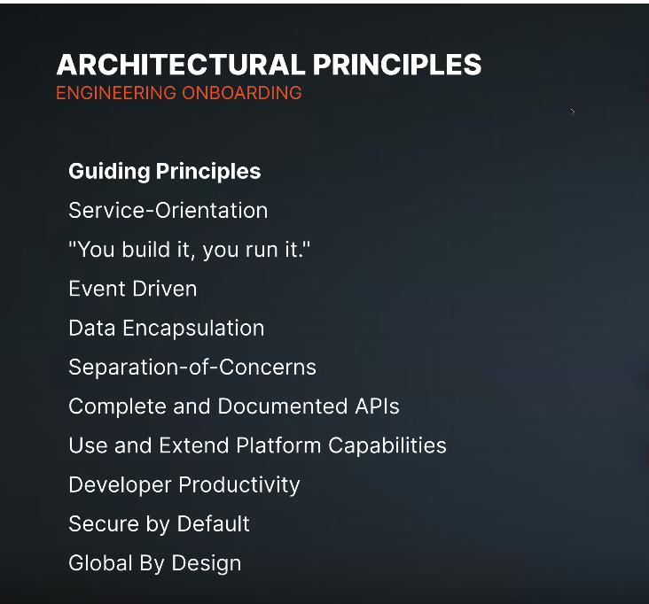
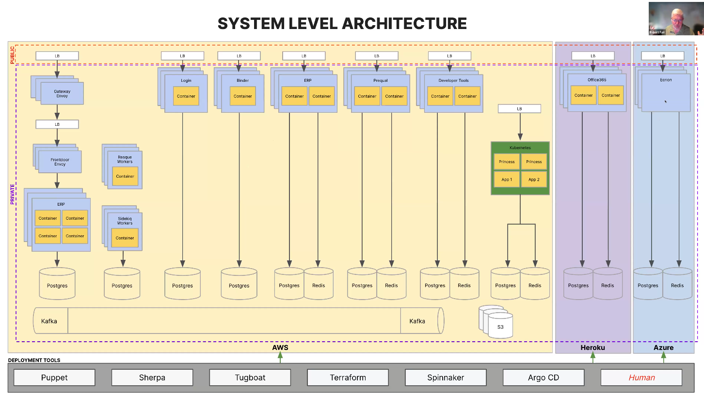
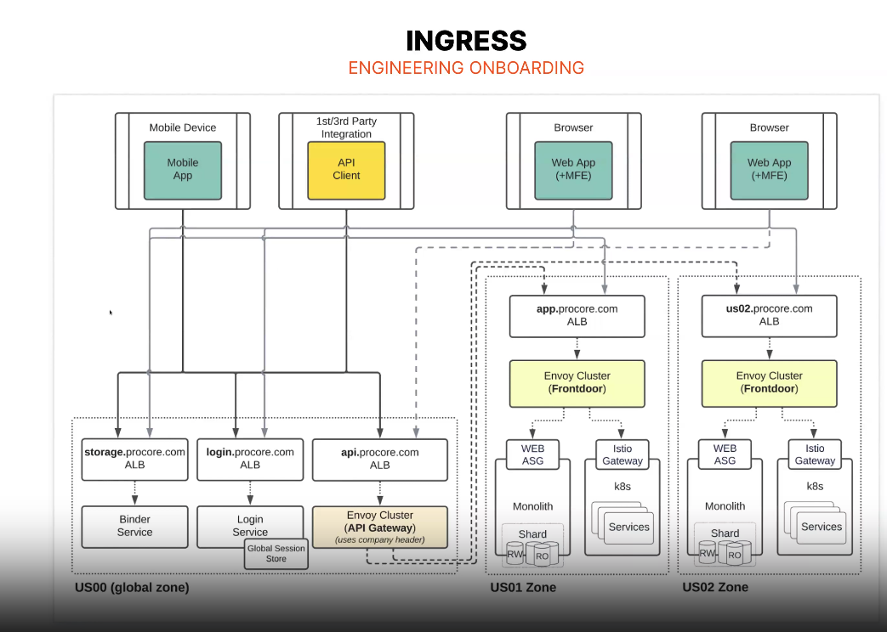
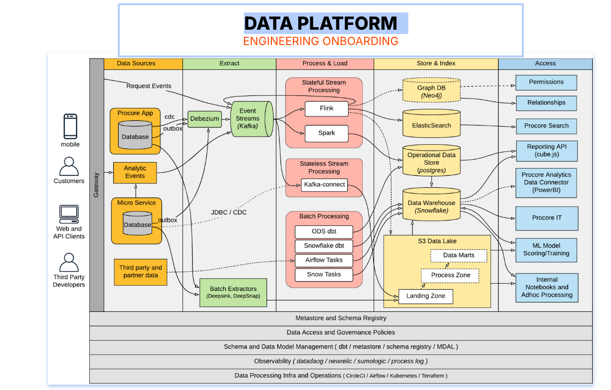
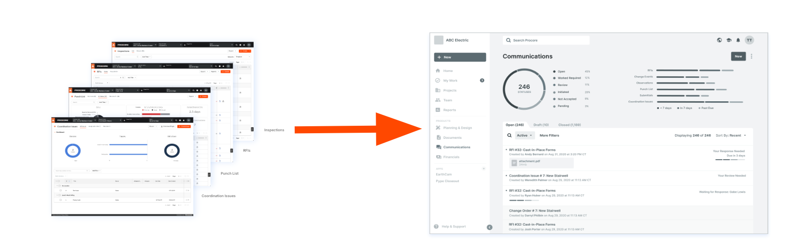
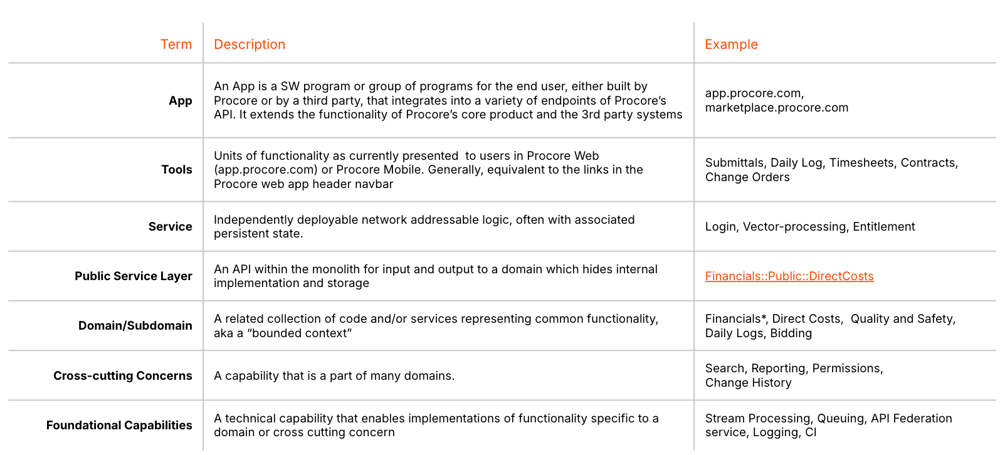
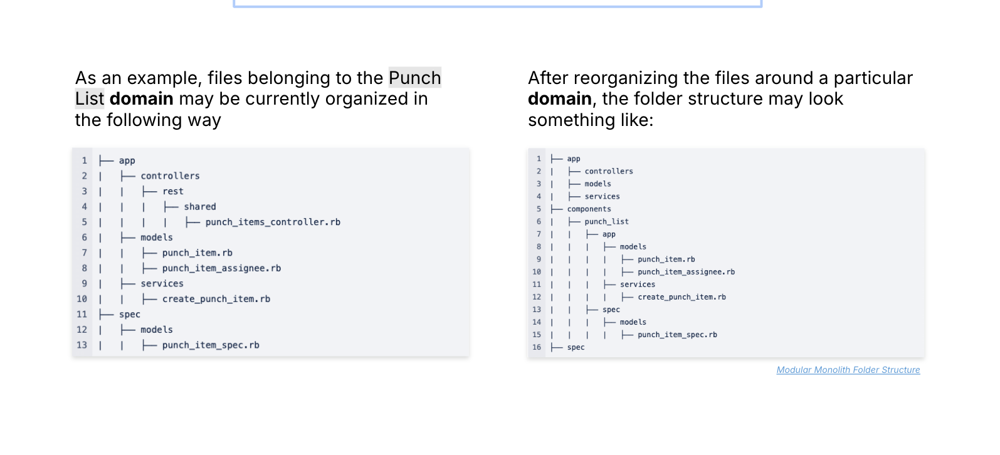
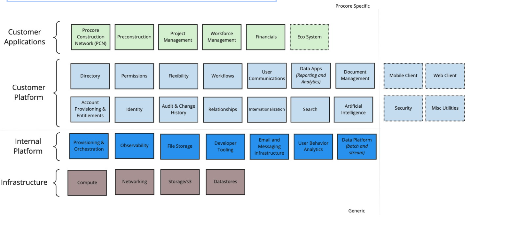
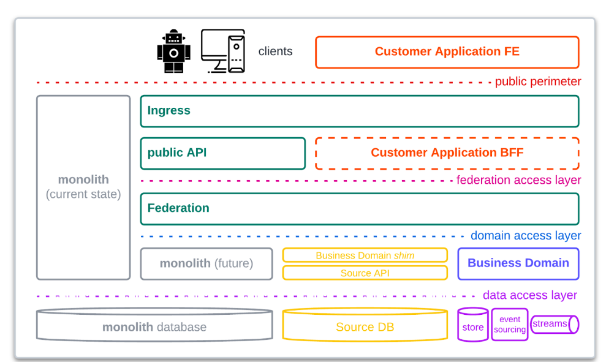
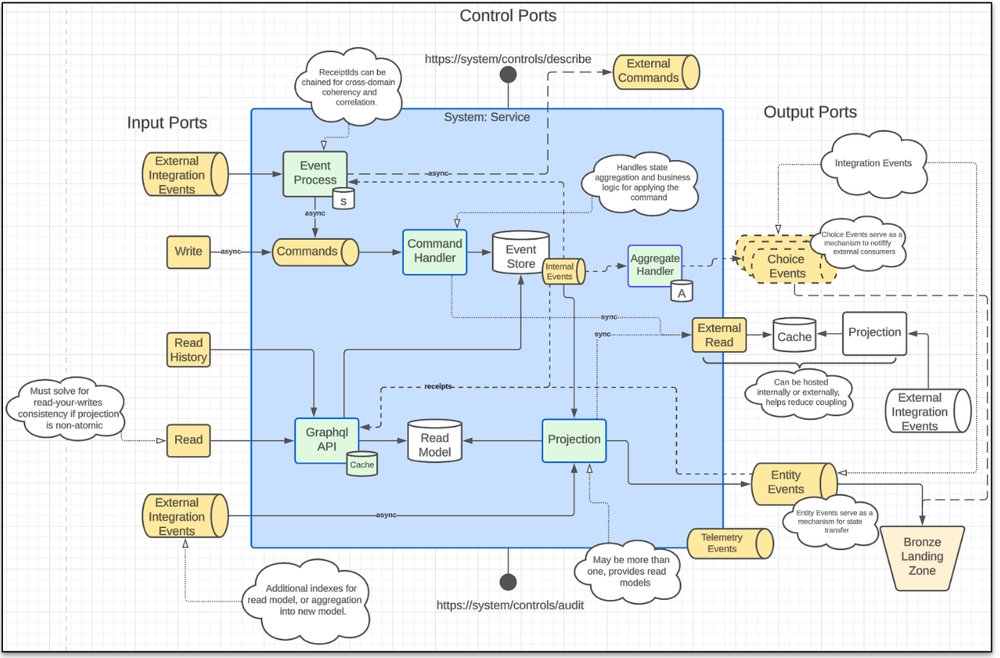

# Procore Architecture

[Procore Architecture Presentation](https://docs.google.com/presentation/d/1YmZ9ABemfsv1M_UhWyiy9ya_fsCw05asIPbYx9GJAb0/edit#slide=id.g251d74f30fb_0_296)

## Architecture Principles

## System Level Architecture

## Ingress

## System Overview

[System Overview on Lucidchart](https://lucid.app/lucidchart/2d8b1f95-b762-403f-9c84-8ac1f884b548/edit?invitationId=inv_307c4514-bc6e-48db-bbe1-549c1d52520a&page=IJnaaBpMeFJW#)

## Data Platform

# Focus Areas

## Connected

Identity and resources are tied to a single company today. 
In order to connect everyone in construction on a global platform, we need the ability to flexibly associate identities and resources more broadly, while still strictly obeying the contractual, legal, and social expectations of our customers.

### Connected Data

## Monolith Decoupling

# Key Concepts

# Monolith Component Organization

# Conceptual Framework Domain Map

# Reference Architecture

# Resources

[Resources](https://docs.google.com/presentation/d/1YmZ9ABemfsv1M_UhWyiy9ya_fsCw05asIPbYx9GJAb0/edit#slide=id.g251c77410f1_0_522)