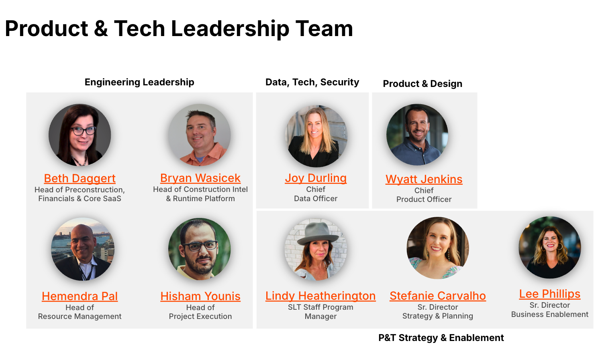
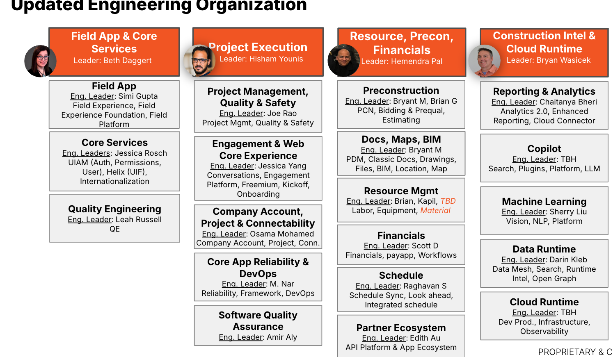
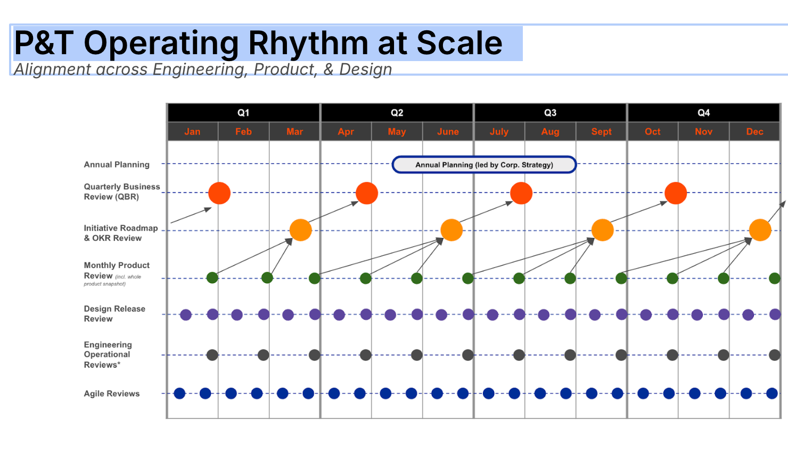
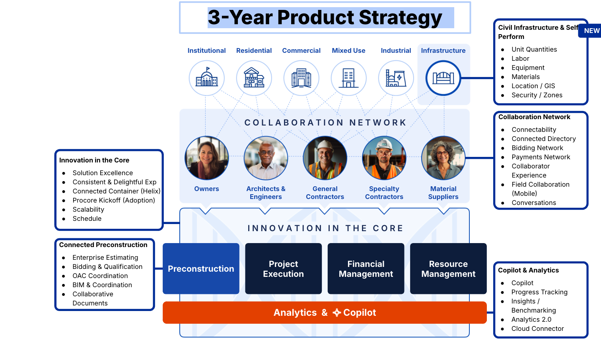
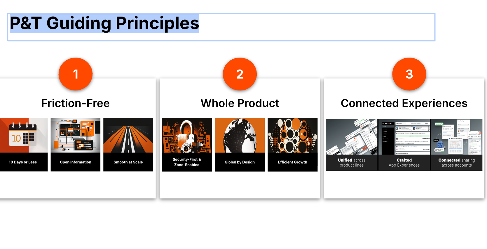
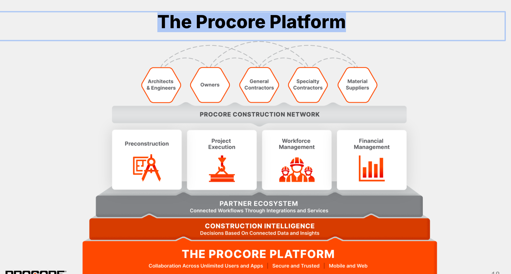
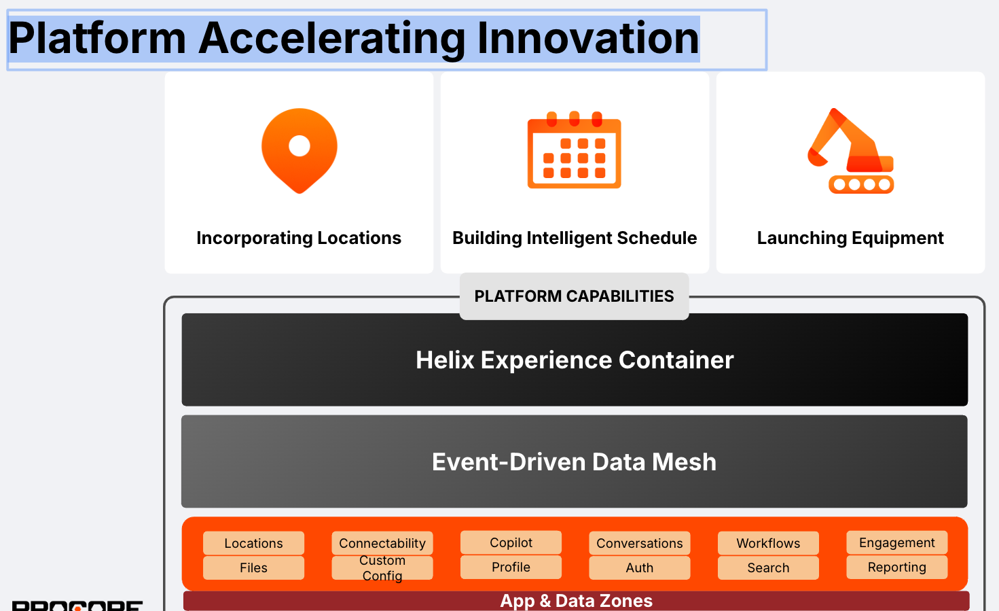
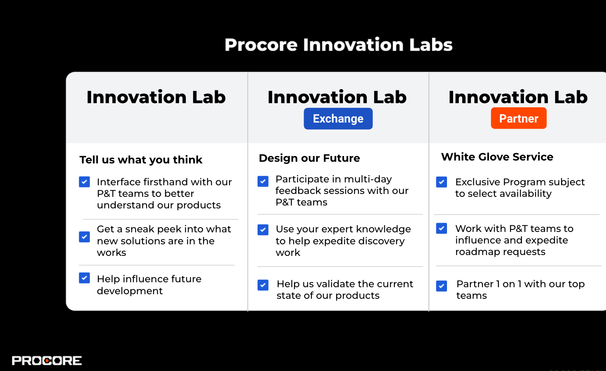

# Procore Product & Technology (P&T) Overview

https://docs.google.com/presentation/d/1YWlHrWtanv47OjC8mz8H3Qrv5BbZ-ojWw5VmdgxwpCI/edit#slide=id.g2999ff55e5b_0_1074

The organization is divided into four main parts:

- Engineering
- Product and Design
- Data Tech and Security
- Portfolio and Enablement

# Leadership

## Product & Tech Leadership Team

## Engineering Organization

## Product Senior Leadership Team

## Product Design Senior Leadership Team

# P&T Operating Rhythm at Scale

# 3-Year Strategy Pillars

[Corporate Strategy FAQs](https://thecore.procore.com/pac/culture_community/culture__community/corporate_strategy_faqs)

The Product Strategy is categorized into themes that drive development initiatives aligned to these pillars:

- GROW THE BASE 2024 - 2025+
- UNLOCK “TRIPLE TAM” 2025 - 2026+
- WIN GLOBAL ENR 250 2026+

# Goal

By 2027, the Procore platform will enable you to build any type or size of construction project in the world - from Preconstruction to closeout - across your network of stakeholders. Save time, build better, invest smarter on the world’s largest construction dataset.

Our Strategy for achieving this vision is to:

- Innovate on our core Project Execution and Financials products.
- Build an enterprise-grade, fully connected Preconstruction solution.
- Enable collaboration for all stakeholders across the network of a project.
- Harness the Construction Lifecycle data to power Procore Copilot.
- Invest in Civil infrastructure and Self-Perform capabilities.

## 3-Year Product Strategy

# P&T Guiding Principles

# The Procore Platform

# Platform Accelerating Innovation

# How Procore Partners with Customers

## Innovation Labs

