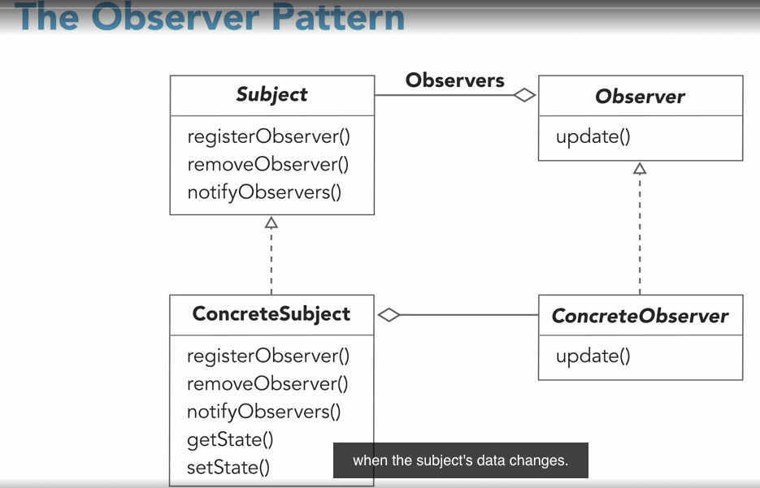
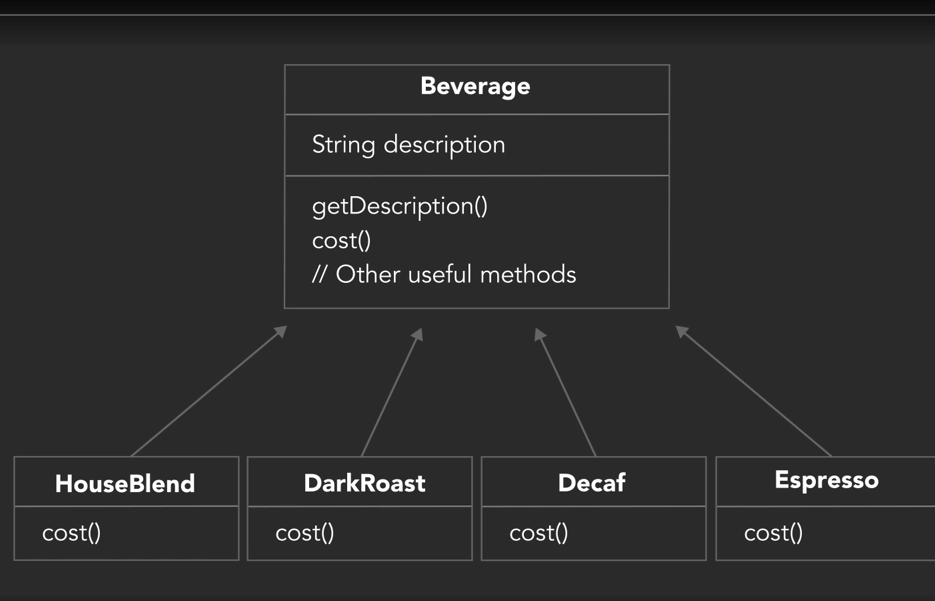
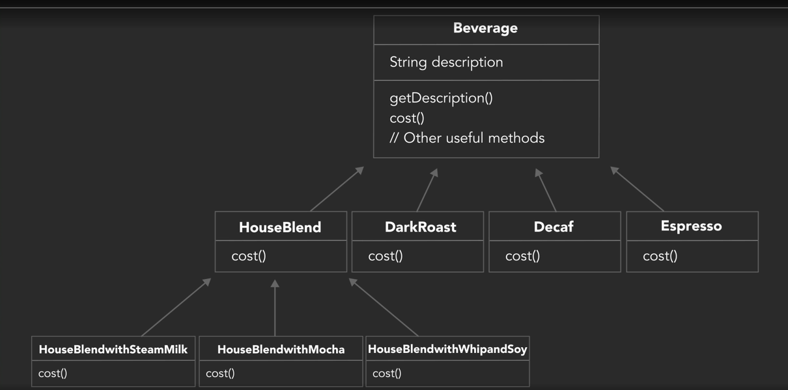
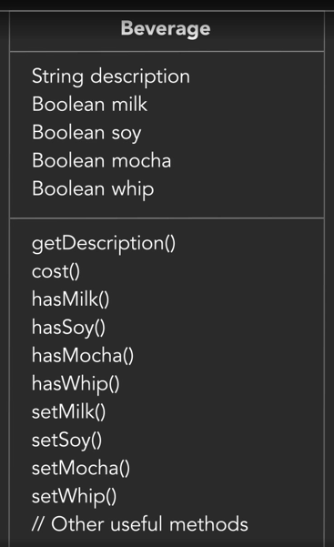
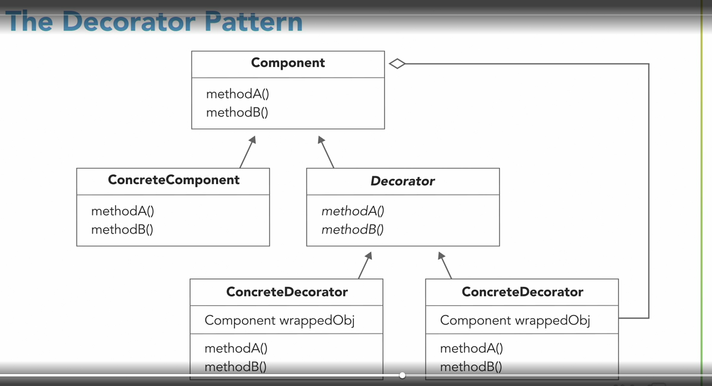
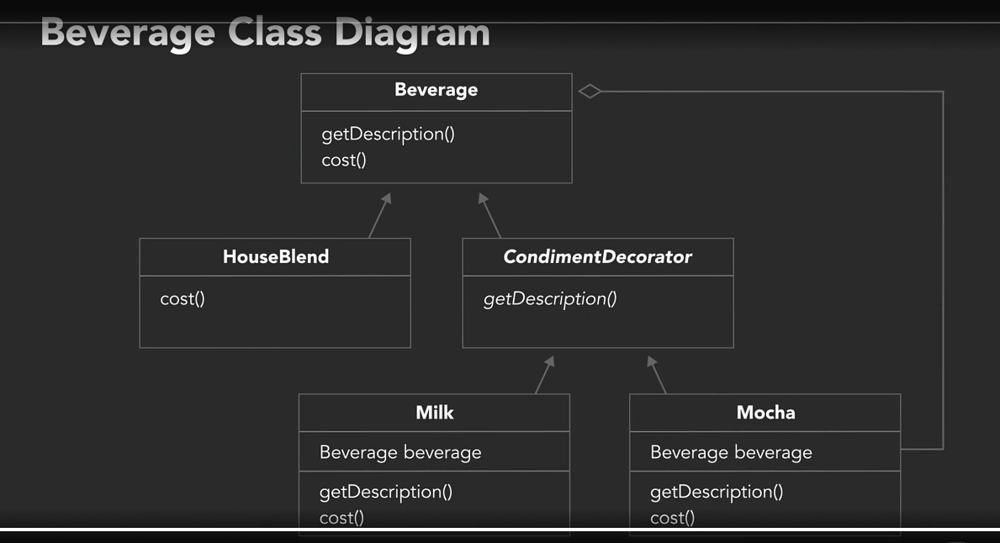
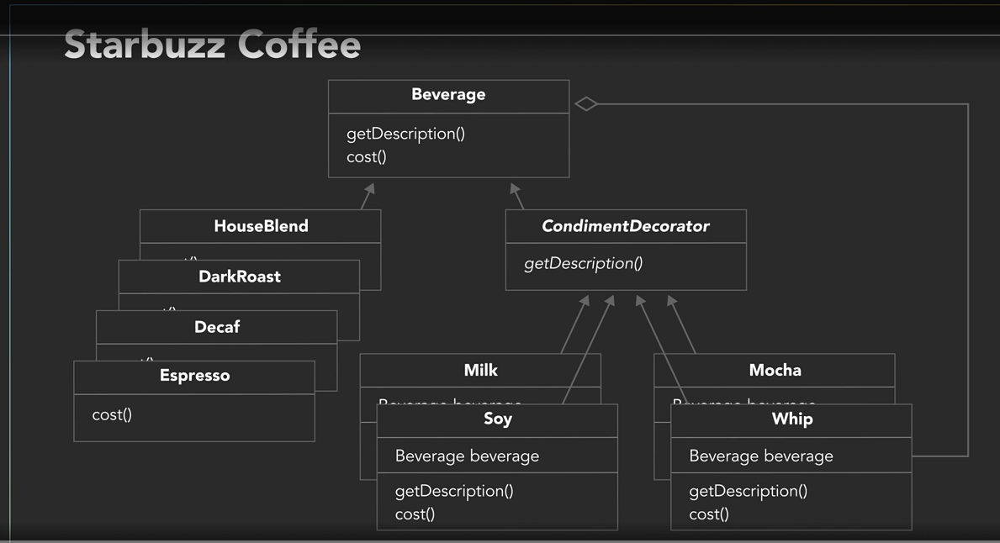
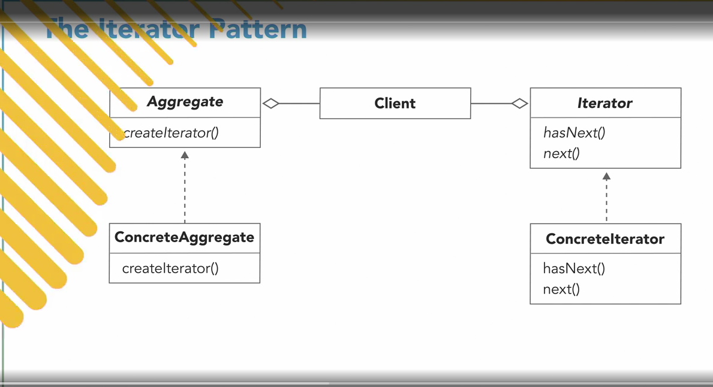

# Design Pattern

## Strategy Pattern

Consider below example for understanding,

- We have a requirement of designing a Duck Simulator

```java
class Duck {
  void quake() {
    // quake quake
  }

  void swim() {
    // swimming
  }

  void fly() {
    // flying
  }

  abstract void display();

}

class WhiteDuck {
  @Overide
  void display() {
    // white duck display
  }

}

class BlackDuck {
  @Overide
  void display() {
    // black duck display
  }

}
```

- In above example we used only inheritence.
- The above design is difficult to manage when system grow.
- Example: If we have a `ToyDuck` , then it dont quake rather it just `beep`.
  - Hence we may need to override quake method and change its quake behaviour
  - When such requirements grow it will lead to lot of code duplication.
- To solve such problem think,
  - What are the parts that varies and use Inheritance in such case.
  - Like `QuakeBehaviour` in our case.
  - Implement different QuakeBehaviours.
  - Use reference of quake behaviour in our Duck class.
  - While creating the Duck tell which QuakeBehaviour to use.
- This idea is maily use composition instead of inheritance.
- Or HAS-A relation instead of IS-A relationship.
- Below is way to use Strategy pattern in our case.

```java
class Duck {
  private QuakeBehaviour quakeBehaviour;

  void fly() {
    // flying
  }

  public Duck(QuakeBehaviour quakeBehaviour) {
    this.quakeBehaviour = quakeBehaviour;
  }

  public void quake() {
    quakeBehaviour.quake();
  }

  abstract void display();
}

interface QuakeBehaviour {
  void quake();
}

class BeepQuake implements QuakeBehaviour {
  @java.lang.Override
  public void quake() {
    // beep beep..
  }
}

class ToyDuck extends Duck {
  public ToyDuck() {
    super(new BeepQuake());
  }

  @java.lang.Override
  void display() {
    // display
  }
}
```

---

## Adapter

- Think of adapter pattern is like some power adapter which sits in between Indian charger pin and american socket.
- As Indian charger pin cannot fit into American socket we need adapter which fix the compatibility issue.
- In our Duck example consider having Turkey but Turkey cannot fit in our DuckSimulator
- Hence, we need Adaptor for Turkey called TurkeyAdaptor

```java
class DuckSimulator {
  void testDuck(Duck duck) {
    duck.fly();
    duck.quake;
    duck.display();
  }
}

interface Turkey {
  void gobble();

  void fly();
}


class WildTurkey implements Turkey {
  // implement turkey
}

class TurkeyAdapter implements Duck {
  // implement methods.
  // here Stretegy pattern helps us as we can define the different Quakebehaviour of Turkey.
  private Turkey turkey;

  public TurkeyAdapter(Turkey turkey) {
    this.turkey = turkey;
  }

  @Override
  public void fly() {
    turkey.fly();
  }
}

// Now we can call DuckSimulator like 
// `new DuckSimulator(new TurkeyAdapter(new WildTurkey()));`
```

---

# Observer

- The observer pattern establishes a one-to-many dependency between objects.
- When one object undergoes a state change, all its dependents are automatically notified and updated.
- Thinking about subscribers and publishers is a great way to visualize the observer pattern


- There are two types of objects `Subject` and `Dependent`
- Dependent are dependent on Subject for Data.
- Subject owns the data as if therre is single copy of it.
- Subject will have methods to register the observer, remove it and notifyAll Observers.
- Makes design loosely coupled.



```java
interface Subject {
  void registerObserver(Observer obsrver);

  void removeObserver(Observer obsrver);

  void notifyAllObserver();
}

interface Observer {
  void update();
}

class SimpleSubject implements Subject {
  private List<Observer> observers = new ArrayList<>();

  @java.lang.Override
  public void registerObserver(Observer obsrver) {
    observers.add(obsrver);
  }

  public void setValue() {
    this.value = value;
    notifyAllObserver();
  }

  @java.lang.Override
  public void notifyAllObserver() {
    observers.forEach(observer -> observer.update());
  }
}
```

---

## Decorator

First Understand the problem decorator pattern can solve.

Consider the example of Coffee shop having beverages.

Inheritance way of implementing it is,



Now, how to handle condiments, One way is given below,But it making our design very difficult.



Now, if we further optimise it, we can add boolean variables and we can set condiments to the beverages. But calculating
cost is difficult we need to check if what all condiments are added and calculate the cost.



Now we have design, but it is not very flexible, to solve the above problems' decorator pattern comes into picture.



- In decorator we have `Component` (in our case Beverage) and we have `decorator` (in our case condiments)
- ConcreteComponent and Decorator both are of type Component.
- The idea is we keep on creating Components and keep on wrapping it.





```java
abstract class Bevarages {
  String description;

  abstract int cost();

  String description() {
    this.description = "Unknown bevarages";
  }
}

class Expresso extends Bevarages {

  public Expresso() {
    this.description = "Expresso";
  }

  @Override
  int cost() {
    return 20;
  }
}

abstract class CondimentDecorator extends Bevarages {
  public abstract description();
}

class Whip extends CondimentDecorator {
  private Bevarages bevarages;

  public Whip(Bevarages bevarages) {
    bevarages = this.bevarages;
  }

  public String description() {
    return bevarages.decription + ", Whip";
  }

  public int cost() {
    return bevarages.cost + 5;
  }
}

class Sugar extends CondimentDecorator {
  private Bevarages bevarages;

  public Sugar(Bevarages bevarages) {
    bevarages = this.bevarages;
  }

  public String description() {
    return bevarages.decription + ", Sugar";
  }

  public int cost() {
    return bevarages.cost + 5;
  }
}

class CoffeeShop {
  public void takeOrder() {
    Bevarages bevarage = new Expresso();
    bevarage = new Whip(bevarage);
    bevarage = new Sugar(bevarage);

    System.out.println("Description :" + bevarage.description() + " Price: " + bevarage.cost());
  }
}
```

---




