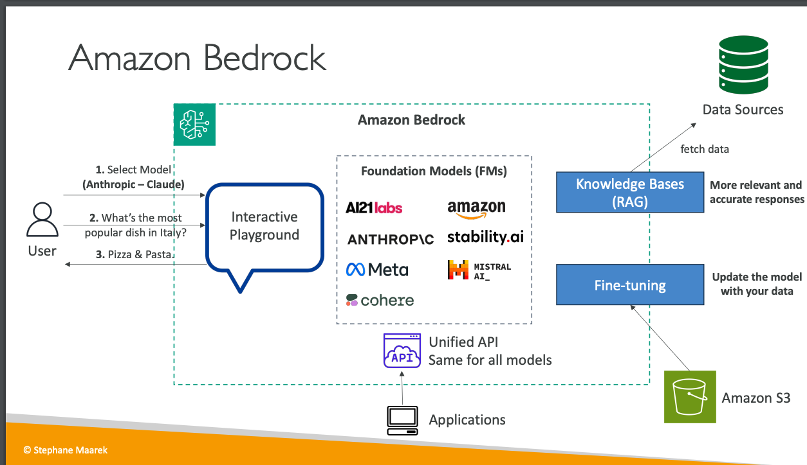

## Introduction to Amazon Bedrock  
- **Purpose**: Build and manage generative AI applications on AWS.  
- **Fully Managed Service**:  
  - No infrastructure to manage.  
  - AWS ensures service availability and functionality.  
- **Data Control**:  
  - Data stays within the user's account.  
  - No data leaves the account for foundation model training.  
- **Pricing**: Pay-per-use model.  
- **Unified API**: Standardized access to all supported models.  
- **Advanced Features**: Includes Retrieval-Augmented Generation (RAG), LLM agents, and responsible AI features.  

## Foundation Models on Amazon Bedrock  
- **Supported Providers**: AI21 Labs, Cohere, Stability.ai, Amazon, Anthropic, Meta, Mitral AI, with more being added over time.  
- **Model Usage**:  
  - Copies of foundation models are made accessible to users.  
  - Models can be fine-tuned using user data without sharing data with providers.  

## Features of Amazon Bedrock  
1. **Interactive Playground**:  
   - Allows users to experiment with models.  
   - Example: Asking "What is the most popular dish in Italy?" might return "Pizza and pasta."  

2. **Knowledge Bases (RAG)**:  
   - Fetches data from external sources for more accurate and relevant responses.  
   - Supports advanced interaction capabilities.  

3. **Model Fine-Tuning**:  
   - Users can adapt models with their own data for specific use cases.  
   - Fine-tuned models remain isolated within the user's account.  

4. **Unified API Access**:  
   - Provides a consistent interface for interacting with all models.  
   - Simplifies application development.  

## Diagram Overview  
- **Core Components**:  
  - Foundation Models: Central to Bedrock's functionality.  
  - Interactive Playground: User interface for basic interactions.  
  - Knowledge Bases: Enhances response accuracy via external data.  
  - Fine-Tuning: Adapts models to specific user needs.  
  - Unified API: Centralized access point for all features.  

## Key Takeaways  
- **Security and Privacy**: Data stays within user control, ensuring compliance and security.  
- **Scalability**: Supports multiple foundation models and advanced features.  
- **Ease of Use**: Fully managed service with standardized access.  

## Hands-on:

- Bedrock:
  - Providers : AB provdes a fully managed service that makes FMs from leading AI startups and Amazon avalable via API. So we can choose wide range of FMs to find the model which suites our requirements. ex: AI21 Labs, Amazon, Anthropic, Coherd, Meta, Mistral AI, Stability AI.
  - Model Access: Shows the list of models from providers - need to enable the access to the models we are intrested in.
  - Playgroud, where we select the model and provide promt to get answer.