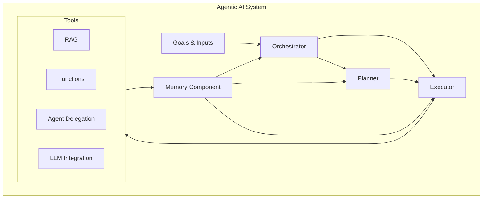
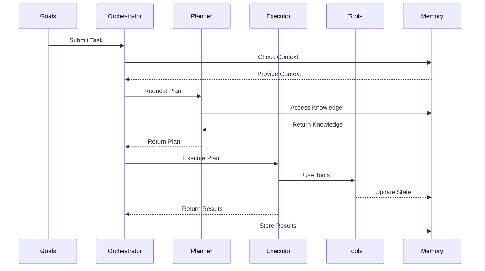

# Components of an Agentic AI System

An agentic AI system is a complex architecture comprising several interconnected components working together to achieve specified goals. The following diagrams and descriptions provide a detailed breakdown of the system architecture and its components.

## System Architecture

## Execution Flow

## Component Details

## Goals and Inputs

### Goals
Goals in Agentic AI represent the desired outcomes that the system is expected to achieve. They share similarities with prompts in GenAI but typically require multi-step processes across multiple tools.

Key characteristics of goals:
- Expressed in natural language or may include other media types
- Require multiple steps or tasks to achieve completion
- Each instance may need different sequences of steps
- Can originate from end users or client applications
- May result in generated output or system actions

Example goals:
- Mathematical problem solving requiring step-by-step breakdown
- Root cause analysis of errors in log files using log repositories and knowledge bases
- Code analysis tasks like memory leak detection in GitHub projects
- Document creation and distribution workflows
- Complex computations like route optimization between locations

### External Inputs
- Additional knowledge and observed data that support goal achievement
- Contextual information needed for goal processing
- System state and environmental data

## Orchestrator

The Orchestrator serves as the central manager of the Agentic AI system, coordinating communications between all components to achieve set goals. It acts as the system's command center with the following key responsibilities:

### Key Functions
- Acts as the single point of contact for external clients, handling input/output
- Maintains knowledge of available services, tools, and their capabilities
- Coordinates with the planner to create task workflows for given goals
- Manages executor interactions for task implementation
- Alternates between planning and execution phases as needed
- Monitors execution progress and implements error handling
- Maintains system state through memory management
  - Tracks chat history
  - Records tool execution results
  - Maintains audit trails
- Manages multiple planning-execution iterations until goals are met

### Workflow Management
- Initiates planning cycles by consulting the planner
- Delegates task execution to the executor
- Evaluates execution results and determines next steps
- Coordinates error recovery and alternative approaches when needed
- Ensures goal completion through iterative refinement

## Planner

### Core Responsibilities
- Creates execution plans for achieving goals
- Maintains inventory of available tools and their capabilities
- Breaks down complex goals into smaller, manageable subgoals
- Identifies and sequences required tasks based on dependencies
- Determines if tasks can be executed sequentially or concurrently
- Selects appropriate tools for task execution
- Creates workflows considering task dependencies and tool capabilities
- Manages input/output relationships between tasks

### LLM Integration
- Collaborates with LLM for plan creation and execution
- Uses LLM for:
  - Understanding user inputs and context
  - Task decomposition and subtask creation
  - Tool selection from available inventory
  - Determining next steps based on previous results
  - Generating final outputs

### Memory Management
- References memory for past similar requests
- Updates memory with planning decisions and outcomes
- Uses execution history for context-aware planning

### Example Workflow
For a goal like "What is the return policy for items in order 1001?", the planner might:
1. Use Tool 1 to retrieve order items
2. For each item, use another tool to fetch return policies
3. Aggregate results and format response
4. Store execution path in memory for future reference

## Executor

The Executor is responsible for implementing the tasks and actions designed by the planner. It serves as the system's implementation arm with the following capabilities:

### Primary Responsibilities
- Executes tasks according to the planner's specifications
- Interfaces with various tool types:
  - Function calls
  - REST API endpoints
  - Queue interfaces
  - Other integration points
- Provides input parameters to tools as specified
- Collects and processes tool execution results
- Returns execution outcomes to the orchestrator
- Performs result validation and basic error handling

### Additional Capabilities
- Conducts goal routing when needed
- Performs reflection on execution results
- Manages tool execution state
- Handles parallel task execution when possible
- Implements retry logic for failed operations

### Implementation Notes
- Can be combined with orchestrator in some implementations
- May be referenced by alternative names (runner, worker, manager)
- Maintains consistent interface regardless of implementation approach
- Focuses on efficient task execution and result handling

## Tools

### Tool Types
Various types of tools are available for task execution in Agentic AI systems:

#### Knowledge and Data Tools
- **RAG (Retrieval-Augmented Generation)**
  - Performs semantic searches to retrieve relevant documents
  - Integrates with knowledge bases and document repositories
  - Enhances responses with contextual information

- **Databases**
  - Provides CRUD (Create, Read, Update, Delete) operations
  - Supports both structured and unstructured data storage
  - Enables data persistence and retrieval

#### Computational Tools
- **Functions**
  - Ranges from simple computations to complex operations
  - Takes specific inputs and returns defined outputs
  - Can interface with third-party cloud services
  - Supports both synchronous and asynchronous operations

- **Microservices**
  - Integrates with enterprise application workflows
  - Provides specialized business logic and operations
  - Enables distributed system integration

#### AI and Cloud Tools
- **GenAI Models**
  - Core Intelligence and Decision Making
    - LLMs serve as the "brain" of AI agents
    - Responsible for planning and decision-making
    - Determines action plans for achieving goals
    - Foundation models and fine-tuned variants for specific domains
  - Multiple Model Integration
    - Single agent can utilize multiple specialized models
    - Planning models for strategic decisions
    - RAG models for knowledge processing
    - Task-specific models (translation, image generation)
  - Implementation Considerations
    - Multiple LLM invocations per goal execution
    - Latency implications from model collaboration
    - Cost considerations for heavy LLM usage
    - Response time and performance trade-offs
  - Specialized Functions
    - Content generation and transformation
    - Image and video processing
    - Language translation
    - Embeddings for RAG systems

- **Cloud Platforms**
  - Integration with services like Salesforce, SharePoint
  - Access to cloud-native services and APIs
  - Enterprise system connectivity

- **Agent Delegation**
  - Delegates tasks to specialized AI agents
  - Enables complex task decomposition
  - Supports parallel processing through agent networks

### Tool Profiles
Tool profiles are essential for effective tool management and usage:

#### Profile Components
- **Purpose and Capabilities**
  - Clear description of tool functionality
  - Specific use cases and limitations
  - Performance characteristics

- **Interface Specifications**
  - Input parameters and formats
  - Output structures and data types
  - API endpoints and protocols

- **Operational Parameters**
  - Resource requirements
  - Rate limits and quotas
  - Authentication methods

- **Error Handling**
  - Common error scenarios
  - Recovery procedures
  - Fallback mechanisms

#### Profile Management
- Profiles are provided as natural language descriptions
- LLM uses profiles to understand tool capabilities
- Orchestrator maintains usage history and effectiveness metrics
- Continuous profile updates based on operational feedback

## Memory Component

Memory is a crucial component in Agentic AI systems, responsible for maintaining context and enabling intelligent decision-making. It consists of two main types: short-term memory and long-term memory.

### Short-Term Memory
- **Scope and Lifetime**
  - Exists for the duration of a single prompt/goal execution
  - Spans across a single chat session with multiple goals
  - Transient storage in computer memory or distributed cache

- **Key Functions**
  - Provides immediate context for LLM planning decisions
  - Tracks current workflow execution history
  - Maintains chat history during user interactions
  - Records tool calls and their results
  - Stores LLM planning calls and responses

### Long-Term Memory
- **Parameter Memory**
  - Fine-tuned model parameters specific to the agent
  - Represents learned behaviors and adaptations

- **Knowledge Storage**
  - Vector databases used in RAG systems
  - Reference knowledge for agent operations
  - Archived short-term memory observations

- **Historical Data**
  - User-assistant conversation history across sessions
  - Planning and tool usage patterns over time
  - Enables analytics and learning from experience

### Integration with Components
- Provides contextual information to the Orchestrator
- Supports Planner's decision-making process
- Enables Executor to maintain task state
- Facilitates tool result persistence and retrieval

## Component Relationships

### Goal-Driven Architecture
- Goals define the system's objectives and guide component interactions
- Components work in harmony to achieve specified goals efficiently
- Continuous feedback loop ensures progress tracking and adaptation

### Component Communication
- Seamless information flow between components
- Standardized interfaces for component interaction
- Event-driven communication for real-time updates
- State management across component boundaries

### System Integration
- Components are loosely coupled but highly cohesive
- Modular design allows for component upgrades and replacements
- Scalable architecture supports system growth
- Robust error handling and recovery mechanisms