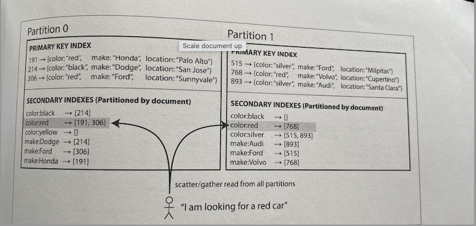
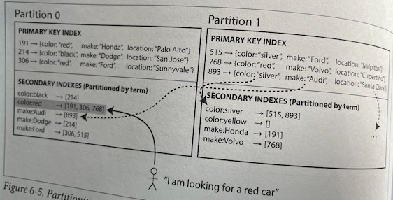

# Partitioning

Replication, for very large datasets or very high query throughput is not sufficient, we need to break the data up into
partitions (sharding).

Basically, each partition is a small database of its own.

The main reason for wanting to partition data is scalability, query load can be distributed across many processors.
Throughput can be scaled by adding more nodes.

---

## Partitioning and replication

Each record belongs to exactly one partition, it may still be stored on several nodes for fault tolerance.

A node may store more than one partition.

---

## Partition of key-value data

Our goal with partitioning is to spread the data and the query load evenly across nodes.

If partition is _unfair_, we call it _skewed_. It makes partitioning much less effective. A partition with
disproportionately high load is called a hot spot.

The simplest approach is to assign records to nodes randomly. The main disadvantage is that if you are trying to read a
particular item, you have no way of knowing which node it is on, so you have to query all nodes in parallel.

## Partition by key range

Assign a continuous range of keys, like the volumes of a paper encyclopaedia. Boundaries might be chose manually by an
administrator, or the database can choose them automatically. On each partition, keys are in sorted order so scans are
easy.

The downside is that certain access patterns can lead to hot spots.

## Partitioning by hash of key

A good hash function takes skewed data and makes it uniformly distributed.

There is no need to be cryptographically strong (MongoDB uses MD5 and Cassandra uses Murmur3).

You can assign each partition a range of hashes. The boundaries can be evenly spaced or they can be chosen
pseudorandomly (consistent hashing).

Unfortunately we lose the ability to do efficient range queries. Keys that were once adjacent are now scattered across
all the partitions. Any range query has to be sent to all partitions.

---

## Skewed workloads and relieving hot spots

You can't avoid hot spots entirely. For example, you may end up with large volume of writes to the same key.

It's the responsibility of the application to reduce the skew.

A simple technique is to add a random number to the beginning or end of the key.

Splitting writes across different keys, makes reads now to do some extra work and combine them.

---

## Partitioning and secondary indexes

The situation gets more complicated if secondary indexes are involved. A secondary index usually doesn't identify the
record uniquely. They don't map neatly to partitions.

**Partitioning secondary indexes by document :**

Each partition maintains its secondary indexes, covering only the documents in that partition (local index).

You need to send the query to all partitions, and combine all the results you get back (scatter/gather). This is prone
to tail latency amplification and is widely used in MongoDB, Riak, Cassandra, Elasticsearch, SolrCloud and VoltDB.

**Partitioning secondary indexes by term :**

We construct a _global index_ that covers data in all partitions. The global index must also be partitioned so it
doesn't become the bottleneck.

It is called the term-partitioned because the term we're looking for determines the partition of the index.

Partitioning by term can be useful for range scans, whereas partitioning on a hash of the term gives a more even
distribution load.

The advantage is that it can make reads more efficient: rather than doing scatter/gather over all partitions, a client
only needs to make a request to the partition containing the term that it wants. The downside of a global index is that
writes are slower and complicated.

---

## Rebalancing partitions

The process of moving load from one node in the cluster to another.

Strategies for rebalancing:

- **How not to do it: Hash mod n.**
  - The problem with mod N is that if the number of nodes N changes, most of the keys will need to be moved from one
    node to another.
- **Fixed number of partitions**
  - Create many more partitions than there are nodes and assign several partitions to each node.
  - If a node is added to the cluster, we can steal a few partitions from every existing node until partitions are
    fairly distributed once again.
  - The number of partitions does not change, nor does the assignment of keys to partitions.
  - The only thing that change is the assignment of partitions to nodes.
  - This is used in Riak, Elasticsearch, Couchbase, and Voldemport.
  - **You need to choose a high enough number of partitions to accomodate future growth.** Neither too big or too small.
- **Dynamic partitioning**
  - The number of partitions adapts to the total data volume.
  - An empty database starts with an empty partition.
  - While the dataset is small, all writes have to processed by a single node while the others nodes sit idle.
  - HBase and MongoDB allow an initial set of partitions to be configured (pre-splitting).
- **Partitioning proportionally to nodes**
  - Cassandra and Ketama make the number of partitions proportional to the number of nodes.
  - Have a fixed number of partitions per node.
  - This approach also keeps the size of each partition fairly stable.

### Automatic versus manual rebalancing

Fully automated rebalancing may seem convenient but the process can overload the network or the nodes and harm the
performance of other requests while the rebalancing is in progress.

It can be good to have a human in the loop for rebalancing. You may avoid operational surprises.

---

## Request routing

This problem is also called service discovery. There are different approaches:

- Allow clients to contact any node and make them handle the request directly, or forward the request to the appropriate
  node.
- Send all requests from clients to a routing tier first that acts as a partition-aware load balancer.
- Make clients aware of the partitioning and the assignment of partitions to nodes.

In many cases the problem is: how does the component making the routing decision learn about changes in the assignment
of partitions to nodes?

- Many distributed data systems rely on a separate coordination service such as ZooKeeper to keep track of this cluster
  metadata.
- Each node registers itself in ZooKeeper, and ZooKeeper maintains the authoritative mapping of partitions to nodes.
- The routing tier or the partitioning-aware client, can subscribe to this information in ZooKeeper
- HBase, SolrCloud and Kafka use ZooKeeper to track partition assignment.
- MongoDB relies on its own config server.
- Cassandra and Riak take a different approach: they use a gossip protocol.

### Parallel query execution

_Massively parallel processing (MPP)_ relational database products are much more sophisticated in the types of queries
they support.
