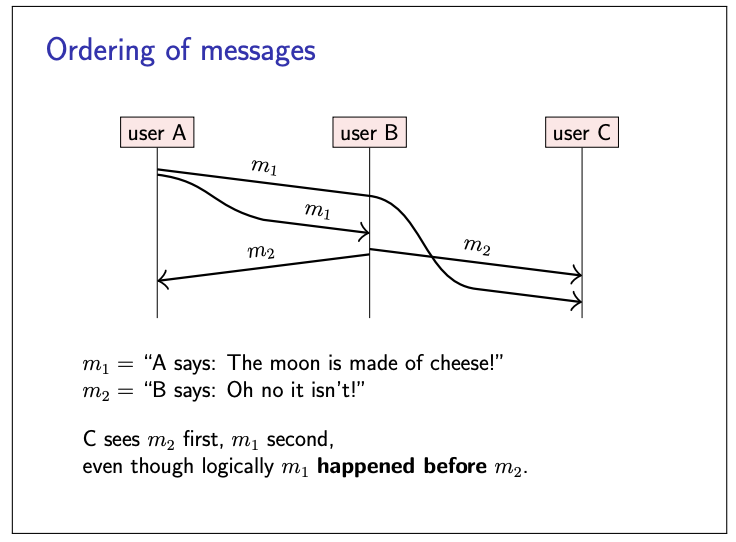
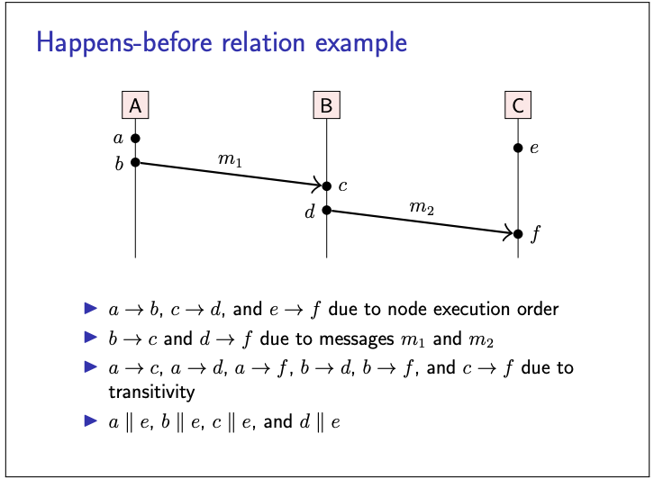

# Happens before

Consider the below example in pic,

- consider m1 to be an instruction that creates an object in a database, and m2 to be an instruction that updates this same object
-  If a node processes m2 before m1 it would first attempt to update a nonexistent object,
- How can C determine the correct order in which it should put the messages?
- A monotonic clock won’t work since its timestamps are not comparable across nodes.
- time-of-day clock won't word as in a partially synchronous system model using NTP, this does not work reliably
- To solve this we use **happens-before relationship.**

- In happens-before relationship  assumes that each node has only a single thread of
execution, so for any two execution steps of a node, it is clear which one happened first.
- We then extend this order across nodes by defining that a message is sent before that same message
is received (for clarification understand the pic below)

- partial order, which means that it is possible that for some events a and b, neither a happened before b, nor
b happened before a. In that case, we call a and b **concurrent.**

# Causality

- The happens-before relation is a way of reasoning about causality in distributed systems.
- Causality considers whether information could have flowed from one event to another, and thus whether one event may have influenced another.

