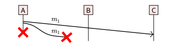
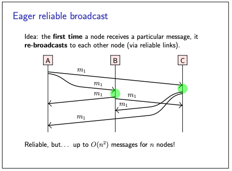
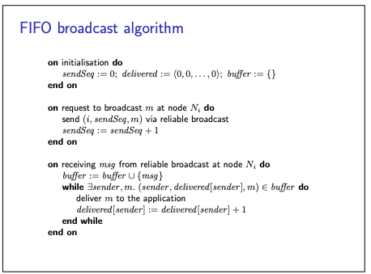
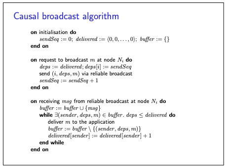
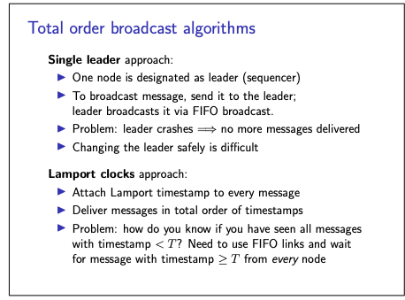

# Broadcast Algorithms

- We will now move on to algorithms for implementing broadcast.
- Roughly speaking, this involves two steps:
  - ensuring that every message is received by every node -> Make best-effort broadcast reliable by retransmitting
    dropped messages
  - delivering those messages in the right order -> Enforce delivery order on top of reliable broadcast

### Ensuring that every message is received by every node

First attempt:

- when a node wants to broadcast a message, it individually sends that message to every other node,
- Use reliable links (retry + deduplicate)
- However, it could happen that a message is dropped, and the sender crashes before retransmitting it
- In this situation, one of the nodes will never receive that message.

To optimise further:

- To improve the reliability, we can enlist the help of the other nodes.
- For example, we could say that the first time a node receives a particular message, it forwards it to every other
  node (this is called eager reliable broadcast).
- This algorithm ensures that even if some nodes crash, all of the remaining (non-faulty)
  nodes will receive every message.
- However, this algorithm is fairly inefficient: in the absence of faults, every message is sent O(n^2) times in a group
  of n nodes
- as each node will receive every message n − 1 times
- This means it uses a large amount of redundant network traffic.

Further, optimise:

- One particularly common family of broadcast algorithms are **gossip protocols**
- also known as epidemic protocols
- In these protocols, a node that wishes to broadcast a message sends it to a small fixed number of nodes that are
  chosen randomly
- On receiving a message for the first time, a node forwards it to a fixed number of randomly chosen nodes.
- This resembles the way gossip, rumours, or an infectious disease may spread through a population
- Gossip protocols do not strictly guarantee that all nodes will receive a message: it is possible that in the random
  selection of nodes, some node is always omitted.
- However, if the parameters of the algorithm are chosen appropriately, the probability of a message not being delivered
  can be very small.
- Gossip protocols are appealing because, with the right parameters, they are very resilient to message loss and node
  crashes while also remaining efficient.

### delivering those messages in the right order

- Now that we have reliable broadcast (using eager reliable broadcast or a gossip protocol), we can build FIFO, causal,
  or total order broadcast on top of it.

I am attaching screenshots of the algos, have not spent too much time understanding it.

