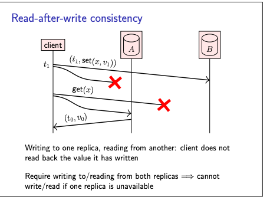
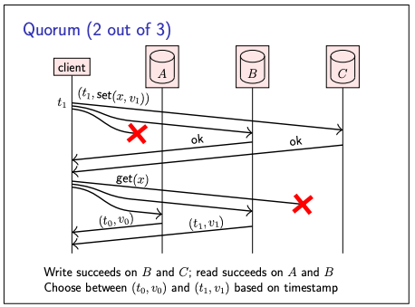
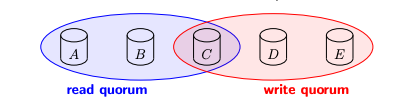
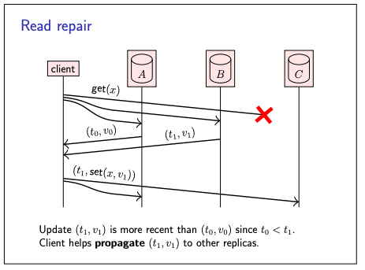

# Quorums

- As discussed, replication is useful since it allows us to improve the reliability of a system
- when one replica is unavailable, the remaining replicas can continue processing requests.
- Unavailability could be due to a faulty node (e.g. a crash or a hardware failure), due to a network partition
  (inability to reach a node over the network), or planned maintenance (e.g. rebooting a node to install software
  updates
- Without fault tolerance, having multiple replicas would make reliability worse:
    - That is, the more replicas you have, the greater the probability that any one of the replicas is faulty at any one
      time
    - However, if the system continues working despite some faulty replicas, then reliability improves
    - the probability that all replicas are faulty at the same time is much lower than the probability of one replica
      being faulty.
- We will now explore how to achieve fault tolerance in replication

**To begin with consider example,**

**Read-after-write consistency**

- Assume we have two replicas, A and B, which initially both associate the key x with a value v0 (and timestamp t0).
- A client attempts to update the value of x to v1 (with timestamp t1).
- It succeeds in updating B, but the update to A fails as A is temporarily unavailable.
- Subsequently, the client attempts to read back the value it has written; the read succeeds at A but fails at B.
- As a result, the read does not return the value v1 previously written by the same client, but rather the initial value
  v0.
- As this behaviour is confusing for users, many systems require read-afterwrite consistency (also known as
  read-your-writes consistency)
- Strictly speaking, with read-after-write consistency, after writing a client may not read the value it wrote because
  concurrently another client may have overwritten the value.
- Therefore we say that read-after-write consistency requires reading either the last value written, or a later value.

**Solution to the above problem,**

_Solution 1:_

- we could guarantee read-after-write consistency by ensuring we always write to both replicas and/or read from both
  replicas.
- However, this would mean that reads and/or writes are no longer fault-tolerant, if one replica is unavailable

_Solution 2:_

- We can solve this conundrum by using three replicas
- We send every read and write request to all three replicas, but we consider the request successful as long as we
  receive ≥ 2 responses
- In the example, the write succeeds on replicas B and C
- while the read succeeds on replicas A and B.
- With a “2 out of 3” policy for both reads and writes, it is guaranteed that at least one of the responses to a read is
  from a replica that saw the most recent write
- Different replicas may return different responses to the same read request
- But timestamps, the client can tell which response is the more recent one

Quorums:

- This above behaviour is reading and writing to **quorums**
- the set of replicas {B, C} that responded to the write request is a write quorum
- and the set {A, B} that responded to the read is a read quorum
- Assume,
    - If a write is acknowledged by w replicas (write quorum),
    - and we subsequently read from r replicas (read quorum),
    - then r + w > n
    - This ensures that, Read quorum and write quorum share ≥ 1 replica

**Read repair**

- In this quorum approach to replication, some updates may be missing from some replicas at any given moment
- For example in above pic, the (t1, v1) update is missing from replica A, since that write request was dropped.
- To bring replicas back in sync with each other, one approach is to rely on an **anti-entropy** process
- Another option is to get clients to help with the process of disseminating updates
- Example - the client reads (t1, v1) from B, but it receives an older value (t0, v0) from A, and no response from C.
  Since the client now knows that the update (t1, v1) needs to be propagated to A, it can send that update to A