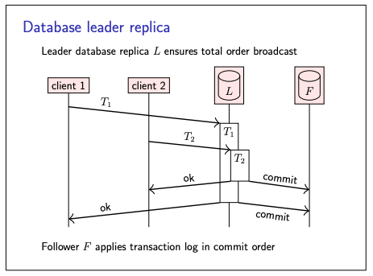
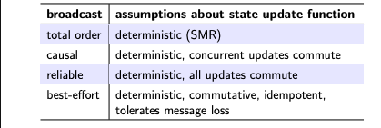

# Replication using broadcast

- We have seen **Quorum** approach essentially uses the best effort broadcast.
    - Where client broadcast every read or write request to all the replicas but the protocol is unreliable.
    - As request might be lost and provides no ordering guarantees.
- An alternative approach to replication is to use the broadcast protocols
- Let’s first consider FIFO-total order broadcast, the strongest form of broadcast we have seen.

### Replication using FIFO-total order broadcast protocol

- we broadcast every update request to the replicas, which update their state based on each message as it is delivered.
  This is called **state machine replication (SMR)**
- We only require that the update logic is **deterministic**:
    - any two replicas that are in the same state, and are given the same input, must end up in the same next state.
    - Even errors must be deterministic: if an update succeeds on one replica but fails on another, they would become
      inconsistent.
- Some distributed database perform replication in this way, with each replica independently executing the same
  deterministic transaction code
- This principle also underpins blockchains, cryptocurrencies, and distributed ledgers

**Algorithm for state machine replication:**

```shell
on request to perform update u do
  send u via FIFO-total order broadcast
end on

on delivering u through FIFO-total order broadcast do
  update state using arbitrary deterministic logic!
end on
```

**Limitations:**

- Cannot update state immediately, have to wait for delivery through broadcast
- Need fault-tolerant total order broadcast (More on this later)

**Database leader replica:**



- one way of implementing total order broadcast is to designate one node as the leader
- and to route all broadcast messages through it in order to impose a delivery order.
- This principle is also widely used for database replication
- many database systems designate one replica as leader, primary, or master
- Any transactions that wish to modify the database must be executed on the leader replica
- the leader may execute multiple transactions concurrently; however, it commits those transactions in a total order
- When a transaction commits, the leader replica broadcasts the data changes from that transaction to all the follower
  replicas, and the followers apply those changes in commit order

### Replication using other broadcast protocols

- We can use other broadcast protocols for replication
- however, more care is required to ensure that replicas remain consistent.
- It is not sufficient to merely ensure that the state update is deterministic
- For example, we can use causal broadcast, which ensures the same delivery order across replicas when one update
  happened before another, but which may deliver concurrent updates in any order.
- If we want to ensure that replicas end up in the same state, no matter in which order concurrent updates are
  delivered, we need to make those updates **commutative**
    - that is, we have to ensure that the final result is the same, no matter in which order those updates are applied.
    - More on commutative in later captures.
    - Updates f and g are commutative if f(g(x)) = g(f(x))

