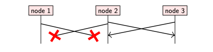
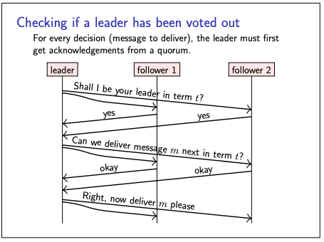

# Consensus

- We saw earlier in the total order broadcast protocol is by designating one node as the leader, and routing all
  messages via it.
- The leader then just needs to distribute the messages via FIFO broadcast, and this is sufficient to ensure that all
  nodes deliver the same sequence of messages in the same order.
- However, the big problem with this approach is that the leader is a single point of failure: What if it fails ?
- One way of overcoming this is through manual intervention,
    - This process is called failover, and it is in fact used in many database systems
    - Failover works fine in situations where the leader unavailability is planned in advance
    - However, for sudden and unexpected leader outages is a problem.
- This raises the question: can we automatically transfer the leadership from one node to another in the case that the
  old leader becomes unavailable?
    - this is exactly what consensus algorithms do.

### Consensus and total order broadcast

- Traditional formulation of consensus: several nodes want to come to agreement about a single value
- In context of total order broadcast: this value is the next message to deliver
- Once one node decides on a certain message order, all nodes will decide the same order
- Consensus and total order broadcast are formally equivalent

**Common consensus algorithms:**

- Paxos: single-value consensus
- Multi-Paxos: generalisation to total order broadcast
- Raft, Viewstamped Replication, Zab: FIFO-total order broadcast by default

**Consensus system models**

- Paxos and Raft assume a system model with
    - fair-loss links
    - crash-recovery behaviour of nodes
    - partial synchrony

**Leader Election Idea for most consensus algos**

- A leader election is initiated when the other nodes suspect the current leader to have failed
- typically because they haven’t received any message from the leader for some time.
- One of the other nodes becomes a candidate and asks the other nodes to vote on whether they accept the candidate as
  their new leader.
- If a quorum of nodes vote in favour of the candidate, it becomes the new leader

**Can we guarantee there is only one leader?**

- If there were multiple leaders, they could make inconsistent decisions that lead to violations of the safety
  properties of total order broadcast (a situation known as split brain)
- Therefore, the key thing we want of a leader election is that there should only be one leader at any one time.
- Possibility of multiple leaders are:
    - Example :
        - node 1 is leader in term t, but due to a network partition it can no longer communicate with nodes 2 and 3
        - Nodes 2 and 3 may elect a new leader in term t + 1.
        - Node 1 may not even know that a new leader has been elected!
        - Thus, we end up with two nodes both believing to be the leader.

**Solution for this multiple leader voting ?**

- even after a node has been elected leader, it must act carefully, since at any moment the system might contain be
  another leader with a later term that it has not yet heard about.
- It is not safe for a leader to act unilaterally.
- Instead, every time a leader wants to decide on the next message to deliver, it must again request confirmation from a
  quorum of nodes
- For every decision (message to deliver), the leader must first get acknowledgements from a quorum.
- Therefore, even though multiple leaders may exist at the same time, the old leaders will no longer be able to decide
  on any further messages to deliver, making the algorithm safe.

