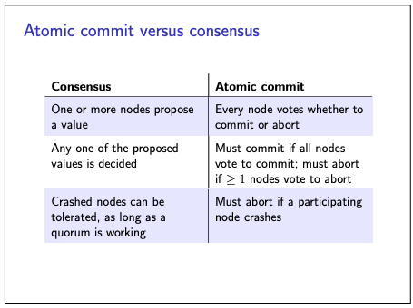
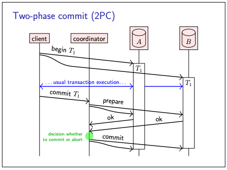
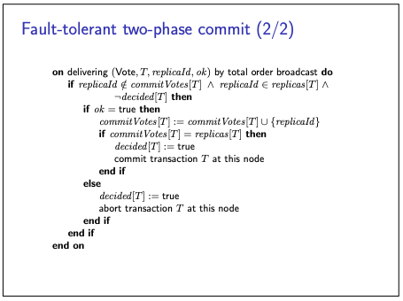

# Two phase commit

- Let’s start with a consistency problem that arises when executing a distributed transaction, i.e. a transaction that
  reads or writes data on multiple nodes.
- The data on those nodes may be replicas of the same dataset, or different parts of a larger dataset; a distributed
  transaction applies in both cases.
- a key property of a transaction is atomicity.
- When a transaction spans multiple nodes, we still want atomicity for the transaction as a whole:
    - that is, either all nodes must commit the transaction and make its updates durable, or all nodes must abort the
      transaction and discard or roll back its updates.
- We thus need agreement among the nodes on whether the transaction should abort or commit
- This is different from consensus.

- The most common algorithm to ensure atomic commitment across multiple nodes is the two-phase commit (2PC) protocol
- The communication flow of 2PC is illustrated below

- The client begin/opens the transaction on multiple database nodes
    - And it just starts the transaction as usual, sends the transaction identifier T1 to those nodes.
    - And does its usual thing so transaction may read & write arbitrary objects in the database.
    - Two phase commit only starts when we ready to commit the transaction.
    - When the client is ready to commit the transaction, it sends a commit request to the transaction coordinator
        - a designated node that manages the 2PC protocol. (In some systems, the coordinator is part of the client.)
    - Phase 1:
        - The coordinator first sends a prepare message to each replica participating in the transaction
        - each replica replies with a message indicating whether it is able to commit the transaction
        - The replicas do not actually commit the transaction yet, but they must ensure that they will definitely be
          able to commit the transaction in the second phase if instructed by the coordinator.
        - This means, in particular, that the replica must write all of the transaction’s updates to disk and check any
          integrity constraints before replying ok to the prepare message, while continuing to hold any locks for the
          transaction.
    - Phase 2:
        - The coordinator collects the responses, and decides whether or not to actually commit the transaction
        - If all nodes reply ok, the coordinator decides to commit;
        - if any node wants to abort, or if any node fails to reply within some timeout, the coordinator decides to
          abort.
        - The coordinator then sends its decision to each of the replicas, who all commit or abort as instructed
        - If the decision was to commit, each replica is guaranteed to be able to commit its transaction because the
          previous prepare request laid the groundwork. If the decision was to abort, the replica rolls back the
          transaction.

### What if coordinator crashes ?

- The problem with two-phase commit is that the coordinator is a single point of failure.
- Crashes of the coordinator can be tolerated by having the coordinator write its commit/abort decisions to stable
  storage
- But there will be some transactions which are prepared but not committed/aborted when coordinator crash (in-doubt
  transactions)
    - Any in-doubt transactions must wait until the coordinator recovers to learn their fate
    - they cannot unilaterally decide to commit or abort, because that decision could end up being inconsistent with the
      coordinator and other nodes, which might violate atomicity

**But it is possible to avoid the single point of failure of coordinator using consensus algorithm (leader selection)
and total broadcast protocol**

- Here the idea is that, every node that is participating in the transaction uses total order broadcast to disseminate
  its vote on whether to commit or abort.
- Moreover, if node A suspects that node B has failed (because no vote from B was received within some timeout), then A
  may try to vote to abort on behalf of B.
    - This introduces a race condition:
    - if node B is slow, it might be that node B broadcasts its own vote to commit around the same time that node A
      suspects B to have failed and votes on B’s behalf.
- In doing so, we count only the first vote from any given replica, and ignore any subsequent votes from the same
  replica.
- Since total order broadcast guarantees the same delivery order on each node, all nodes will agree on whether the first
  delivered vote from a given replica was a commit vote or an abort vote

**Pseudocode for 2PC having fault tolerance.**

