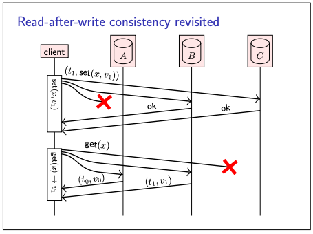
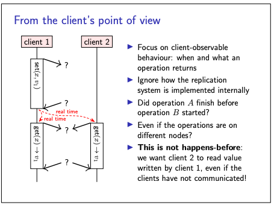
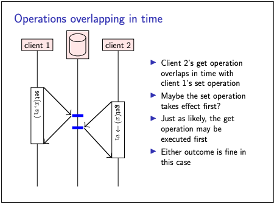
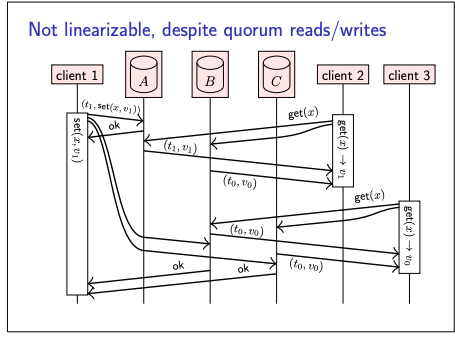
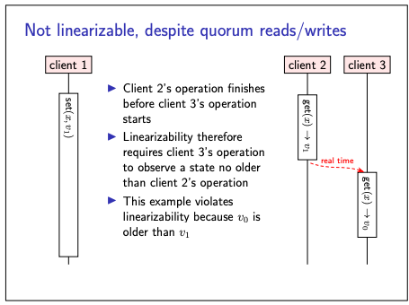
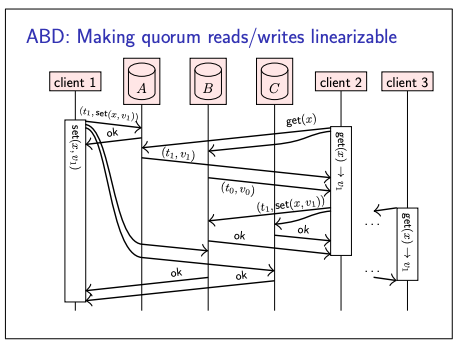

## Linearizability

### Why Linearizability consistency model?

- We have seen atomic commitment protocol (2PC) is a way of preserving consistency across multiple replicas in the face
  of faults
- It does that by ensuring that all participants of a transaction either commit or abort
- However, when there are multiple nodes concurrently reading and modifying some shared data concurrently, ensuring the
  same commit or abort outcome for all nodes is not sufficient.
- We also have to reason about the interaction that arises from concurrent activity.
- Hence Linearizability comes to rescue.

### Details about Linearizability

- The main purpose of linearizability is to guarantee that nodes observe the system in an “up-to-date” state; that is,
  they do not read stale (outdated) values
- The idea behind linearizability is that the system as a whole behaves as if it was not replicated or distributed at
  all
- so it behaves as if there was actually only a single copy of the data and all of the operations happen atomically on
  that single copy of the data
- so when you issue a read or write operation that operation will take an effect atomically at some point in time
- and even though there might be multiple replicas in the system from the point of view of the clients it looks as
  though there was only a single copy of the data

**revisit Read after write consistency**

- Previously we saw read after write consistency
- It reads and write from quorums,
- so if you have a client that wants to write some value v1 to some object x it can make this write request to a quorum
  of replicas and if a quorum responds okay then this set request is successful
- then subsequently that same client might make a get requests and send that get request to a quorum of replicas get
  some responses back use the timestamps to figure out which is the more recent value
- BUT this read after write model defines consistency by the for read and write made by the same node.
- WHEREAS, linearizability generalises this idea to operations made concurrently by different nodes.

**What matters in Linearizability**

- Linearizability is independent of the system implementation and communication protocols:
- all that matters is the timing of each operation’s start and finish, and the outcome of the operation.
- The key thing that linearizability cares about is whether one operation finished before another operation started,
  regardless of the nodes on which they took place.

Lets see system behaviour from client point of view.

Consider below pics,

- In pic 1
  - the two get operations both start after the set operation has finished,
  - and therefore we expect the get operations to return the value v1 written by set.
- In pic 2
  - the get and set operation overlap in time:
  - in this case we don’t necessarily know in which order the operations take effect.
  - get may return either the value v1 written by set, or x’s previous value v0, and either result is acceptable

Note:

- “operation A finished before operation B started” is not the same as “A happened before B”.
- The happens-before relation is defined in terms of messages sent and received;
- it is possible to have two operations that do not overlap in time, but are still concurrent according to the
  happens-before relation because no communication has occurred between those operations.
- On the other hand, linearizability is defined in terms of real time:
  - To understand more on this point:
  - a hypothetical global observer who can instantaneously see the state of all nodes (or, a perfectly synchronised
    clock on each node) determines the start and finish times of each operation.
  - In reality such global observer or perfectly sync clock does not exists.
  - But we can define linearizability in tearms of of such a hypothetical observer.
  - This has the advantage that if we prove a system to be linearizable, we can be sure that its consistency guarantees
    hold regardless of whether some communication has taken place or not.

**linearizability for one get operation to another get operation.**

- Linearizability is not only about the relationship of a get operation to a prior set operation,
- but it can also relate one get operation to another
- Example:
  - client 1 sets x to v1, and due to a quirk of the network the update to replica A happens quickly, while the updates
    to replicas B and C are delayed.
  - Now, Client 2 reads from a quorum of {A, B}, receives responses {v0, v1}
  - After client 2’s read has finished, client 3 starts a read from a quorum of {B, C}, receives v0 from both replicas,
    and returns v0 (since it is not aware of v1).
- Thus, client 3 observes an older value than client 2, even though the real-time order of operations would require
  client 3’s read to return a value that is no older than client 2’s result.
- This behaviour is not allowed in a linearizable system.
- Fortunality, we can fix this problem using read repair.
- Example:
  - Once client 2 reads the most recent value v1 from the quorum, it must write back to all other nodes, to ensure that
    the most recent value is available in the quorum.
  - The get operation of client 2 finishes only after it gets ok response from the quorum for its read repair request.
  - This ensures that client 3 get which starts after client2 get in real time, will always get the latest value.
  - This approach is known as the ABD algorithm
- Important point to consider whith ABD algo is that:
  - To generalise the ABD algorithm to a setting where multiple nodes may perform set operations, we need to ensure
    timestamps reflect the real-time ordering of operations.
  - Say operation set(x, v1) has a timestamp of t1, operation set(x, v2) has a timestamp of t2, and the first operation
    finishes before the second operation starts: then we must ensure that t1 < t2.

