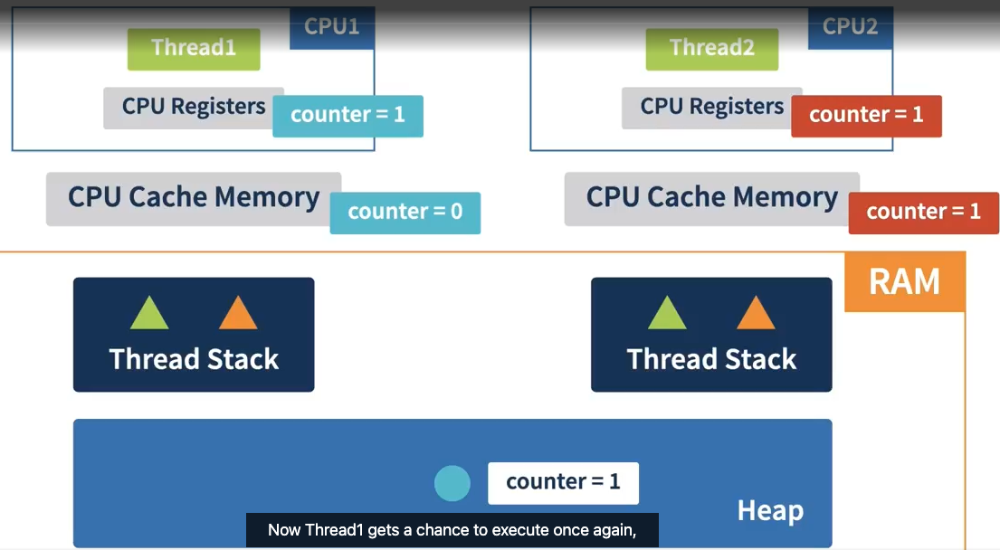

# Memory Inconsistency: Data Race

- **Java Memory Model**:
  - Memory is structured across **CPU registers**, **CPU cache**, and **main memory (RAM)**.
  - Threads running on different CPUs/cores access data in memory, leading to potential issues.

- **Data Flow**:
  - CPU fetches data from main memory into **cache** and then into **CPU registers** for processing.
  - Data is written back to main memory in reverse order (from registers to cache to RAM).

- **Data Race**:
  - Occurs when multiple threads access shared data (e.g., a variable in heap) without proper synchronization.
  - Example: 
    - **Thread1** and **Thread2** both read the counter's value (0) into their CPU registers.
    - Thread1 increments it to 1 but doesn’t write back to memory immediately.
    - Thread2 increments its own copy of the counter and writes it back as 1.
    - Thread1 later writes its stale value (1) back to memory, causing the final value to be incorrect.

- **Consequence**:
  - Despite both threads performing an increment operation, the final value remains 1 instead of 2.
  - Memory ends up in an inconsistent state due to the missed write from Thread1.

- **Example in Action**:
  - In a task where two threads increment a counter to 1 million each, the final count should be 2 million.
  - Due to a data race, the final value is often less than expected.

- **Key Points**:
  - A data race might not always occur; it depends on **context switching** and how the OS schedules thread execution.
  - However, the inconsistent behavior caused by data races must be **prevented** to ensure correct memory states.