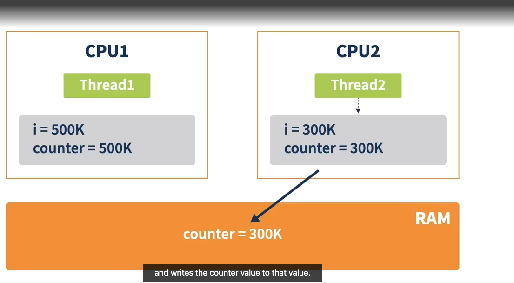

# Thread Interference: Race Condition

- **Thread Execution**:
  - Threads execute in an arbitrary order decided by the operating system, akin to vehicles overtaking each other.
  - There is no guarantee on the timing or ordering of thread execution.

- **Impact on Results**:
  - The timing and ordering of thread execution can affect the correctness of results when threads access shared data (e.g., an object in the heap).
  - Issues are more apparent with non-atomic operations, such as `counter++`.

- **Race Condition**:
  - A race condition occurs when multiple threads access a shared variable without proper synchronization.
  - **Example**:
    - **Thread1** executes first, reads the counter value (0), and increments it to 1.
    - The operation `counter++` is not atomic; it consists of three steps: read, update, and write.
    - In the brief period during these operations, **Thread2** might read the same counter value (0), increment it, and write it back to memory.
    - Consequently, the main memory holds a value of 1 instead of the expected 2.

- **Practical Example**:
  - In the `MyRunnable` class, a member variable named `counter` is shared between **Thread1** and **Thread2**.
  - Each thread increments the counter in a loop, which should lead to a final count of 2 million if both execute correctly.
  - After executing, the program prints the counter value and the time taken for each thread.
  - Results may vary across runs due to race conditions:
    - **Thread2** may finish earlier (e.g., in 15 milliseconds) than **Thread1** (e.g., in 20 milliseconds), but the final counter value never reaches 2 million.

- **Visualization**:
  - During execution, the threads may perform operations in this sequence:
    - **Thread1** loops for 500,000 iterations but is interrupted before writing back its increment.
    - **Thread2** reads the counter, increments it, and writes 1 back to memory.
    - When **Thread1** finally writes back its incremented value, it overwrites the updated value, leading to an incorrect final value.

- **Conclusion**:
  - Race conditions can cause unpredictable results due to threads interfering with each other while accessing shared resources.
  - Proper synchronization mechanisms should be used to prevent such conditions.