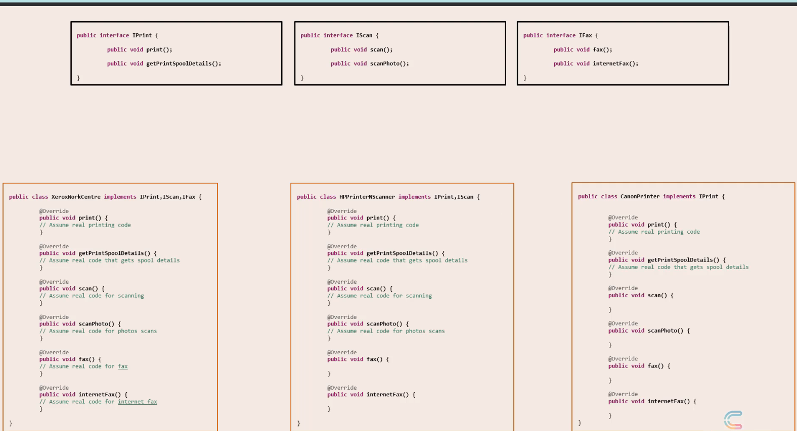
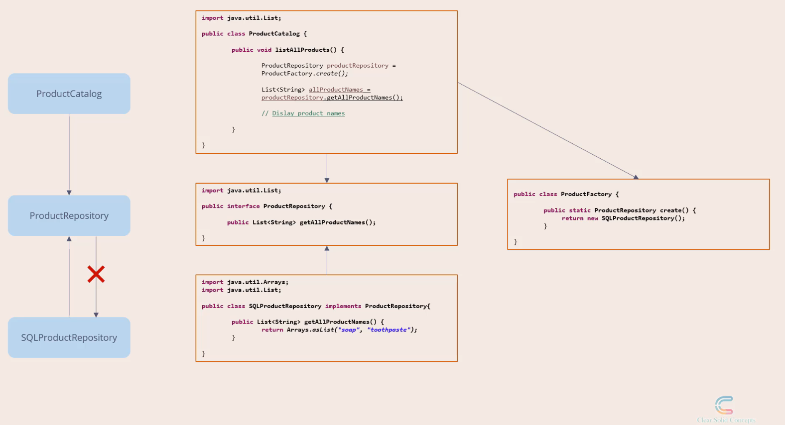
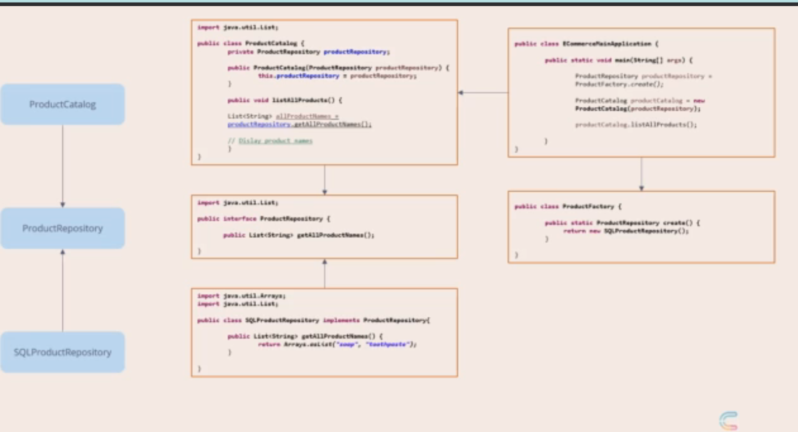
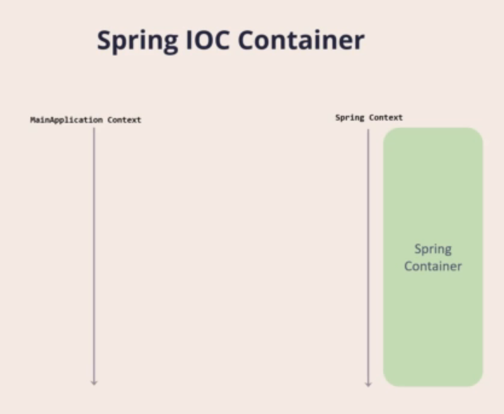

# SOLID

## Single Responsibility Principle

- A software component should have a single responsibility
- It should be modified for a only one reason.
- It should be high cohesion and loosely coupling.
- Cohesion refers to the degree of the relation between the software components.
  - We can say unsegregated waste bin is low cohesion.
  - Whereas segregated waste bin is high cohesion. (All plastic waste in plastic waste and so on.)
- Coupling meaning the degree at which the software components are dependent on each other.
  - Each software component is less dependent on other component, which makes them loosely coupled.

---

## Open Close Principal

- A software should be open to extension but close for modification.
- Example : A PS5, we can have different controllers.
  - Like gun for shooting games.
  - Strearing for car games.
  - But, for adding new controller we dont need to make any modification in PS5 design.
  - We simply plug in the new controller. Example:

**Bad design:**

```java
class InsurancePremiumDiscountCalculator {
  public int calculate(HealthInsuranceCustomerProfile healthInsuranceCustomerProfile) {
    if (healthInsuranceCustomerProfile.isLoyalCustomer()) {
      return 10;
    }
    return 0;
  }

  public int calculate(VehicalInsuranceCustomerProfile vehicalInsuranceCustomerProfile) {
    if (vehicalInsuranceCustomerProfile.isLoyalCustomer()) {
      return 10;
    }
    return 0;
  }
}

class HealthInsuranceCustomerProfile {
  public boolean isLoyalCustomer() {
    return true; // or false
  }
}

class VehicalInsuranceCustomerProfile {
  public boolean isLoyalCustomer() {
    return true; // or false
  }
}
```

**Good Design:**

```java
class InsurancePremiumDiscountCalculator {
  public int calculate(InsuranceCustomerProfile insuranceCustomerProfile) {
    if (insuranceCustomerProfile.isLoyalCustomer()) {
      return 10;
    }
    return 0;
  }
}

interface InsuranceCustomerProfile {
  boolean isLoyalCustomer();
}

class HealthInsuranceCustomerProfile implements InsuranceCustomerProfile {
  public boolean isLoyalCustomer() {
    return true; // or false
  }
}

class VehicalInsuranceCustomerProfile {
  public boolean isLoyalCustomer() {
    return true; // or false
  }
}
```

---

## Liskov Substitution Principal

- Objects should be replaceable with their subtypes without affecting the correctness of the program.
- 2 patterns here,
  - Breaking the hierarchy
  - Tell don't ask

- We have Ostrich class which extends Bird class
- But Ostrich cannot fly.
- So Ostrich has unimplemented fly method.
- Whenever there is a unimplemented method there is a design flaw.
- Hence LSP, gives us way to think away from IS-A type.

Bad design of hierarchy:

```java
import java.util.Arrays;
import java.util.List;

class Car {
  public int getCabinWidth() {
    return 9;
  }
}

class RacingCar extends Car {
  @Override
  public int getCabinWidth() {
    throw new IllegalStateException(); // Racing car do not have cabin but it has cockpit
  }

  public int getCockPitWidth() {
    return 5;
  }
}

class CarUtils {
  public static void main(String[] args) {
    Car first = new Car();
    Car sec = new Car();
    Car racingCar = new RacingCar();

    List<Car> cars = Arrays.asList(first, sec, racingCar);

    for (Car car : cars) {
      if (car instanceof RacingCar) {
        RacingCar racingCar1 = (RacingCar) car;
        System.out.println(racingCar1.getCockPitWidth());
      }
      System.out.println(car.getCabinWidth());
    }
  }
}
```

Good Design :

```java
import java.util.Arrays;
import java.util.List;

interface Vehical {
  int getInteriorWidth();
}

class Car implements Vehical {
  @Override
  public int getInteriorWidth() {
    return getCabinWidth();
  }

  public int getCabinWidth() {
    return 9;
  }
}

class RacingCar implements Vehical {
  @Override
  public int getInteriorWidth() {
    return getCockPitWidth();
  }

  public int getCockPitWidth() {
    return 5;
  }
}

class CarUtils {
  public static void main(String[] args) {
    Vehical first = new Car();
    Vehical sec = new Car();
    Vehical racingCar = new RacingCar();

    List<Vehical> Vehicals = Arrays.asList(first, sec, racingCar);

    for (Vehical vehical : Vehicals) {
      System.out.println(vehical.getInteriorWidth());
    }
  }
}
```

---

## Interface Segregation

No client should be forced to use methods it does not use.

Bad Design:


GoodDesign:



---

## Dependency Inversion Principal

- "High Level Modules should not depend on Low Level Modules. Both should depend on abstractions".
- "Abstractions should not depend on details. Details should depend on abstractions".



## Dependency Injection



## Inversion of control (IOC)


