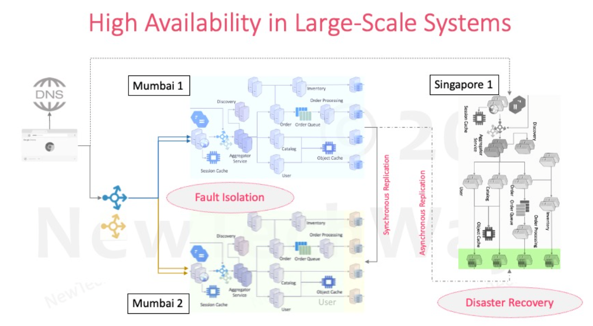

# System Reliability

Below failures can happen in the system,

- Network failure
- Machine failure
- Software failure
- Disaster - Datacenter
- Operations failure
    - Deployment failure
    - Configuration failire
    - Load induced failure
    - External service failure

No matter how hard we try, in distributed systems

- Hardware and network failures will happen
- A changing software will fail
- Disasters will happen

Also, at a point it is much more easy to recover from failure instead of preventing it altogether.

**To keep the system reliable we need to do reliability engineering,**

- **Reliability**
    - A system is said to be reliable if it can continue to function correctly and remain available for operations even
      in the presence of partial faults
    - It measures as probability of a system working correctly in a given interval (i.e Availability)
- **Availability**
    - It is probability of a system working correctly at any given time and being available for operations.
    - Time based availability
        - availability = uptime / (uptime + downtime)
    - Request based availability
        - availability = successful request / total request
    - There could be a downtime but system is expected to recover from it quickly.
- **High Availability**
    - The system should use downtimes permitted by SLA/SLO for rollout of new features.
    - E.G. 99%, 99.9%, 99.95%, 99.99%, 99.999%
- **Fault tolerance**
    - Now to improve the reliability and availability of the system , we need fault tolerance
    - This technique has ability to automatically
        - Detect partial failures
        - Handle partial failures
        - Recover from partial failures

So in general to make the system reliable we need to increase the availability and reliability of the system, And to do
so we need to make system more fault-tolerant

**Below things, we can do to make the system fault tolerance,**

- Redundancy
- Fault Detection
- Recovery

### Redundancy

It means replication or duplication of critical components or funtions of a service to increase its reliability

Types of Redundancy:

- Active Redundancy -Hot spare
    - All nodes do processing
    - Ideal for providing the highest availability
- Passive redundancy - Warm Spare
    - Only active nodes do processing
    - Ideal for quick recovery
- Cold redundancy - Spare backup
    - Spare nodes are brought up only on failover
    - It is not a HA option

For redundancy identify the Single point of failure and introduce the redundancy on it.

Redundancy for stateless components are easy, just need to add more nodes. It is mostly on services which does not hold
states.

Redundancy for stateful components is bit more difficult, as we need to do redundancy of data as well and keep it in
sync. It is mostly at DBs, queue, caches LBs.

We can also have **datacenter redundancy** for handling the fault where entire datacenter goes down or some network
issue connecting to datacenter.

- Fault Isolation
- Zonal Redundancy
    - HA, Active-Active setup
- Regional redundancy
    - Disaster recovery
    - Active passive setup

### Fault detection

Fault Models:

- Response failure
    - A server fails to receive or respond to the incoming request
- Timeout failure
    - A server response duration is longer than timeout duration.
- Incorrect response failure
    - A server response is incorrect.
- Crash failure
    - A server faults but working correctly.
- Byzantine faults
    - Security compromised.

Such faults can be detected by monitoring the system, below are the ways to monitor the system for fault detection

- Health checks
    - External system will check service
    - It checks the alerts for recovery
    - It can also have events for scaling
- Hearth beats
    - No external system
    - Periodically exchanges the heartbeats between nodes.
    - Useful for stateful cluster components
    - E.x Dbs and LBs

### Recovery from fault

Once fault is detected we need to recover the system

For faults in **stateless redundant systems** we can restart or add new replicas.

**For stateful redundancy**, we can have a _hot or warm standby_
On Failover we can use virtual IP as floating IP and change the IP pointing from primary to secondary

OR we can use registry which will fetch the IP for primary and on failover it fetch IP for secondary.

**For DB recovery:**
We can have a hot standby and have synchronous replication, this will have slow writes All nodes will serve the requests

Or we can have a warm standby, and have async sync, mostly used for disaster recovery.

Also have option of cold recovery, it is based DB backups, will have downtime on faiover

High availability in large scale systems:

FAilover best practices:

- Failover automation
- Regular faiover testing in production